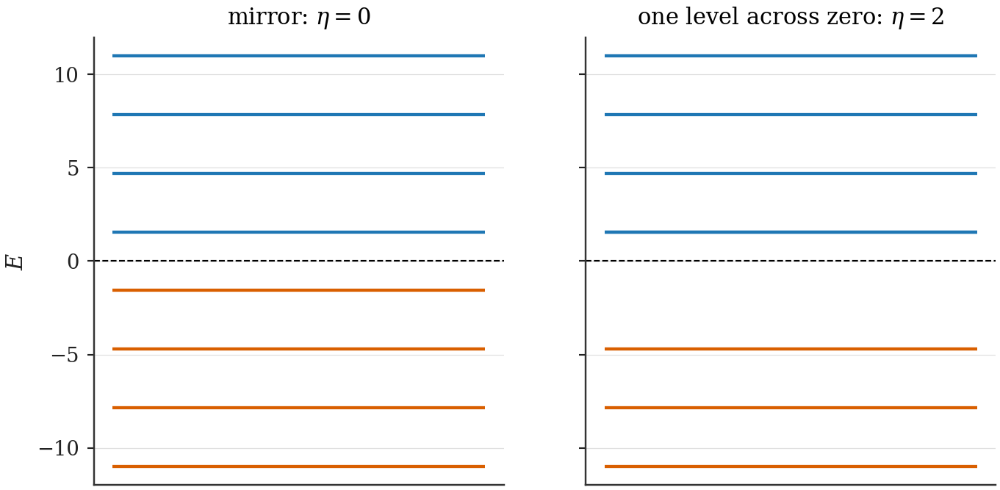
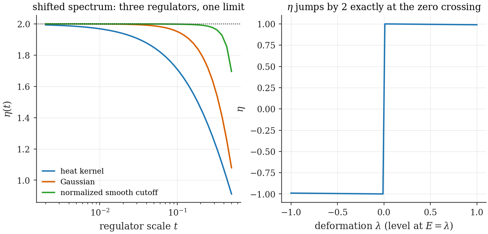

# Chapter 9 — Vacuum charge and the Spectral-Flow Master Theorem

---

Part II's driving question — *does an expanding box create more matter than antimatter?* — sounds like a question about pair-creation amplitudes, and the natural reflex is to compute Bogoliubov coefficients and sum their squares. This chapter proves that the reflex, while not wrong as a calculation, answers the wrong question. The *net charge* created by any sudden geometry change is fixed by a single spectral quantity, with no mode sum, no truncation, and no amplitude anywhere in sight. Once this theorem is in hand, the phenomenology of the following chapters becomes almost embarrassingly easy to organize: mechanisms that move the spectrum produce charge; mechanisms that do not, cannot — whatever their truncated mode sums appear to say.

## 9.1 The spectral asymmetry $\eta$, made finite

Section 8.7 produced the vacuum charge $Q_{\text{vac}} = -\tfrac12\eta$ with $\eta$ "$=$" $\sum_k \operatorname{sgn}(E_k)$ — a difference of two infinities. To make this a number we regulate, suppress high-energy levels smoothly, and remove the regulator:

> **Definition (regulated spectral asymmetry).**
>
> $$\eta \;=\; \lim_{t \to 0^+}\; \eta(t), \qquad \eta(t) \;=\; \sum_k \operatorname{sgn}(E_k)\, e^{-t|E_k|}. \tag{9.1}$$

The exponential is the **heat-kernel regulator**; the limit exists for the operators in this thesis, and — the property that earns the definition its keep — the limit is *regulator-independent*: any even, smooth, sufficiently decaying suppression $f(t|E_k|)$ with $f(0) = 1$ gives the same $\eta$ (App. B proves this for the class used here; the intuition is that $\eta$ measures an *infrared* imbalance, the high-$E$ tails of the two branches cancelling pairwise under any even damping).

One convention, stated once. (9.1) presumes no level sits exactly at $E = 0$: an exact zero mode contributes $\operatorname{sgn}(0) = 0$ to $\eta$, and the operator identity (8.15) then assigns it $\hat n_0 - \tfrac12$ — each zero mode adds $\pm\tfrac12$ to the vacuum charge according to its filling, which is precisely the Jackiw–Rebbi half of the next section. Every statement below assumes zero-mode-free *endpoint* spectra; zero modes live transiently at crossings, where they do the pumping.

> **Toolbox: $\eta$ on a solvable example.** Take the 1+1D massless MIT bag (§8.3): momenta $p_j = (j - \tfrac12)\pi/L$, $j = 1, 2, \ldots$, energies $\pm p_j$ — every positive level has a negative twin. Then $\eta(t) = \sum_j [e^{-tp_j} - e^{-tp_j}] = 0$ identically: a mirror-symmetric spectrum has $\eta = 0$ at every $t$, no limit needed. Now *shift one level by hand* across zero (move the lowest $-p_1$ level to $+p_1$): the count changes by $2$, $\eta = 2$, $Q_{\text{vac}} = -1$ — moving one level across zero changes the vacuum's charge by one unit. This cartoon is the entire mechanism of Part II; the rest is establishing when nature performs the shift. **[Computed]** `ch09_eta_toy.py` verifies both statements and the regulator-independence claim numerically (heat-kernel vs Gaussian vs a normalized smooth cutoff: one limit, Fig. 9.2).

*Figure 9.1 — What $\eta$ measures. Left: a mirror-symmetric spectrum, $\eta = 0$, neutral vacuum. Right: the same spectrum with one level pulled across zero; $\eta$ jumps by 2, the vacuum charge by $-1$. No particle has been created "into" any level — the *definition of vacuum* has shifted by one slot.*

## 9.2 Fractional vacuum charge: the standard anchors

That a vacuum can carry charge — even *fractional* charge — is not a speculation of this framework; it is established physics with a Nobel-grade pedigree, and anchoring to it is both honest and strategically wise.

**Jackiw–Rebbi (1976) [Standard].** A 1+1D Dirac field with a mass term that changes sign across a soliton has a single self-conjugate zero mode bound to the kink; charge-conjugation symmetry then forces the two degenerate vacua to carry charge $\pm\tfrac12$. Fermion number $\tfrac12$ — not as an expectation over fluctuations but as a sharp quantum number — was the first demonstration that $Q_{\text{vac}}$ is physical.

**Goldstone–Jaffe (1983) [Standard].** In the chiral bag model (the $\theta$-walls of §8.4, in 3+1D), the vacuum carries fermion number set by the wall's chiral angle — the famous resolution of where the baryon number "goes" when a skyrmion is fed into a bag. This is *exactly* the family of boundary conditions our framework's walls realize, and Ch. 12 will find its 1+1D shadow quantitatively: $Q_{\text{vac}} = -\Delta/2\pi$.

The point of the anchors: when this thesis claims "the vacuum charged up because the spectrum tilted", it is invoking a mechanism with four decades of consistency checks, not inventing one.

## 9.3 The Master Theorem

We now combine §8.7's operator identity with §8.8's bookkeeping into the central result of Part II.

> **Spectral-Flow Master Theorem [Theorem].** Let a Dirac field on a *fixed* spatial domain undergo a *sudden* change of its bilinear data, $\Lambda \to \Lambda'$ (wall chiral angles, mass profile, any charge-conserving bilinear coupling — no interactions switched on, no pairing terms), with both endpoint spectra free of zero modes. Prepare the system in the vacuum of the initial parameters, $|0_\Lambda\rangle$. Measure, after the quench, the net charge relative to the *new* vacuum:
>
> $$\Delta Q_{\text{net}} \;\equiv\; \big\langle N_b - N_d \big\rangle_{\text{new basis}}\,.$$
>
> Then
>
> $$\boxed{\;\Delta Q_{\text{net}} \;=\; Q_{\text{vac}}(\Lambda) - Q_{\text{vac}}(\Lambda') \;=\; -\,\frac12\Big[\eta(\Lambda) - \eta(\Lambda')\Big]\;} \tag{9.2}$$
>
> — net charge production in a sudden quench is a purely spectral quantity. (Domain growth — the box size itself changing — needs one more declared ingredient and one more ledger entry; both follow the proof.)

*Proof, in full.* Three ingredients.

**(i) $\hat Q$ is conserved through the quench.** The charge operator (8.14) is built from the field at one instant; the quench Hamiltonians before and after are bilinear, $H = \int \psi^\dagger h_{\Lambda}\psi\,(+\,\text{c-number})$, and gauge invariance of each $h_\Lambda$ gives $[\hat Q, H_\Lambda] = 0$ for every $\Lambda$ along the change. Hence $\langle\hat Q\rangle$ is the same number the instant before and the instant after. (Suddenness is used only to say the *state* doesn't change at the instant of the quench; conservation holds regardless.)

**(ii) Evaluate $\langle\hat Q\rangle$ before, in the old basis.** The state is the old vacuum: no particles, no holes. By (8.15),

$$\langle \hat Q\rangle = 0 + Q_{\text{vac}}(\Lambda).$$

**(iii) Evaluate the same number after, in the new basis.** The same state, re-expressed in the new eigenbasis, contains particles and antiparticles (this is where all the Bogoliubov drama lives — and note that we never need to compute any of it). By (8.15) again,

$$\langle \hat Q\rangle = \big\langle N_b - N_d\big\rangle_{\text{new}} + Q_{\text{vac}}(\Lambda') = \Delta Q_{\text{net}} + Q_{\text{vac}}(\Lambda').$$

Equate (ii) and (iii). $\blacksquare$

The proof is short because the work was done in §8.7: once the charge operator is *forced* (not chosen) to be symmetrically ordered, the vacuum term is not optional, and charge conservation does the rest. Two matters of honesty before the corollaries: what the left-hand side *means* when its two sums diverge, and what changes when the domain itself grows.

**What $\langle N_b - N_d\rangle$ means when both sums diverge.** In any finite-dimensional realization — a lattice, a truncated basis — steps (i)–(iii) are exact linear algebra and (9.2) holds identically, level crossings included. In the continuum a sudden quench generically makes $\langle N_b\rangle$ and $\langle N_d\rangle$ *separately* divergent, and their difference must be defined by the same $C$-odd bookkeeping that forced (8.14). The definition used everywhere in this thesis: damp the new-basis mode sum evenly in energy,

$$\Delta Q_{\text{net}} \;=\; \lim_{t\to0^+}\;\Bigg[\sum_{E'_k>0} e^{-t|E'_k|}\,\langle \hat n'_k\rangle \;-\; \sum_{E'_k<0} e^{-t|E'_k|}\,\big(1 - \langle \hat n'_k\rangle\big)\Bigg] \tag{9.2a}$$

— the $t$-regulated $\langle N_b\rangle - \langle N_d\rangle$, with $\langle \hat n'_k\rangle$ the occupation of new level $k$ in the prepared state. Under this even damping, step (iii) is the $t \to 0^+$ limit of a finite identity, and the limit is regulator-independent in the sense of App. B.1. *Asymmetric* prescriptions — truncating the two branches at different heights, sharp mode counts — need not converge to the same number, and generically do not: Chapter 11 computes in closed form what they converge to instead (a wall-polarization integral), which is why rule 1 of §9.5 exists.

**Extension (domain growth).** When the *box itself* grows, $[0, L] \to [0, L']$, the theorem needs one more declared ingredient, because "the old vacuum, and nothing in the fresh region $[L, L']$" is not a state of a fermion field — §11.4 proves that a literally empty interval carries divergent charge relative to every admissible vacuum. Declare the fresh region, with its own wall data, in the filled sea of its own Hamiltonian; the same three steps then give

$$\Delta Q_{\text{net}} \;=\; -\,\frac12\Big[\eta(L) + \eta_{\text{fresh}} - \eta(L')\Big], \tag{9.2b}$$

the fresh region entering the ledger with the charge its own vacuum carries. For mirror-spectrum fresh walls (MIT-like), $\eta_{\text{fresh}} = 0$ and (9.2) survives verbatim; for CP-structured fresh walls it does not, and the difference is physical, not conventional — different preparations of the fresh region are different experiments (Ch. 27, item 11 poses the systematic study). The pump of Ch. 12 is untouched by this subtlety: there the box is *stretched continuously*, and the accounting is spectral flow along the deformation path (Corollary 9.2), with no fresh region ever glued in.

Short as it is, the theorem has unusual destructive and constructive power, which we now unpack.

## 9.4 Corollaries, destructive and constructive

> **Corollary 9.1 (mirror spectra are sterile).** If both the initial and final spectra are symmetric under $E \to -E$, then $\eta(\Lambda) = \eta(\Lambda') = 0$ and
>
> $$\Delta Q_{\text{net}} = 0 \quad\text{exactly}$$
>
> — to all orders in every coupling and phase, at every truncation, for every quench between such spectra. Any truncated mode sum claiming otherwise is measuring something other than net charge (Ch. 11 identifies what).

> **Corollary 9.2 (the staircase decomposition: what moves $\eta$, and when production is quantized).** Deform the bilinear data continuously from $\Lambda$ to $\Lambda'$, and write $\Delta\eta \equiv \eta(\Lambda') - \eta(\Lambda)$ (final minus initial — the convention used everywhere $\Delta\eta$ appears; in it the boxed theorem (9.2) reads $\Delta Q_{\text{net}} = +\tfrac12\Delta\eta$). Then $\eta$ changes in exactly two ways:
>
> $$\Delta\eta \;=\; \delta\eta_{\text{smooth}} \;+\; 2\,\Big[\#\{\text{levels crossing } 0 \text{ upward}\} \;-\; \#\{\text{levels crossing } 0 \text{ downward}\}\Big], \tag{9.3}$$
>
> a *smooth part*, present only when the deformation tilts the two branches' level densities against each other (chiral wall angles do exactly this: it is the finite-volume shadow of the Atiyah–Patodi–Singer local term, and it carries the fractional charge law of Ch. 12), and *integer jumps* of $\pm2$ when a level crosses $E = 0$. Consequently
>
> $$\Delta Q_{\text{net}} \;=\; \tfrac12\,\delta\eta_{\text{smooth}} \;+\; \#\{\text{up}\} - \#\{\text{down}\}\,,$$
>
> and **production is quantized — an integer equal to the spectral flow of the Dirac operator along the path — exactly when the smooth part vanishes.** The hypothesis under which this thesis uses integrality: *the deformation changes only the box size, at fixed wall data.* Why that suffices deserves care, because the obvious argument is wrong: at $m \ne 0$, changing $L$ is *not* a pure rescaling — $mL$ is a genuine shape parameter, and the sub-gap level of Ch. 12 migrates across the entire gap as $L$ grows, so levels do not merely relabel. The correct support is *locality* of the smooth part: $\delta\eta_{\text{smooth}}$ is the finite-volume APS local term, an integral of a CP-odd density of the background — in the bulk that requires a chiral-angle gradient, absent for a constant real mass, so the smooth part lives entirely at the walls and is a function of the held-fixed wall data alone. Equivalently, by the Goldstone–Wilczek accounting of Ch. 12, the fractional part of $Q_{\text{vac}}$ is pinned at $-\Delta/2\pi$ at *every* $L$. Size-only deformations therefore move $\eta$ only through crossings, and the plateaus of $Q_{\text{vac}}(L)$ between crossings are exact **[argument + Computed]** — flat to $3.7\times10^{-5}$/$2.3\times10^{-6}$ across the Ch. 12 pump's range, the residual being regulator-extrapolation error.

**[Computed]** `ch09_eta_toy.py` checks both halves of the decomposition. *The integrality hypothesis:* for the two-wall bag of Ch. 12 (walls $(-2, +2)$, $m = 1$), the fixed-angle plateaus of $Q_{\text{vac}}(L)$ are flat in $L$ to $3.7\times10^{-5}$ below the crossing and $2.3\times10^{-6}$ above it. *The smooth part in isolation:* the *massless* two-wall bag, whose spectrum from (12.7) is the shifted tower $E_n^+ = [(n+\tfrac12)\pi - \Delta/2]/L$, $E_n^- = -[(n+\tfrac12)\pi + \Delta/2]/L$, gives $\eta = \Delta/\pi$ *continuously* in the mismatch ($\Delta \equiv \theta_L - \theta_0$, the wall-angle difference — Ch. 12's central knob, met here ahead of its formal introduction) — $0.15915,\ 0.31831,\ 0.63662,\ 0.95493$ at $\Delta = 0.5, 1, 2, 3$, two regulators agreeing to eight digits — with the spectral gap open throughout: $\eta$ moves with **no level crossing anywhere**. A "levels-only" reading of $\eta$ is therefore wrong in general, and the wall angles are precisely the deformations that move the smooth part.

*(Where the dichotomy comes from: for each $t > 0$ the damped sum (9.1) is continuous in $\Lambda$; away from crossings its $t \to 0$ limit can move only through the smooth APS-local part — which, being an integral of a CP-odd *local* density, is sourced by the wall data and by bulk chiral gradients only: size-only deformations touch neither, which is why they sit on exact plateaus, while boundary-data deformations shift the two towers against each other and drag the limit continuously. At a crossing one $\operatorname{sgn}$ flips: $\pm2$. App. B.2 states the decomposition carefully and shows exactly where a "the limit is locally constant" argument would fail.)*

> **Corollary 9.3 (robustness).** $\Delta Q_{\text{net}}$ depends only on the endpoint spectra (through $\eta$) — not on the quench speed profile *at all*: sudden is a convenience, not a hypothesis, since $[\hat Q, H(t)] = 0$ along any bilinear charge-conserving path, so a slow passage redistributes *pair* content but cannot touch the net (the Landau–Zener physics at a crossing dresses pairs, never the unit — Ch. 27, item 10). Not on the mode basis. Not on any cutoff. It is the rare observable in this subject that is *cutoff-theorem-protected*: Ch. 5's warning ("if it depends on the cutoff, it's wrong") cannot even be formulated against it.

Corollary 9.2 deserves a name in plain words: **to create an integer unit of charge, the deformation must drag a level through zero energy; to move the vacuum's fractional charge, it must twist the boundary data.** Pair creation that merely populates symmetric branches — however violently — nets to zero charge. This converts Part II's program into a sharply posed hunt: find the parameters that do each. Chapter 10 eliminates the obvious candidate (a bulk CP phase: it *cannot* move $\eta$, for two independent reasons, each proved exactly). Chapter 12 finds the real one (a *mismatch* of wall chiral angles: it moves the smooth part by exactly the Goldstone–Jaffe fraction, and — as the box then grows at fixed angles — crossings occur at analytically computable sizes, each delivering one exact integer unit).

*Figure 9.2 — $\eta(t)$ under three different regulators on the shifted-level toy spectrum of §9.1, extrapolating to the same integer limit. The spectral asymmetry is a property of the spectrum, not of the bookkeeping.*

## 9.5 What this means for "pair-creation asymmetries"

A reader arriving from the quantum-field-theory-in-curved-space literature may feel a tension: cosmological particle production (Parker; the moving-mirror literature — both return in Ch. 17) is real, and Bogoliubov sums measure it. There is no contradiction, and the distinction is worth one careful paragraph because the next two chapters live inside it.

A quench generically *does* create particles — in pairs. The Bogoliubov machinery correctly counts the **pairs**: $\langle N_b\rangle$ and $\langle N_d\rangle$ are separately nonzero, generically large, and physically meaningful (they carry energy, they back-react in a fuller theory). What the Master Theorem constrains is the **difference**: the net imbalance between branches. The difference is spectral; the sum is not. A truncated computation of the *difference*, however, inherits none of the protections of either: it is the small mismatch of two large, slowly converging, separately cutoff-sensitive quantities — numerically nonzero at any finite truncation for kinematic reasons, with a limit that (Ch. 11 proves) is a *boundary polarization integral*, not a charge. Three rules of practice follow, and they govern every computation in the rest of Part II:

1. **Net charge claims must be spectral-flow claims.** Compute $\eta$ from complete spectra, or count crossings; never subtract truncated mode sums and report the residue as charge.
2. **Bogoliubov sums are for pair content and distributions**, where they converge honestly and mean what they say.
3. **When the two disagree, the spectral computation wins by theorem**, and the disagreement itself is diagnostic data — it measures the polarization observable of Ch. 11.

## 9.6 Summary

Symmetric ordering forces a vacuum charge $Q_{\text{vac}} = -\tfrac12\eta$ (§8.7); charge conservation across a sudden quench on a fixed domain then fixes the net production to $\Delta Q_{\text{net}} = -\tfrac12\big[\eta_{\text{before}} - \eta_{\text{after}}\big] = +\tfrac12\Delta\eta$ in the final-minus-initial convention of Cor. 9.2 (**Spectral-Flow Master Theorem**; domain growth adds the declared fresh region's $\eta_{\text{fresh}}$ to the ledger), which is zero between mirror spectra (Cor. 9.1), splits into a smooth boundary-data part plus integer spectral flow — quantized for size-only deformations (Cor. 9.2) — and is protected against cutoffs and protocol speed alike (Cor. 9.3). The hunt is now on for parameters that move levels through zero. First, a parameter that *seems* perfect for the job and fails for beautiful reasons: the bulk CP phase.

---

**Validation.** `ch09_eta_toy.py`: the mirror/shifted toy spectra, $\eta(t)$ under three regulators with Richardson extrapolation (Fig. 9.2), a numerical illustration of Corollary 9.2's jump part on a parametric family dragging one level through zero, the massless-bag shifted tower (the smooth part in isolation: $\eta = \Delta/\pi$, two regulators, eight digits), and the fixed-angle plateau-flatness check on the two-wall bag of Ch. 12. The theorem itself is exact; its consequences are stress-tested numerically throughout Ch. 10–12 (machine-zero $\eta$ checks, the quantized pump, the control quench).
