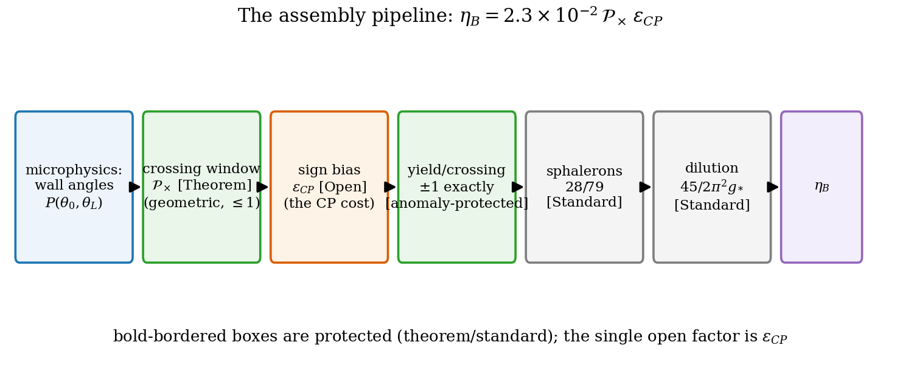
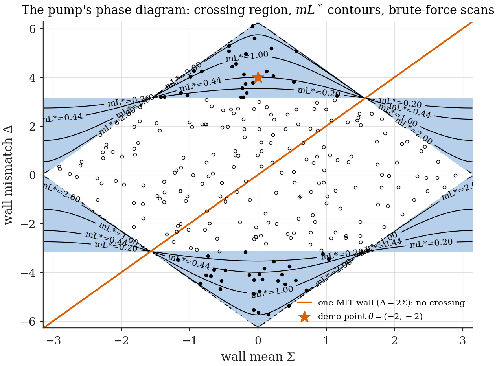
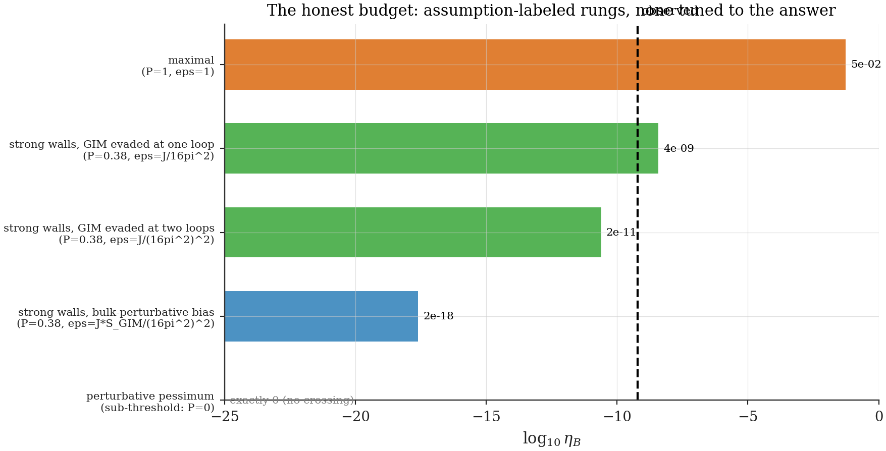

# Chapter 14 — From pumping to η_B: the corrected estimate

---

Chapter 12 delivered a charge pump with an exactly quantized stroke: one unit per level crossing, protected by anomaly arguments against every continuous deformation. What it deliberately did not deliver is a *rate*. Quantization cleanly splits the baryogenesis problem into a protected part (the yield per crossing: exactly $\pm1$) and a contingent part (how often crossings happen, and with what sign bias). This chapter computes the contingent part as far as theorems allow and budgets the remainder without mercy. The result is a master formula whose kinematic engine — the **Crossing-Density Amplitude** — is new, geometric, and computable, and whose CP-strength factor is presented for what it is: the framework's dominant open problem, inherited from the Standard Model's GIM structure (Ch. 13), with sharply identified escape routes.

A reader should finish this chapter knowing exactly which factors of the estimate would survive hostile review unchanged, and which would not.

## 14.1 The pipeline

From a microscopic pump to today's $\eta_B$, five factors:

$$\eta_B \;=\; \underbrace{\Big(\frac{s}{n_\gamma}\Big)_{\!0}}_{\approx\,7.04} \;\times\; \underbrace{\frac{45}{2\pi^2 g_*}}_{\approx\,0.0214} \;\times\; \underbrace{C_{\text{sph}}}_{28/79} \;\times\; \underbrace{N_{\text{dof}}}_{\text{species/color}} \;\times\; \underbrace{\frac{1}{N_c}}_{\text{quark}\to\text{baryon}} \;\times\; \underbrace{\mathcal N_{\text{steps}}\,\bar\nu\;\varepsilon_{CP}}_{\text{this chapter}} \;\times\; \underbrace{f_{\text{neq}}}_{\approx\,1\ \text{(Ch. 6)}} . \tag{14.1}$$

The first three are standard electroweak cosmology, and the fourth and fifth come as a pair whose product is deceptively innocent: the pump moves *quark* number — three colors, three quarks per bag crossing, $N_{\text{dof}} = N_c = 3$ — while $\eta_B$ counts *baryons*, $n_B = n_q/3$, so a $1/N_c$ rides along and $N_{\text{dof}}/N_c = 1$: one baryon per bag crossing. (An earlier draft silently dropped the $1/N_c$ — a factor-3 audit failure in a chain that carries $28/79$ to four digits; it is now a displayed factor.) The two conversion factors are kept separate as Ch. 13.4 insists — $45/2\pi^2 g_*$ converts a production-epoch density per $T^3$ into the conserved $n_B/s$, and $(s/n_\gamma)_0 = \pi^4 g_{*s}^0/45\zeta(3) \approx 7.04$ converts that into today's photon-normalized $\eta_B$; conflating them mis-prices the chain by two orders. One normalization postulate rides along and is stated rather than hidden: converting a *per-bag* probability into a density per $T^3$ assumes one bag per thermal volume, $n_{\text{bag}} \sim T^3$ **[Postulate]** — the natural reading of cells at the thermal scale, but a reading, with any $\mathcal O(1)$ mismatch absorbed into the budget below. $f_{\text{neq}} \approx 1$ is the framework's structural advantage — the expansion arrow is a *permanent* departure from equilibrium, so no phase-transition gymnastics are needed (Expansion-Preference Theorem; the Dirac-sector check that CP phases do not weaken the preference is part of the Ch. 8 validation suite). The heart is the pump block: $\mathcal N_{\text{steps}}$ counts iso-energy steps per bag during the relevant epoch, $\bar\nu$ is the mean crossing probability per step, and $\varepsilon_{CP}$ is the sign bias between $+1$ and $-1$ pumps. We now build $\bar\nu$ and $\varepsilon_{CP}$ from Chapter 12's exact results.

*Figure 14.1 — From pump to ratio. Protected factors (boxes with bold borders: quantized yield, sphaleron conversion, entropy dilution) versus contingent factors (crossing density, sign bias, step counting). The figure is the chapter's table of contents.*

## 14.2 The per-bag yield: a one-crossing theorem

First, a structural theorem that simplifies everything downstream.

> **One-Crossing Theorem [Theorem].** A two-wall chiral bag with fixed angles $(\theta_0, \theta_L)$ and mass $m$ experiences, over its entire expansion history $L: 0 \to \infty$, **at most one** level crossing — hence pumps at most one unit of charge. The crossing exists iff
>
> $$\operatorname{sgn}\big[\cos(\Delta/2)\big] \;=\; -\operatorname{sgn}\big[\cos\Sigma\big] \quad\text{and}\quad \big|\cos(\Delta/2)\big| \;<\; \big|\cos\Sigma\big|, \tag{14.2}$$
>
> in which case it occurs at the unique size
>
> $$L^*(\Delta, \Sigma; m) \;=\; \frac{1}{m}\,\operatorname{artanh}\!\Big(\!-\frac{\cos(\Delta/2)}{\cos\Sigma}\Big). \tag{14.3}$$
>
> *Proof.* The Crossing Condition (12.9) equates $\tanh(mL)$ — strictly increasing from $0$ to $1$ on $L \in (0,\infty)$ — to a constant fixed by the angles. A constant in $(0, 1)$ is hit exactly once; outside $[0,1]$, never. Condition (14.2) is "the constant lies in $(0,1)$" spelled out. $\blacksquare$

**[Computed]** `ch14_crossing_density.py` confirms by brute force: for $390$ random angle pairs (400 drawn uniformly; ten discarded at the $|\cos\Sigma| < 0.05$ numerical edge, where $L^* \to \infty$), transfer-matrix zero-mode scans over $mL \in (0, 8]$ — fully independent of the master equation — find exactly one crossing when (14.2) holds and none otherwise ($390/390$ on both counts), with the $101$ crossing locations all matching (14.3) to $10^{-6}$.

The existence region (14.2) is the single most consequential fact of this chapter, so look at it. At $\Sigma = 0$ (symmetric walls) it requires $\cos(\Delta/2) < 0$, i.e. $|\Delta| > \pi$: **order-one wall mismatch**. Small mismatches — however nonzero — pump nothing, not "exponentially little" but *exactly nothing*: there is no crossing to count. The pump has a threshold, and the threshold is topological in flavor: the wall angles must disagree by more than a half turn of the $2\pi$-periodic $\gamma_5$-angle before the gap hosts a zero mode at any size.

*Figure 14.2 — The pump's phase diagram. The $(\Sigma, \Delta)$ plane with the existence region (14.2) shaded and contours of $mL^*$ from (14.3); overlaid points: brute-force spectral-flow scans (crossing found = filled, none = open). The MIT diagonal ($\theta_0 = 0$ line $\Delta = 2\Sigma$) grazes the boundary and never enters — the one-ordinary-wall no-go of Ch. 12 visualized.*

## 14.3 The Crossing-Density Amplitude *(new)*

Now the ensemble. At the electroweak epoch, the framework pictures comoving regions as bags taking iso-energy steps (Ch. 3: $L_k = (n_0 + k)L_0/n_0$), with wall angles set by local CP microphysics — drawn from some distribution $P(\theta_0, \theta_L)$, generally epoch-dependent. Define the chapter's central object:

> **Definition (Crossing-Density Amplitude).** $\nu_k$ = expected number of crossings traversed during step $k$, per bag:
>
> $$\nu_k \;=\; \int dP(\theta_0, \theta_L)\;\; \mathbb 1\big[(14.2)\text{ holds}\big]\;\; \mathbb 1\big[\,L_k < L^*(\Delta,\Sigma; m) \le L_{k+1}\,\big]. \tag{14.4}$$

Two exact reductions make (14.4) usable.

**(a) The step measure.** In the thermal regime $n \gg 1$ (Ch. 6, caveat 3), the step is infinitesimal: $L_{k+1}/L_k = 1 + 1/n_k$, so the indicator selects a shell of logarithmic width $d\ln L = 1/n_k$, and

$$\nu_k \;=\; \frac{1}{n_k}\; \rho_{\ln L^*}\big(\ln L_k\big), \qquad \rho_{\ln L^*} = \text{density of } \ln L^* \text{ induced by } P \text{ via } (14.3). \tag{14.5}$$

Summing over the steps an expanding region takes during the epoch, the total expected crossings per bag is the integral of $\rho_{\ln L^*}$ over the $e$-folds traversed — step bookkeeping ($\mathcal N_{\text{steps}}$) and crossing density combine into a single, reparametrization-clean quantity: **the fraction of the ensemble whose $L^*$ falls inside the epoch's expansion window**,

$$\mathcal N_{\text{steps}}\,\bar\nu \;=\; \Pr\Big[\,L^*(\Delta, \Sigma; m) \in \big(L_{\text{in}},\, L_{\text{out}}\big)\,\Big] \;\equiv\; \mathcal P_\times . \tag{14.6}$$

This is the corrected kinematic amplitude, and its structure is worth a sentence of contrast: it is a *probability* (bounded by 1, dimensionless, basis-free), not a truncated overlap sum; every pathology catalogued in Ch. 11 is structurally excluded. With $mL^*$ given by (14.3) and the epoch window $m L \in (m/T_{\text{in}}\text{-scale},\, \ldots)$ of order one at the crossover ($m_t/T_{\text{EW}} \sim 1$), $\mathcal P_\times$ is an order-unity geometric factor *whenever the angle distribution populates the existence region at all* — the entire smallness of $\eta_B$ is thereby pushed into the next factor, where it honestly belongs.

**(b) The sign bias.** Which sign does a crossing pump? Under $E \to -E$, the Master Equation maps $\Delta \to -\Delta$ (Wall-Mismatch Criterion); correspondingly the crossing level dives *into* the sea for one sign of $\Delta$ and climbs *out* for the other, pumping $\mp 1$ respectively **[Computed + Ch. 12 accounting]** (`ch14_crossing_density.py` computes the slope correlation $\operatorname{sgn}(dE/dL) = \operatorname{sgn}(\sin(\Delta/2))$ across its sampled crossings — of order ten surviving the sampling filters — and the jump of $Q_{\text{vac}}$ at $L^*$, $-\operatorname{sgn}(\sin(\Delta/2))$, then follows by Cor. 9.2's crossing bookkeeping; the jump itself is verified spectrally at the Ch. 12 demonstration point). The ensemble's net pumping is therefore controlled by the CP asymmetry of the angle distribution:

$$\varepsilon_{CP} \;=\; \frac{\Pr[\text{crossing with } \Delta > 0] - \Pr[\text{crossing with } \Delta < 0]}{\Pr[\text{crossing}]}\,, \tag{14.7}$$

and a CP-symmetric ensemble ($P$ even in $\Delta$) pumps net zero — as it must: this is the Sakharov C/CP condition materializing inside the formula, in exactly the right place.

> **Crossing-Density Amplitude (master form) [Theorem, given the ensemble picture].**
>
> $$\boxed{\;\mathcal N_{\text{steps}}\,\bar\nu\,\varepsilon_{CP} \;=\; \mathcal P_\times\,\varepsilon_{CP}\,,\;}$$
>
> with $\mathcal P_\times$ the geometric window probability (14.6) — computable in closed form from (14.3) for any specified $P(\theta_0, \theta_L)$ — and $\varepsilon_{CP}$ the distribution's sign bias (14.7).

**[Computed]** `ch14_crossing_density.py` evaluates $\mathcal P_\times$ and $\varepsilon_{CP}$ for parameterized families (Gaussian angle pairs of mean $\pm\mu$ and spread $\varsigma$; sign-biased mixtures), validates the One-Crossing Theorem by brute force (390/390 existence and uniqueness; crossing locations matching (14.3) to $10^{-6}$), and produces Fig. 14.2. Representative outputs (epoch window $mL \in (0.3, 3)$): a near-MIT ensemble ($\mu = 0$, $\varsigma = 0.5$) gives $\mathcal P_\times = 0$ at Monte-Carlo resolution — for Gaussian tails the true value is doubly-exponentially small ($\sim e^{-\pi^2/4\varsigma^2}$, never sampled), and *exactly* zero for any distribution supported inside $|\Delta| \le \pi$: the sub-threshold statement, stated precisely; broad tails reach the region ($\varsigma = 1.5 \to \mathcal P_\times = 0.073$; $\varsigma = 2.2 \to 0.153$); strong-wall ensembles ($\mu = 2$, $\varsigma = 1$) give $\mathcal P_\times = 0.38$. The sign bias passes through faithfully ($\varepsilon_{CP} \approx$ the imposed mixture bias), and the flow direction obeys $\Delta Q_{\text{pumped}} = +\operatorname{sgn}(\sin(\Delta/2))$ per crossing across the sampled cases (per the slope correlation of (b)).

## 14.4 What sets the wall angles — and the honest budget

Everything now hangs on $P(\theta_0, \theta_L)$, i.e. on the microphysics of the walls, and here the framework meets the Standard Model's hard wall (Ch. 13). The wall angle is the relative phase between the boundary condensate (the chiral structure that terminates the fermion at the cell wall) and the bulk mass matrix. Two regimes:

**The perturbative pessimum.** If wall angles are generated perturbatively from CKM physics, the natural scale of both the spread of $\Delta$ and the bias $\varepsilon_{CP}$ inherits the full GIM-suppressed budget: loop measures $(1/16\pi^2)^2$, Jarlskog $J_{CP} \sim 3\times10^{-5}$, mass-difference factors $\mathcal S_{\text{GIM}} \sim 10^{-7}$ (Ch. 13.5) — and, fatally compounded by the threshold (14.2): a perturbatively narrow $P$ centered on MIT walls sits *entirely below threshold*. In this regime the framework predicts $\eta_B$ zero for any wall-angle distribution supported inside $|\Delta| \le \pi$, and doubly-exponentially small for thin-tailed ones — an honest and falsifiable statement, and an improvement in clarity over a suppressed-but-fuzzy estimate.

**The strong-wall scenario.** If the boundary condensate carries an order-one chiral structure — as it does in every QCD-flavored bag model, where the wall angle is the analogue of the hybrid chiral bag's pion-field angle — then $\mathcal P_\times = \mathcal O(1)$ *geometrically*, and the entire smallness of $\eta_B$ is carried by $\varepsilon_{CP}$: the CP bias of the strong-wall ensemble. Its value is **[Open]**; what Ch. 13.5's budget lines *do* fix is a reference ladder of assumption-labeled scales:

$$\varepsilon_{CP} \;\sim\; \underbrace{J_{CP}\,\mathcal S_{\text{GIM}}\Big(\tfrac{1}{16\pi^2}\Big)^{\!2} \approx 1.2\times10^{-16}}_{\text{bulk-perturbative generation}} \;\Big|\; \underbrace{J_{CP}\Big(\tfrac{1}{16\pi^2}\Big)^{\!2} \approx 1.2\times10^{-9}}_{\text{GIM evaded, two loops}} \;\Big|\; \underbrace{\frac{J_{CP}}{16\pi^2} \approx 1.9\times10^{-7}}_{\text{GIM evaded, one loop (ceiling)}} \;\Big|\; \underbrace{\mathcal O(1)}_{\text{maximal}},$$

a sixteen-order range whose resolution requires deciding whether **boundary-localized CP violation evades GIM** — flavor physics at a chiral wall is not flavor physics in the bulk plasma (the wall breaks the chiral symmetry that organizes the GIM cancellation in the first place; whether enough of the cancellation survives, and whether the wall's own chiral structure saves a loop measure, is a concrete, unsolved calculation). This is the framework's dominant open problem, stated in its sharpest known form: **[Open]**, Ch. 27 item 4, with the three candidate evasion routes (soft-mode enhancement; boundary-condensate phases; single-CKM-insertion boundary mixing) specified there.

**The assembled estimate.** With $g_* = 106.75$, $(s/n_\gamma)_0 = 7.04$, $C_{\text{sph}} = 28/79$, $N_{\text{dof}}/N_c = 1$ for the top-quark channel:

$$\eta_B \;\approx\; 5.3\times10^{-2}\;\times\; \mathcal P_\times\;\varepsilon_{CP}, \tag{14.8}$$

so that matching $\eta_B^{\text{obs}} = 6.1\times10^{-10}$ requires

$$\mathcal P_\times\,\varepsilon_{CP} \;\approx\; 1.15\times10^{-8}. \tag{14.9}$$

**[Computed]** prefactors assembled and propagated in `ch14_eta_assembly.py`. In the strong-wall scenario ($\mathcal P_\times \sim 0.1$–$1$), observation demands $\varepsilon_{CP} \sim 1.2\times10^{-8}$–$1.2\times10^{-7}$. Placed on the reference ladder above (at $\mathcal P_\times = 0.38$, the strong-wall benchmark): a factor $\sim 6$ *below* the one-loop-evasion ceiling, a factor $\sim 25$ *above* the two-loop-evasion rung, and some **eight orders** above the bulk-perturbative value. Two sentences of honesty about what that placement is and is not. It is *not* a passed consistency test: the ladder spans sixteen orders of magnitude and ends at $\mathcal O(1)$, so no observed value of $\eta_B$ below $\sim 5\times10^{-2}$ could have fallen outside it — window-membership carries no evidential weight, which is exactly why $\varepsilon_{CP}$ is labeled **[Open]** rather than estimated. What *is* informative is where observation lands: between the two GIM-evaded rungs, within a factor $6$–$25$ of either — so the mechanism lives or dies entirely on the boundary-GIM calculation, and if evasion holds at loop level, no further small number needs inventing (and none is available to hide behind). It does not *predict* the value until that calculation is done; the thesis claims structure, not the number.

*Figure 14.3 — The honest budget. Horizontal bars: the $\eta_B$ value implied by each assumption-labeled rung of the $\varepsilon_{CP}$ ladder at the strong-wall benchmark $\mathcal P_\times = 0.38$; dashed line: observation. Every bar is a named assumption combination — none is tuned to land on the observation, and observation lands between the two GIM-evaded rungs. The perturbative-pessimum bar sits at zero (sub-threshold). No bar is labeled "prediction".*

## 14.5 Inherited cautions from the three-dimensional assembly

Three honesty items, each inherited from the wider geometry — the first two bounded, the third **not**:

1. **Dimensional uplift.** The quantitative engine above is 1+1D (slab). The 3+1D spherical chiral bag has a richer crossing structure (one condition per $\kappa$-channel), plausibly *raising* $\mathcal P_\times$ (more channels, more crossings) — but until computed (Ch. 27, item 3), the 1+1D value stands as the defensible core. The slab limit itself is rigorous (Slab Eigenvalue Theorem, §10.A).
2. **The rectangular factorization conjecture.** Treating a finite rectangular cell as three independent slabs is proved in the slab and non-relativistic limits, conjectured at $mL_i \sim 1$. It enters only the *multiplicity* bookkeeping ($N_{\text{dof}}$-level factors of order one), not the mechanism. **[Conjecture]**, flagged.
3. **Spin counting.** At fixed transverse momentum the two spin polarizations are exactly twofold degenerate (§10.A), and for bulk-phase mechanisms their pumped charges are C-conjugate and cancel pairwise — *exactly*. For wall-mismatch pumping the cancellation question must be re-posed per channel, and it has not been: until the 3+1D computation is done, the spin factor on $N_{\text{dof}}$ is an unresolved number in $[0, 2]$, and **the null is a live outcome** — exact cancellation across all channels would set $\eta_B \equiv 0$ and kill the baryogenesis uplift, precisely the stake Ch. 27 item 3 names. This factor is *not* absorbed into the budget bars of Fig. 14.3; it multiplies every bar, including by zero.

## 14.6 Summary, and what would change this chapter

The corrected estimate replaces a truncated overlap amplitude with a **probability that an exactly located level crossing falls inside the epoch's expansion window** ($\mathcal P_\times$, geometric, computable, bounded) times a **sign bias** ($\varepsilon_{CP}$, the genuine CP cost, currently only bracketed by the assumption ladder of §14.4). The yield per event is exactly one unit in 1+1D — anomaly-protected, beyond revision; the 3+1D channel sum, with its unresolved spin factor in $[0,2]$ (§14.5, item 3), is the named computation standing between the per-channel unit and a three-dimensional rate. The pipeline (14.1) is structurally complete, every factor either standard, theorem-grade, or labeled **[Open]** with a named calculation attached.

Three computations would upgrade the estimate to a prediction, in order of leverage: the boundary-GIM calculation for $\varepsilon_{CP}$ (item 4 of Ch. 27); the 3+1D spherical crossing density (item 3); and the microphysics of the wall-angle distribution at the electroweak crossover. None requires a new idea — each is a finite, posed problem. That is, by the standards of baryogenesis model-building, an unusually good place to stand.

---

**Validation.** `ch14_crossing_density.py`: brute-force validation of the One-Crossing Theorem (400 random angle pairs drawn, 390 tested, 101 crossings — matching §14.2); the $(\Sigma, \Delta)$ phase diagram with flow-direction map; $\mathcal P_\times$ and $\varepsilon_{CP}$ for parameterized ensembles (Fig. 14.2). `ch14_eta_assembly.py`: prefactor assembly including the $1/N_c$ quark$\to$baryon factor, the $\varepsilon_{CP}$ reference ladder with the required-over-rung ratios, the budget bars (Fig. 14.3), and the required $\mathcal P_\times\varepsilon_{CP}$ value (14.9). Both print every number quoted.
