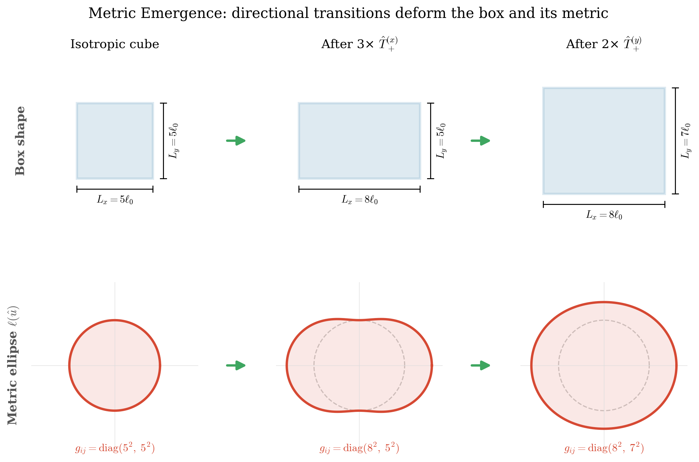
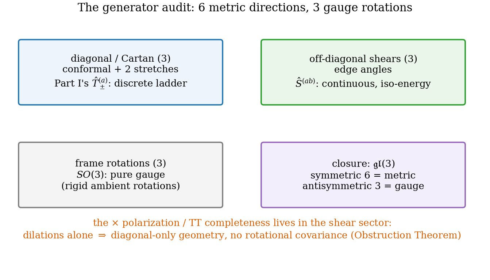
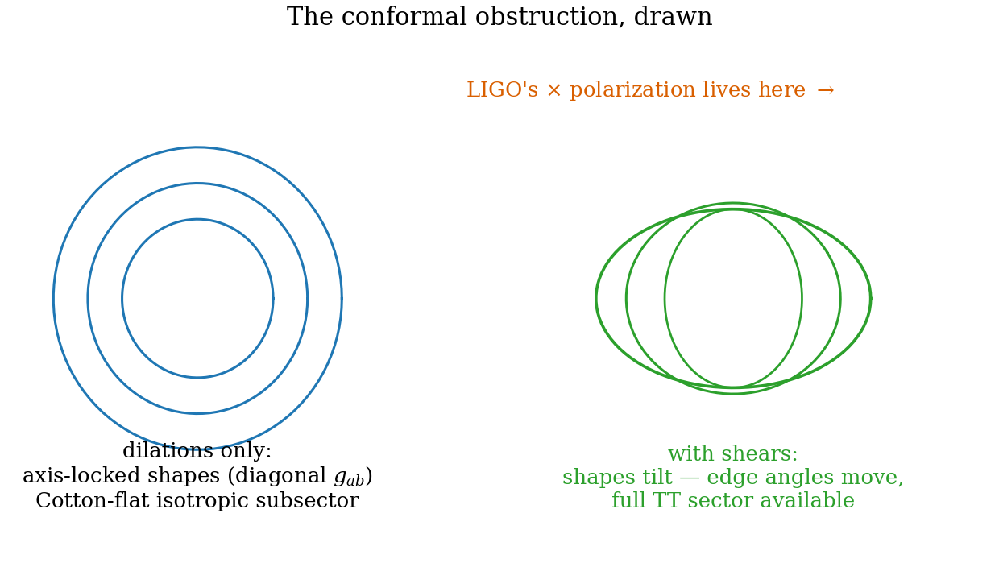

# Chapter 18 — A lattice of cells: the triad, the missing shears, and the conformal obstruction

---

The dictionary of Ch. 17 converts one box into one metric — a *homogeneous* geometry, a single dial per direction. General relativity is a theory of geometry that varies from place to place. The minimal upgrade is a **lattice of cells**: tile space, give each cell its own shape, and let the iso-energy machinery of Part I act cell by cell. This chapter builds the kinematics of that upgrade and discovers two things, one gratifying and one humbling. Gratifying: the cell description automatically produces the *triad* (vielbein) — the variable on which every modern gauge-theoretic formulation of gravity is built, and the one that standard treatments must postulate. Humbling: the transition operators inherited from Part I generate only *half* the metric — and the missing half is not a detail, because a theorem stands behind it: dilations change no angles, so geometry built from them alone stays locked to the lattice frame's diagonal — no rotational covariance, and only half a transverse–traceless sector: no gravitational waves of general relativity's type. Identifying the missing generators — the iso-energy **shears** — and verifying that the completed set closes on $\mathfrak{gl}(3)$ is this chapter's constructive payoff.

## 18.1 The cell lattice and its variables

Tile space with cells; the cell at lattice site $\mathbf x$ is a parallelepiped spanned by three **edge vectors** $\mathbf e_1(\mathbf x), \mathbf e_2(\mathbf x), \mathbf e_3(\mathbf x)$ (not necessarily orthogonal, not necessarily equal in length). The matter content of each cell is the box quantum mechanics of Part I, with quantum numbers $\mathbf n(\mathbf x)$. Two questions immediately: what is the coordinate-free description of a cell's shape? and what do the transition operators of Ch. 3 do to it?

## 18.2 The Metric Emergence Theorem

A cell's shape is exactly the information needed to measure lengths within it: for a displacement $\xi^a \mathbf e_a$ along the edges (the $\xi^a$ are the natural within-cell coordinates), the physical length is $\ell^2 = |\xi^a\mathbf e_a|^2$ — a quadratic form in the coordinates. Quadratic forms on coordinates *are* metrics:

> **Metric Emergence Theorem [Theorem].** The cell shape, up to rigid rotations in ambient space, is completely characterized by the **Gram matrix** of the edges,
>
> $$g_{ab}(\mathbf x) \;=\; \mathbf e_a(\mathbf x)\cdot\mathbf e_b(\mathbf x), \tag{18.1}$$
>
> symmetric and positive-definite by construction (the $\mathbf e_a$ span), with $g_{aa} = |\mathbf e_a|^2$ the squared edge lengths and $g_{ab}$ ($a \ne b$) the edge angles — six independent entries, matching the spatial metric of GR, written in the cell-frame coordinates $\xi^a$. A directional iso-energy transition dilates one edge, $\mathbf e_a \to \lambda\,\mathbf e_a$ with $\lambda = \tfrac{n_a+1}{n_a}$, and acts on (18.1) as the congruence update
>
> $$\hat T^{(a)}_+:\quad g \;\longrightarrow\; \big(\mathbb 1 + (\lambda - 1)P_a\big)\,g\,\big(\mathbb 1 + (\lambda - 1)P_a\big), \qquad P_a = \text{projector on frame direction } a, \tag{18.2}$$
>
> which at rectangular configurations ($g$ diagonal) is the rank-one update $\delta g = (\lambda^2 - 1)\,g_{aa}P_a \approx \tfrac{2}{n_a}\,g_{aa}P_a$ ($n_a \gg 1$), and rank-two off them. On the rectangular sector the particle energy is the coordinate-invariant pairing
>
> $$E \;=\; \frac{\pi^2}{2m}\,n_a\,n_b\;g^{ab} \qquad (g\ \text{diagonal}), \tag{18.3}$$
>
> with $g^{ab}$ the inverse Gram matrix — the 3D dictionary of Ch. 17. The pairing is exact **iff** the cell is rectangular; at a rectangular configuration the exact spectrum is *stationary at first order* in the off-diagonal (shear) entries, so (18.3) remains correct through first order in shear and is not a closed form beyond.
>
> *Proof.* (18.1): symmetry is manifest; positivity because $g_{ab}v^av^b = |v^a\mathbf e_a|^2 > 0$ for $v \ne 0$ when the $\mathbf e_a$ span; the components are read off the definition. (18.2): insert $\mathbf e_a \to \lambda\mathbf e_a$ into (18.1) — only row and column $a$ move; for diagonal $g$, only $g_{aa} \to \lambda^2 g_{aa}$. (18.3): for a rectangular cell it is Ch. 17's formula, $E = \tfrac{\pi^2}{2m}\sum_a n_a^2/|\mathbf e_a|^2$; first-order stationarity in shear is Ch. 19's Splitting Theorem (ii) — the cross-derivative perturbation has vanishing diagonal matrix elements in every product mode. $\blacksquare$

**The lesson the covariant shortcut teaches.** It is tempting to read (18.3) at non-diagonal $g^{ab}$ — "$n_a$ a covector, $g^{ab}$ an inverse metric, their pairing a scalar" — and declare it exact for arbitrary parallelepipeds. It is not, and the failure mode is worth a box of its own: a sheared cell's Dirichlet problem is not separable, no integer triple labels its exact levels, and the exact spectrum is *even* in the shear (the reflection $\xi^1 \to 1 - \xi^1$ flips the shear's sign and preserves the domain), while the shortcut's cross term $2n_1n_2\,g^{12}$ is *linear* in it. The vanishing of the linear response is exactly Ch. 19's Splitting Theorem (ii) — the two statements are one fact. **[Computed]** `ch18_metric_updates.py`: the sheared-cell spectrum is even in the shear to $2\times10^{-12}$; at $g^{12} = 0.30$ the shortcut misses the ground state by $29\%$ ($n = (1,1)$) and $26\%$ ($n = (1,-1)$), while the diagonal formula at the same stretch entries misses only the genuine $O(\text{shear}^2)$ shift ($1.5\%$).

One honesty note the construction owes the reader: the dot products in (18.1) presuppose an ambient Euclidean inner product for the container the edges live in — exactly as every vielbein construction presupposes the flat internal metric $\delta_{ij}$. What emerges is the *metric field* — position-dependent geometry as the bookkeeping of cell shape — not metricity as such.

The metric is not postulated; it is the unique coordinate-free bookkeeping of cell shape, and it *moves* when transitions fire. **[Computed]** (18.2) exercised over $200$ random transition sequences in `ch18_metric_updates.py`: congruence residual at machine zero ($3\times10^{-14}$); rank one at rectangular configurations, rank two off them.

*Figure 18.1 — Cells as geometry. A patch of the lattice with per-cell edge vectors (top); a sequence of directional transitions deforming one cell's shape ellipsoid and its $g_{ab}$ entries (bottom). (drawn)*

## 18.3 The triad recognized — and its gauge redundancy

Equation (18.1) deserves a stronger name than "bookkeeping". In components it reads $g_{ab} = \sum_i e^i_a\,e^i_b$: exactly the **vielbein (triad) decomposition** that underlies every gauge-theoretic formulation of gravity — Cartan's, Kibble–Sciama's (Ch. 16.9), and the Ashtekar variables of loop quantum gravity — with the edge label $a$ as the *coordinate* index and the ambient Cartesian index $i$ as the *internal (frame)* index. The accounting that matters:

$$\underbrace{9}_{\text{triad } e^i_a} \;=\; \underbrace{6}_{\text{metric } g_{ab}} \;+\; \underbrace{3}_{\text{local } SO(3) \text{ frame rotations}},$$

since a rigid rotation of the cell's edge triple in the ambient container, $e^i_a \to R^i{}_j\,e^j_a$ with $R \in SO(3)$, changes every edge and no dot product: (18.1) is untouched. In the standard treatments the triad is *introduced* so that spinors can couple to gravity, and its rotation redundancy is decreed. Here both arrive unbidden: the edges are physical objects of the cell model, and the freedom to rotate a cell rigidly without changing any within-cell measurement is *visibly* a redundancy of description — the first conceptual step of Ch. 23's frame-group gauging, supplied by the microscopic theory for free. (Relabeling the edges is, by contrast, *not* gauge in this sense but the lattice ancestor of a coordinate change: it moves $g_{ab}$ covariantly, as a metric should move. And Part II quietly needed the frame structure too: spinor boundary conditions live on frames, not metrics.)

## 18.4 Flatness of the single-cell kinematics

> **Flatness (Commutativity) Theorem [Theorem].** Directional transitions on a single cell commute:
>
> $$\big[\hat T^{(a)}_\pm,\, \hat T^{(b)}_\pm\big] = 0 \qquad \forall\, a, b.$$
>
> *Proof.* $\hat T^{(a)}$ acts only on the pair $(n_a, \mathbf e_a)$; different $a$ touch disjoint variables; both orderings land on the same final configuration (the explicit two-path check is one line per component). $\blacksquare$

The honest reading, calibrated carefully: commutativity is the discrete analogue of a *flat connection* — paths between the same endpoints in shape space compose identically — which is exactly right for a *single* cell, whose geometry is homogeneous (one point's worth of metric; nothing to curve). Curvature, in the gauge-theoretic sense Ch. 23 will need, must come from the *lattice*: transport around a closed loop of cells whose geometries disagree. The theorem is thus a consistency check with a built-in forecast: when inter-cell coupling arrives (Ch. 21–22), the deformed non-commutativity of transport is where the Riemann tensor will live. (And recall Ch. 3's slogan — kinematics telescopes, dynamics remembers: physical *amplitudes* along different paths already differ through spectator dressing; it is the bare kinematics that is flat.)

## 18.5 What the inherited generators span — and what they miss

Now the audit. Decompose the metric's six dimensions at a point, GR-style (Ch. 16.4):

$$g_{ab} = e^{2\phi}\,\hat g_{ab}, \quad \det\hat g = 1: \qquad 6 \;=\; \underbrace{1}_{\text{conformal }\phi} + \underbrace{5}_{\text{unimodular shape }\hat g}.$$

Group-theoretically, metrics live on the coset $GL(3)/SO(3)$, whose tangent space is the six-dimensional space of symmetric matrices. The directional transitions (18.2) move — at a rectangular cell — single *diagonal* entries of $g_{ab}$. Three independent directions: the **Cartan subalgebra** of the symmetric space. Composing them reaches any diagonal metric — the conformal factor plus two of the five shape directions (the anisotropic *stretches*; precisely the Bianchi-I configurations Ch. 20 will evolve). What no composition of them reaches: the three **off-diagonal** components — the *angles* between edges. No operator of Part I changes the angle between two edges; the rotational transitions one might hope to repurpose act on $\mathbf n$, not on the cell, and do not fill the gap.

> **Definition (iso-energy shear generators) [Definition].** The missing generators are
>
> $$\hat S^{(ab)}:\quad \mathbf e_a \;\to\; \mathbf e_a + \varepsilon\,\mathbf e_b \qquad (a \ne b), \tag{18.4}$$
>
> tilting the cell at fixed (to $\mathcal O(\varepsilon)$) volume. Iso-energy versions exist for a better reason than the selection-rule logic of Ch. 2 — no quantum-number jump is required at all: Ch. 19 proves the shears' energy cost vanishes identically at first order at every rectangular configuration. (The same theorem is what forbids reading (18.3) linearly in the shear — the lesson box of §18.2 and this definition are two faces of one fact.)

## 18.6 Why the gap is fatal if unfilled: the Conformal Obstruction Theorem

One might hope the diagonal sector is "enough gravity to start with". It is not, and the obstruction is a theorem about the configuration space, not aesthetics.

> **Conformal Obstruction Theorem [Theorem; Standard ingredients].** Directional dilations rescale edges and change no edge angles: a geometry sector generated by them alone produces only metrics *diagonal in the fixed lattice frame*, $g_{ab}(\mathbf x) = \mathrm{diag}\big(a_1^2, a_2^2, a_3^2\big)(\mathbf x)$, and, in its isotropic subsector, only the conformally flat family $\Omega^2(\mathbf x)\,\delta_{ab}$. (In three dimensions the correct diagnostic of conformal flatness is the **Cotton tensor**, which vanishes for that subsector; the 3D Weyl tensor vanishes identically for *every* metric and diagnoses nothing.) Consequently the theory:
>
> 1. **has no rotationally covariant geometry sector** — a cell cannot represent a shape whose principal axes tilt relative to the lattice frame, so the configuration space cannot even state, let alone realize, $SO(3)$ covariance of geometry coupled to matter;
> 2. **cannot carry the gravitational waves of general relativity** — of the two transverse–traceless polarizations of a wave along a lattice axis, the $+$ mode is a diagonal (stretch) deformation, but the $\times$ mode is an off-diagonal shear: half the TT sector is unreachable in every frame the theory can express, and no frame rotation exists to restore it. A pure conformal factor cannot wave at all.
>
> *Proof structure.* Dilations preserve all angles; exponentiated position-dependently they generate exactly the diagonal metrics over the rectangular reference, with $\Omega^2\delta_{ab}$ as the isotropic subfamily — conformally flat by definition, Cotton-flat by direct computation **[Standard]**. The TT decomposition of metric waves and their polarization content are **[Standard]**. $\blacksquare$

Two honest boundaries, stated so the theorem is not overread. *First*, it is a statement about the **spatial** sector only: conformally flat spatial slices do *not* by themselves preclude light bending — Schwarzschild's constant-time slices in isotropic coordinates are conformally flat, and starlight bends around the sun regardless. Verdicts about null geodesics belong to the assembled four-dimensional geometry, lapse included, and are delivered where that assembly exists (Ch. 24–25), not here. *Second*, the obstruction is *kinematic*, which is what makes it sharp: it is not that dilation-only dynamics has the wrong action (Ch. 23 will add that, too — the invariant pure-scale actions start at four derivatives), but that the **configuration space itself** is too small. No clever Lagrangian on a diagonal-only configuration space produces the $\times$ polarization or a rotationally covariant coupling of geometry to matter. Either the shears (18.4) exist as physical generators of the cell dynamics, or the program stops here. The thesis takes the first branch, with consequences immediately testable in this Part: the shear sector must carry the gravitational waves — a prediction Ch. 25 confirms with the measured coefficient.

*Figure 18.2 — The generator audit. The six metric directions (symmetric matrices) split into the diagonal/Cartan sector reached by Part I's transitions (conformal + 2 stretches) and the off-diagonal shear sector (3 angles) reached only by $\hat S^{(ab)}$; the three frame rotations are gauge. Callouts: the $\times$ polarization and TT completeness live in the shear sector; a diagonal-only geometry sector is not rotationally covariant.*

*Figure 18.3 — The obstruction, drawn. Dilations alone reach only frame-diagonal metrics — no off-diagonal $g_{ab}$, no $\times$ polarization, no $SO(3)$ covariance; the shear generators $\hat S^{(ab)}$ fill exactly the missing sector. (drawn)*

## 18.7 Closure: the full kinematic algebra

Assemble the inventory: three directional dilations (diagonal, symmetric), three shears $\hat S^{(ab)}$ (off-diagonal, symmetric, by symmetrizing (18.4)), three frame rotations (antisymmetric, gauge). Their commutators close on the Lie algebra

$$\mathfrak{gl}(3) \;=\; \underbrace{\mathfrak{so}(3)}_{\text{3: gauge rotations}} \;\oplus\; \underbrace{\text{Sym}(3)}_{\text{6: metric directions}} \qquad \text{(as a vector space — the Cartan decomposition; } [\text{Sym}, \text{Sym}] \subset \mathfrak{so}(3)\text{, not a subalgebra)}, \tag{18.5}$$

with the symmetric part acting transitively on the space of metrics $GL(3)/SO(3)$ and the trace of $\mathfrak{gl}(3)$ — the overall dilation — being exactly the Weyl direction of Ch. 17.5. *Nothing missing, nothing extra*: the completed cell kinematics carries precisely the local degrees of freedom of a spatial geometry plus the frame gauge that spinors require. **[Computed]** the span and closure relations (rank $9/9$; commutator closure residual $2\times10^{-16}$) and the transitivity statement (fifty random SPD metrics realized exactly as edge Gram matrices) are verified numerically in `ch18_metric_updates.py`.

## 18.8 Summary

A lattice of cells upgrades the dictionary to a *field* of metrics, with the triad derived (18.1), transitions acting as congruence updates (18.2) — rank-one on the rectangular sector — single-cell kinematics flat (as it must be), and the energy pairing (18.3) exact on the rectangular sector and first-order-stationary off it. The audit found Part I's generators spanning only the diagonal sector; the **Conformal Obstruction Theorem** shows that stopping there forfeits rotational covariance and the $\times$ half of the gravitational-wave sector; the iso-energy **shears** (18.4) complete the algebra to $\mathfrak{gl}(3)$ (18.5). Two questions now stand, and they organize the next two chapters: *what is the quantum geometry of the completed shape space?* (Ch. 19 — where the diagonal and shear sectors turn out to play structurally different roles, in exact parallel to the DeWitt split), and *what dynamics does the sector traffic of Part I induce on it?* (Ch. 20 — where the coupling law selects, or fails to select, general relativity's orbits).

---

**Validation.** `ch18_metric_updates.py` (new; every quoted number printed): $\mathfrak{gl}(3)$ span and commutator closure of {dilations, shears, rotations} (rank $9/9$, residual $2\times10^{-16}$); the congruence update (18.2) over $200$ random transitions (residual $3\times10^{-14}$; rank one at rectangular configurations, rank two off them); transitivity (fifty random SPD metrics realized as Gram matrices, residual $4\times10^{-15}$); the covariant-shortcut negative control (sheared-cell spectrum even in the shear to $2\times10^{-12}$; shortcut off by $29\%$/$26\%$ at $g^{12} = 0.30$ against $1.5\%$ for the diagonal formula) and the rectangular positive control ($6\times10^{-5}$, discretization). Figures 18.1–18.2 are drawn schematics.
