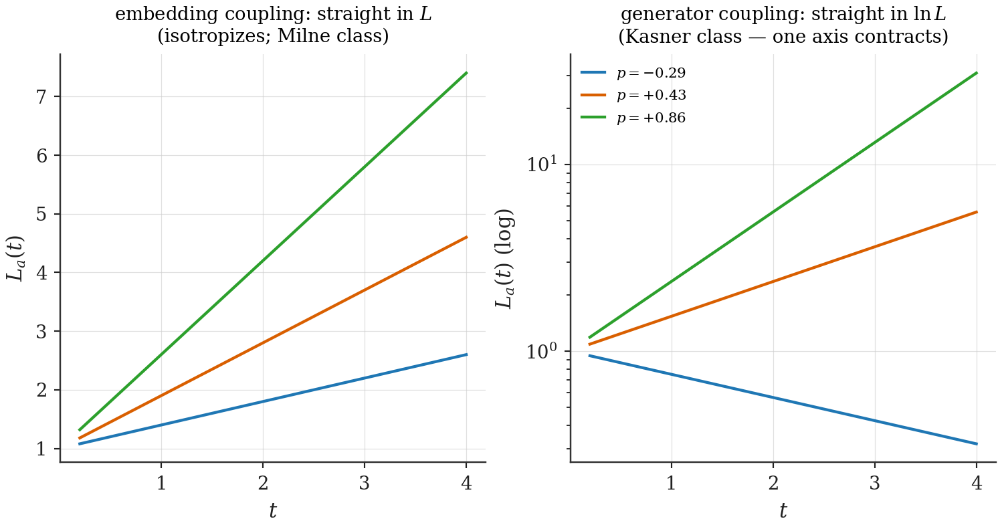
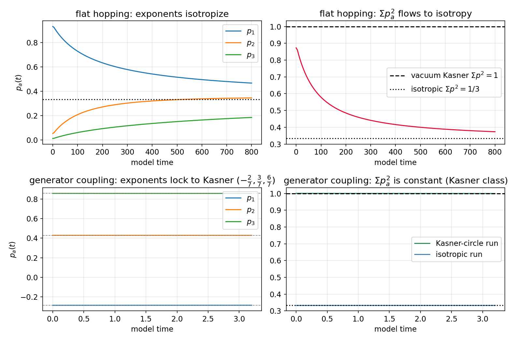
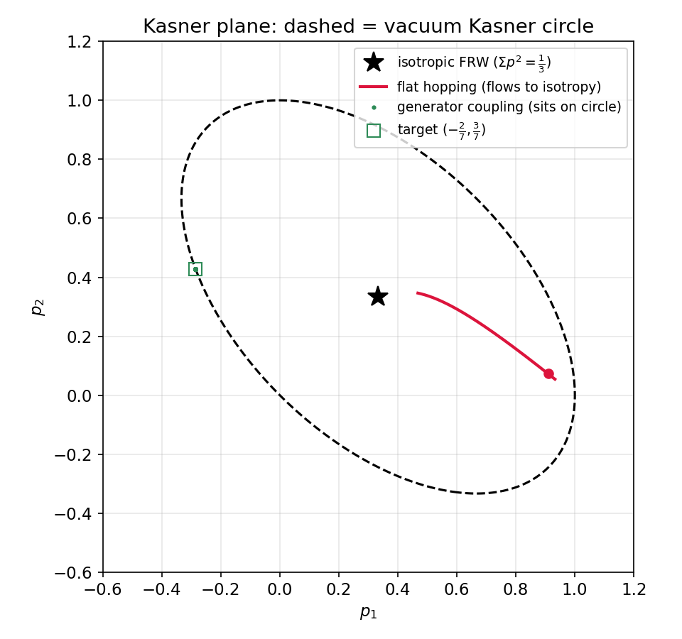
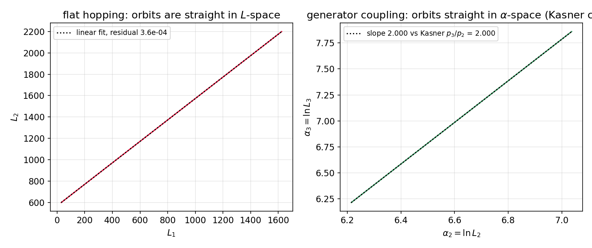
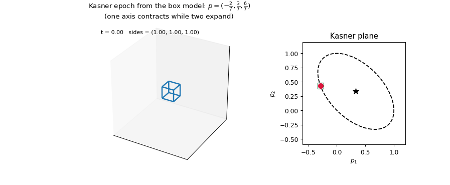
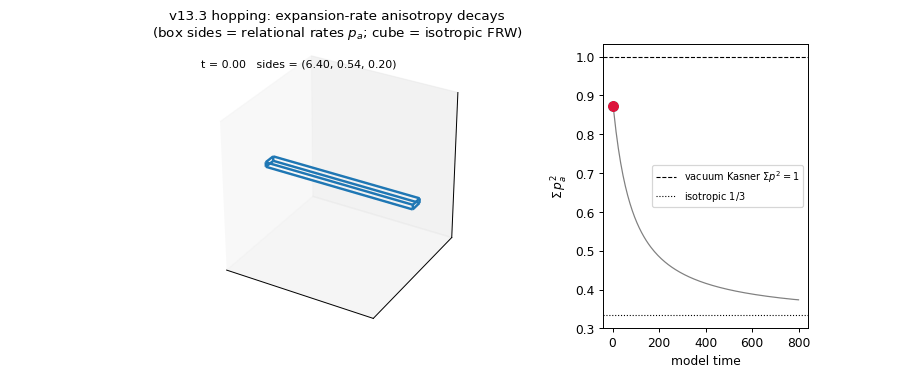

# Chapter 20 — Minisuperspace dynamics: the Kasner Selection Theorem

---

Everything is now in place to run the model as a universe and grade it against general relativity. The cell's diagonal sector is a three-axis copy of Part I's ladder (Ch. 18–19); the dictionary says its rungs are scale factors (Ch. 17); and GR's verdict for this configuration space — homogeneous, flat, anisotropic — is unforgiving and specific: vacuum Bianchi-I universes follow **Kasner orbits**, straight lines in $\alpha_a = \ln a_a$ with exponents on the circle $\sum p_a = \sum p_a^2 = 1$, one axis always contracting (Ch. 16.6). The question of this chapter is whether the quantum ladder reproduces that — and the answer turns out to hinge, completely, on the one dynamical choice Part I left open: *which operator couples neighbouring geometry sectors*. The embedding coupling lands in the wrong universality class (instructively wrong — it isotropizes, like Bianchi-I with matter). The dilation-generator coupling — whose matrix element $\langle n{+}1|x\partial_x|n\rangle = \tfrac{2n(n+1)}{2n+1}$ was computed in Ch. 3 with a promissory note attached — lands *exactly* on the Kasner class. The note is hereby redeemed: half a page of trigonometric integrals in Chapter 3 selects the orbit family of general relativity.

## 20.1 The minisuperspace limit of the ladder

The geometry dynamics per axis is the tight-binding chain of Ch. 4,

$$H_{\text{geo}} = \sum_n t(n)\,\big(|n{+}1\rangle\langle n| + \text{h.c.}\big),$$

now with the hopping law $t(n)$ left general — it encodes the sector-coupling operator. A wavepacket centered at rung $n$ with lattice quasimomentum $\theta$ feels the local dispersion

$$\omega(n, \theta) \;=\; 2\,t(n)\,\cos\theta, \tag{20.1}$$

in the raw $+t$ convention of Ch. 4's toolbox (eq. 4.4's derivation), not the relabeled band of (4.3) — the two differ by $\theta \to \pi - \theta$ and agree at the band-center fixed points used below —

and the centroid obeys Hamilton's equations on the lattice phase space ($n$ position-like, $\theta$ conjugate):

$$\dot n \;=\; \frac{\partial \omega}{\partial \theta} \;=\; -\,2\,t(n)\,\sin\theta, \qquad \dot\theta \;=\; -\,\frac{\partial\omega}{\partial n} \;=\; -\,2\,t'(n)\,\cos\theta. \tag{20.2}$$

(The standard stationary-phase derivation; corrections are the wavepacket-width effects quantified in §20.5.) Everything now hinges on $t(n)$. Two candidates present themselves, both already in the thesis:

**(a) The embedding coupling** — sectors coupled by $g\,\iota$ as in Ch. 6. The hopping inherits the promoted-mode overlap: $t(n) = \bar\lambda\,\sqrt{n/(n+1)} \to \bar\lambda$, asymptotically **constant**.

**(b) The generator coupling** — sectors coupled by the dilation generator $\hat D$ of Ch. 3, the operator that implements the scale similarity $(n, L) \to (\lambda n, \lambda L)$ of Ch. 2. The hopping inherits the Lemma's matrix element: $t(n) = g\,\tfrac{2n(n+1)}{2n+1} \approx g\,(n + \tfrac12)$, asymptotically **linear**.

Constant versus linear: the entire fate of the model's cosmology sits in that difference.

## 20.2 Case (a): the embedding law — ballistic in $L$, the isotropizing class

With $t \to \bar\lambda$ constant, $t' \to 0$: by (20.2), $\theta$ is conserved and $\dot n = $ const — **ballistic motion in $n$**, i.e. in $L$ (rungs are sizes). Orbits are straight lines *in $L$-space*. Run three axes with velocities $v_a$ and translate to the relational exponents of Ch. 16.6 ($\alpha_a = \ln n_a + $ const along the ladder):

$$p_a(t) \;=\; \frac{\dot\alpha_a}{\sum_b \dot\alpha_b} \;=\; \frac{v_a/n_a}{\sum_b v_b/n_b} \;\xrightarrow{\;t\to\infty\;}\; \frac13, \qquad \Sigma_K \;=\; \sum_a p_a^2 \;\longrightarrow\; \frac13. \tag{20.3}$$

(The axis with the largest $n_a$ contributes the smallest $\dot\alpha_a$; late times equalize all three.) The embedding-coupled universe **isotropizes**: whatever anisotropy it starts with, expansion rates converge — qualitatively the behaviour of Bianchi-I *with soft matter*. Run backwards, the same algebra makes $\Sigma_K$ *grow* toward the Kasner circle: the model knows that **collapse amplifies anisotropy**, the seed of BKL behaviour (Ch. 24). But the orbits are straight in $L$, not in $\ln L$ — a Milne-like universality class. Respectable physics; not vacuum general relativity.

## 20.3 Case (b): the generator law — the Kasner Selection Theorem

GR's vacuum orbits need $\dot\alpha_a = \dot n_a/n_a = $ const, i.e. hopping **linear in $n$**. Is there a *principled* origin for that? Chapter 3's Lemma answers: coupling the sectors through the dilation generator — the operator implementing the model's defining homogeneity $(n, L) \to (\lambda n, \lambda L)$; a distinguished choice, though honestly a *choice* (the similarity is a spectrum-preserving map, not a Noether symmetry with a conserved charge) — gives exactly $t(n) = g(n + \tfrac12)$. And the semiclassical flow acquires a beautiful rigidity:

> **Kasner Selection Theorem [Theorem].** With generator coupling $t(n) = g\,(n + \tfrac12)$ per axis (couplings $g_a$, $a = 1, 2, 3$):
>
> (i) the dispersion $\omega = 2g\,n\cos\theta$ (large $n$) is conserved along (20.2), so $n\cos\theta$ is an invariant of each axis's flow;
>
> (ii) $\theta = \pm\tfrac\pi2$ are fixed points of the $\theta$-flow, on which
>
> $$\dot\alpha \;=\; \frac{\dot n}{n} \;=\; \mp\,2g \;=\; \text{const}:$$
>
> exact ballistic motion **in $\alpha$-space** — straight lines in $\ln a_a$;
>
> (iii) per axis, choose one of the two fixed points — a sign vector $\sigma_a \in \{+1, -1\}$, $\theta_a = -\sigma_a\tfrac\pi2$ ($\sigma_a = +1$: expanding). Then $\alpha_a(\tau) = 2\sigma_a g_a\tau + $ const, hence **constant relational exponents**
>
> $$p_a \;=\; \frac{\sigma_a\,g_a}{\sum_b \sigma_b\,g_b}\,,\qquad \sum_a p_a = 1 \;\;\text{automatic}, \qquad \Sigma_K = \sum_a p_a^2 \;\;\text{set by the } (g_a, \sigma_a)$$
>
> — straight lines in $\ln a_a$ with constant exponents: the **generalized-Kasner orbit family**, and the sign choice is load-bearing — with all $\sigma_a = +1$ the reachable exponents are all-positive ($\tfrac13 \le \Sigma_K < 1$, strictly *inside* the vacuum circle); reaching the circle itself, where one exponent is negative, *requires* a mixed sign vector. The family is the full plane $\sum_a p_a = 1$: it contains GR's Kasner/Jacobs class ($\tfrac13 \le \Sigma_K \le 1$), with the couplings playing the role Kasner's constants $c_a = VH_a$ play in GR, but it is strictly larger — mixed signs also reach $\Sigma_K > 1$, which in GR would require negative-energy stiff matter. Landing exactly *on* the vacuum circle is a codimension-one condition on the $(g_a, \sigma_a)$.
>
> *Proof.* (i): $\omega$ is the Hamiltonian of (20.2). (ii): $\dot\theta \propto \cos\theta = 0$ at $\theta = \pm\pi/2$; there $\dot n = \mp 2g\,n\cdot 1$ (using $t \approx gn$), so $d\ln n/dt = \mp2g$. (iii): exponentiate per axis with the chosen signs; $\sum p_a = 1$ is the definition of relational exponents; the reachable set is the whole plane because any target with $\sum_a p_a = 1$ is hit by $\sigma_a = \operatorname{sgn} p_a$, $g_a \propto |p_a|$ (the denominator is then $\sum_a |p_a|\operatorname{sgn}p_a \cdot$const $= $ const$\cdot\sum p_a > 0$). $\blacksquare$

One piece of stability fine print, stated so the theorem is not overread. The invariant of (i) cuts both ways: a trajectory carrying $C \equiv n\cos\theta \ne 0$ leaves the *contracting* fixed point once $n$ falls toward $|C|$ and turns around at $n_{\min} = |C|$ — exact perpetual contraction is the measure-zero launch $C = 0$, and a quantum packet's $\theta$-spread sets a floor. (Expansion is the benign direction: growing $n$ drives $\cos\theta \to 0$, *toward* the fixed point.) In the runs below the floor sits at $n_{\min} \approx 8$ against contracting trajectories that stay above $n \approx 400$: the Kasner epoch is exact for as long as it lasts, and the eventual turnaround is the model's own small-$n$ quantum regime announcing itself (§20.5).

Two readings of the theorem, one per audience. *For the relativist:* the model's hopping law is its lapse-and-dynamics choice, and the similarity generator selects the GR orbit family — the discrete ladder, coupled through the operator of its own homogeneity, "knows" Kasner. *For the quantum mechanic:* equation $\langle n{+}1|x\,d/dx|n\rangle \approx n + \tfrac12$ — an undergraduate integral — is the entire mechanism; no continuum input, no metric ansatz, no Einstein equations were consulted.

What the theorem does **not** fix is $\Sigma_K$: the orbit may sit *on* the vacuum circle ($\Sigma_K = 1$), *inside* it (matter-like, down to FRW at $\tfrac13$), or — with mixed signs — *outside* it ($\Sigma_K > 1$, the regime GR assigns to negative-energy stiff matter, which nothing in the ladder kinematics forbids). All of that is initial data here, exactly as $c_a$ are initial data in GR. In GR the freedom is curtailed by the Hamiltonian constraint — the energy budget between geometry and matter — which with non-negative matter energy both selects $\Sigma_K \le 1$ and excises the unphysical exterior. The model's version of that constraint is Chapter 21's business, and excluding $\Sigma_K > 1$ is explicitly part of what it must do; in this chapter's simulations $\Sigma_K$ is dialed through the $(g_a, \sigma_a)$, and the honest scorecard says so — the $u = 2$ run below lands on the circle because the couplings are *tuned* to a circle point (codimension one), not because the dynamics prefers it.

*Figure 20.1 — The selection. Same ladder, two coupling laws. Embedding coupling (left): straight in $L$, exponents flowing to $\tfrac13$ — the isotropizing class. Generator coupling (right): straight in $\alpha = \ln L$, exponents locked — the Kasner class. The sector-ladder diagram of Fig. 3.1 reappears with its rungs relabeled as scale factors.*

## 20.4 The simulations: a quantum wavepacket does Kasner cosmology

The theorem is semiclassical; the universe of the model is a quantum state. So the verification runs **genuine quantum wavepackets** — no semiclassical shortcut — on three chains of up to $5200$ rungs (sparse Krylov propagation; methods in App. C), measuring $\langle n_a\rangle(t)$, $\alpha_a = \ln\langle n_a\rangle$, the relational exponents $p_a(t)$, and $\Sigma_K(t)$. The simulated hopping is $t(n) = g\,(n + \tfrac12)\sqrt{n/(n+1)}$ — the generator element dressed by the overlap toll of Ch. 3 — which agrees with $g(n + \tfrac12)$ to $O(1/n)$, so the theorem applies verbatim in the large-$n$ regime the packets occupy. **[Computed]** (`ch20_kasner_sim.py`):

**Vacuum-Kasner point.** Generator coupling, $g_a \propto |p_a^{\text{target}}|$ and $\sigma_a = \operatorname{sgn} p_a^{\text{target}}$ — the sign vector of Thm 20.1(iii) — for the $u = 2$ Kasner point $p^{\text{target}} = (-\tfrac27, \tfrac37, \tfrac67)$, packets at the corresponding $\theta_a = -\sigma_a\tfrac\pi2$ fixed points (axis 1 contracts):

| quantity | measured | predicted |
|---|---|---|
| $\dot\alpha_a$ | $(-0.1712,\ +0.2570,\ +0.5140)$ | $\mp 2g_a = (-0.1714,\ +0.2571,\ +0.5143)$ |
| $p_a$ (mid-time) | $(-0.2855,\ 0.4284,\ 0.8571)$ | $(-0.2857,\ 0.4286,\ 0.8571)$ |
| $\Sigma_K$ | $0.9997$ | $1$ |

Read the scorecard precisely, because what is derived and what is dialed are different things. *Derived* — the dynamics' own output: exponents locked constant, orbits straight in $\alpha$-space, $\Sigma_K$ constant in time, and the rate law $\dot\alpha_a = \mp 2g_a$ to three–four digits. *Dialed* — initial data, exactly as Kasner's constants $c_a$ are in GR: *where* on the circle the universe sits (the $g_a$ were targeted at the $u = 2$ point, one of them at the contracting fixed point). The quantum universe then holds that vacuum point to three–four digits, one axis contracting while two expand. A second run with equal couplings lands at $\Sigma_K = 0.3333$ — the isotropic FRW point to four digits — demonstrating that the generator-coupled ladder populates the matter-like interior as well; the orbit-geometry check confirms straight lines in $\alpha$-space with slope ratios $\alpha_3'/\alpha_2' = p_3/p_2 = 2$ as the $u = 2$ point requires.

**Isotropization run.** Embedding coupling, packets launched at $n^0 = (30,\ 600,\ 2500)$ — a violently anisotropic start, $\Sigma_K(0) \approx 0.83$: the exponents flow monotonically to $\Sigma_K = 0.374$ and onward toward $\tfrac13$, with orbits straight in $L$-space to one part in $10^4$ — case (a) verified in the same code that verifies case (b), which is the cleanest internal control available.

*Figure 20.2 — Exponents vs time for both couplings: locked constants (generator/vacuum run) vs the monotone flow to $\tfrac13$ (embedding run), with $\Sigma_K(t)$ tracks.*

*Figure 20.3 — Both dynamics on the $(p_1, p_2)$ plane: the generator-coupled state pinned to the Kasner circle at the $u = 2$ point; the embedding-coupled state spiraling into the FRW center.*

*Figure 20.4 — The orbit-space discriminant: $L$-linear (embedding) versus $\alpha$-linear (generator) trajectories; the slope ratio check $p_3/p_2 = 2$.*

*Animation 20.A — The vacuum-Kasner run: the physical box flattening along axis 1 while stretching along 2 and 3, beside the state pinned to the Kasner circle. Rendered from the saved quantum trajectories, not cartoons.*

*Animation 20.B — The embedding-coupled run: the expansion-rate box relaxing from needle to cube as $\Sigma_K \to \tfrac13$ — matter-like isotropization.*

## 20.5 Quantum corrections, measured for free

Because the simulations are genuinely quantum, the packets spread (e.g. $\sigma_n = 40$ at $\langle n\rangle = 4100$), and the theorem's semiclassical pedigree can be stress-tested rather than assumed. The relational exponents prove **self-averaging**: the spread enters $p_a$ only at relative order $\mathrm{Var}(n)/\langle n\rangle^2 \sim 10^{-4}$ — the same order as the residuals in the table above. Two morals: the emergent cosmology is *robust against the quantum fluctuations of geometry* in the large-$n$ (late-time) regime; and the corrections **grow toward small $n$** — early times — exactly where one expects quantum gravity to bite. The model thus comes with its own, calculable quantum-cosmology regime built in; probing it is flagged in Ch. 27.

## 20.6 Summary and the missing law

The minisuperspace limit of the geometry ladder is classical mechanics with the hopping law as sole input (20.1)–(20.2). The **Kasner Selection Theorem** then splits the candidates: embedding coupling → Milne-like, isotropizing (with the physically pregnant corollary that contraction amplifies anisotropy); generator coupling → *exactly* the Kasner/Jacobs class, verified by genuine quantum simulation to three–four digits, contracting axis and all. What no coupling law fixes is the energy budget — the value of $\Sigma_K$, vacuum circle versus matter interior — which in GR is the Hamiltonian constraint's job. Importing, closing, and ultimately deriving that constraint is the arc of the next two chapters; with it, the same ladder that just did Kasner will do Friedmann, growth, and collapse.

---

**Validation.** `ch20_kasner_sim.py` (adapted from the archived `scripts/ports/kasner_sim.py`; uses the shared `ladder` module, App. C.3): both coupling laws, the fixed-point launch, exponent/Σ_K extraction, the table above, orbit-geometry fits, packet-width tracking (including the $\sigma_n = 40$ at $\langle n\rangle = 4100$ flat-hopping embedding run of §20.5); writes `data/ch20_kasner_traj.npz` and regenerates Figs. 20.2–20.4. Animations reused from the validated archive (`scripts/ports/make_anims.py` renders them from the saved trajectories). Every number quoted is printed by the simulation script (orbit-fit residuals appear in the figure legends).
