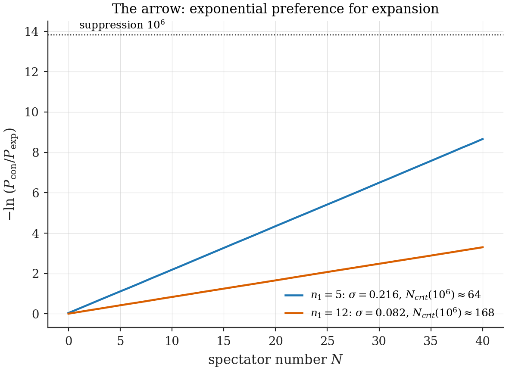
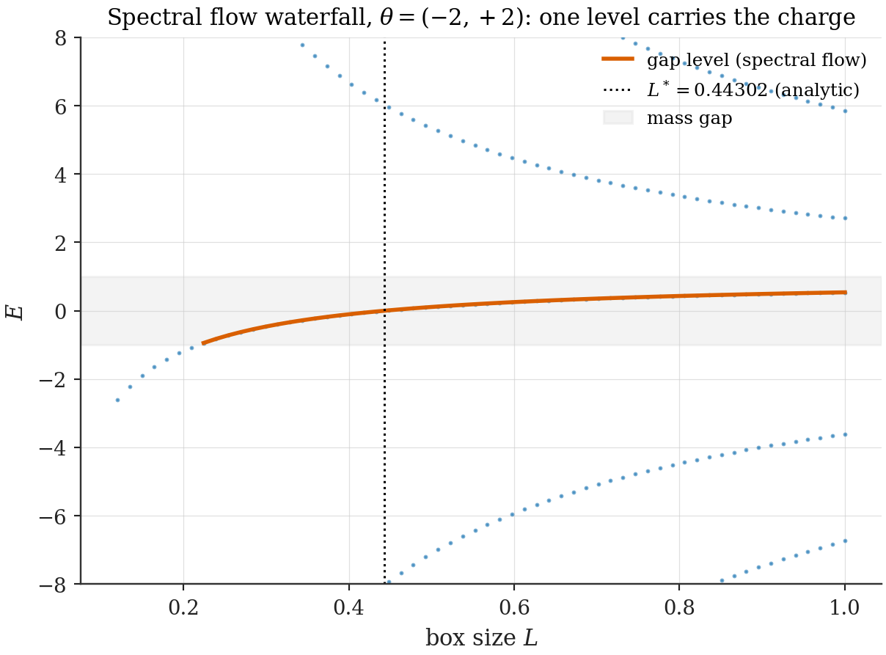
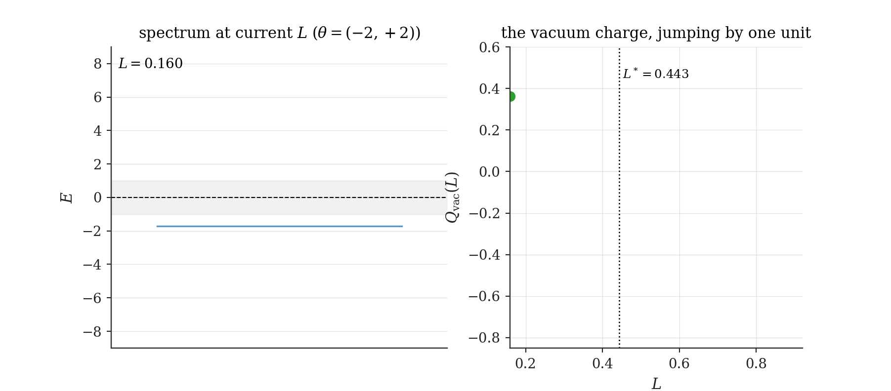
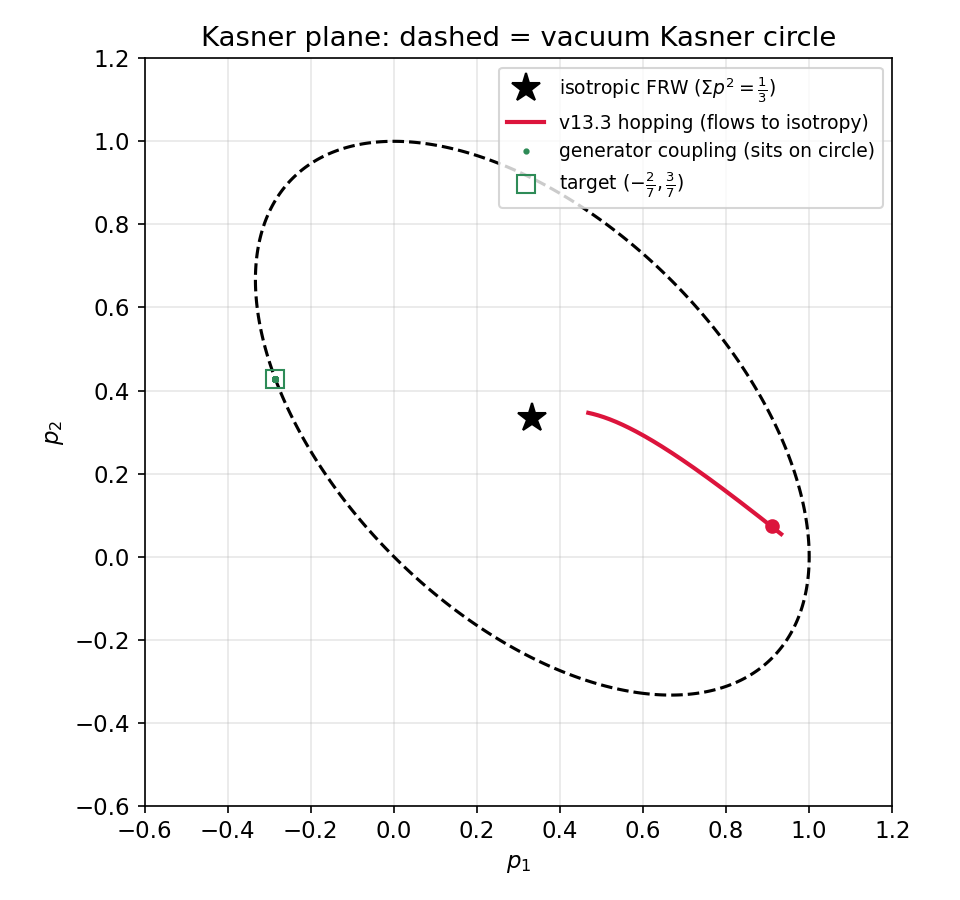
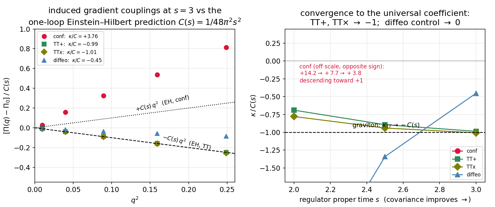
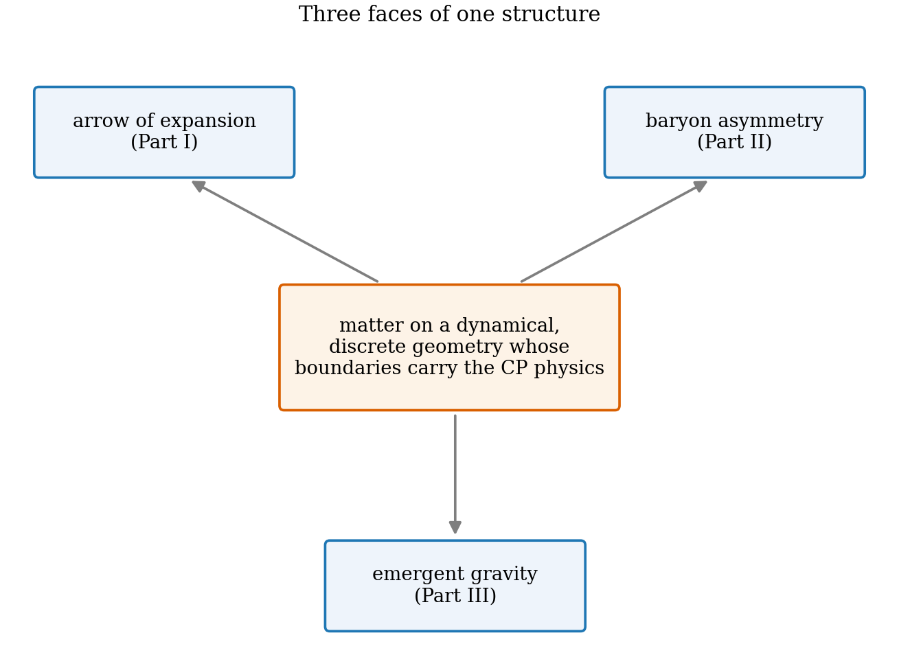
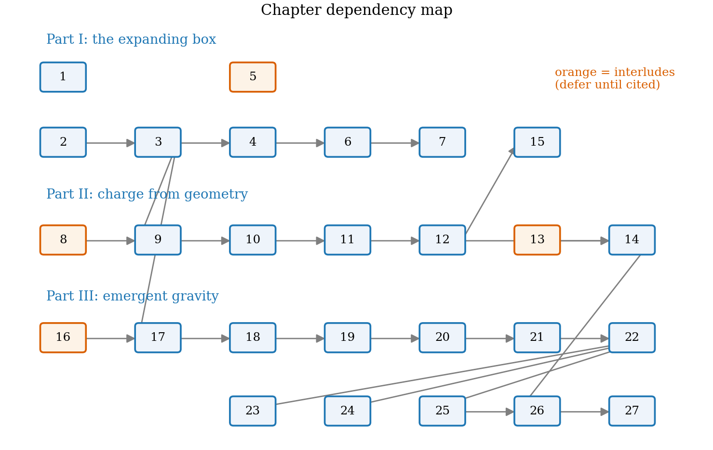

# Chapter 1 — Introduction: three puzzles, one box

---

## 1.1 What this document is, and why you should be suspicious of it

This document claims that three of cosmology's structural facts — that the universe expands rather than contracts, that matter exists in the first place, and that geometry obeys Einstein-like dynamics down to a massless two-polarization graviton — emerge from a single mechanism whose starting point is the first system every quantum mechanics student meets: a particle in a box.

You should not believe that on first hearing. Stated all at once, it pattern-matches to a familiar and almost always disappointing genre: the theory of everything built on a toy model, long on unification and short on numbers, allergic to the one question that matters — *what would prove this wrong?* The author is aware of the pattern-match. This introduction is therefore written for the skeptical reader, and it makes its case the only way that genre permits: not by enthusiasm, but by exhibiting **sharp numbers attached to falsifiable structures, with the test suite included**. Three facts about this document's construction, up front:

- **Every claim is labeled.** Six tags — **[Theorem]** (proved in full), **[Computed]** (converged numerics, every number printed by a named script), **[Standard]** (established literature), **[Postulate]**, **[Conjecture]**, **[Open]** — and the labels are enforced, including on the claims the framework would most enjoy overstating. §1.7 lists what is *not* claimed.
- **Everything is regenerable.** One command (`run_all.py`) reruns every computation and reprints every quoted number; even the schematic drawings are generated by script. There is nowhere for a fudged figure to hide.
- **The framework has already survived its own autopsy.** Its development included a wrong result — a convergent, symmetry-respecting "matter-creation signal" that an earlier stage of this program took seriously — which the framework's own theorems later killed and *diagnosed*, exactly (it was vacuum polarization, not charge; Ch. 11). The corrected mechanism that replaced it is stronger than the artifact ever was. A framework that can catch its own errors at theorem strength has earned a hearing; §1.4 tells that story rather than hiding it.

What follows is the shortest honest path through the claims, each with its best evidence. The reader with one hour should read this chapter and the six chapters it points at. The reader with one minute should look at the four figures below and the table in §1.8.

## 1.2 The observation, and the single wager

The energy levels of a particle in a box of width $L$ satisfy an exact homogeneity:

$$E_n(L) = \frac{n^2\pi^2\hbar^2}{2mL^2} \qquad\Longrightarrow\qquad E_{\lambda n}(\lambda L) = E_n(L).$$

Stretch the box and promote the quantum number in proportion; the energy does not move — the de Broglie wavelength is the invariant. A mathematical triviality, taught everywhere, used nowhere. On it, this document places exactly one structural wager **[Postulate]**: *the box size is a quantum variable*, and the elementary dynamics of geometry is the discrete energy-preserving step this homogeneity singles out — $n \to n \pm 1$ with $L \to \frac{n\pm1}{n}L$. The arena this forces (Ch. 3) is a Hilbert space that is a direct sum over geometries, with computable overlap amplitudes pricing every transition. There are no further wagers and no tunable functions: the step sizes, the overlap costs $\sqrt{n/(n+m)}$, the coupling operators are all fixed by the structure. Whatever comes out, comes out.

Three things come out.

## 1.3 First payoff: why the universe expands

Put $N$ particles in the box and let one drive an iso-energy step. Every other particle — every *spectator* — must ride along, and the fare is direction-dependent: riding into a **larger** box costs nothing (extension of the wavefunction by zero is an isometry — probability exactly conserved, kinetic energy exactly conserved: two theorems, Ch. 6), while riding into a **smaller** box costs each spectator a computable overlap deficit, because part of its wavefunction has nowhere to go. The deficits *multiply* across spectators:

$$\frac{P_{\text{contract}}}{P_{\text{expand}}} \;=\; \Big(1 - \frac{1}{n_1^2}\Big)\prod_{\alpha=1}^{N}\mathcal N_{\text{con}}(n_1, n_{2,\alpha}) \;\sim\; e^{-\sigma N}, \qquad \sigma \approx \frac{1}{n_1} \quad \textbf{[Theorem]}.$$

For any macroscopic occupancy the ratio is zero by every physical standard. **The arrow of expansion is not an initial condition; it is a counting argument** — the same logical species as the second law. And the two historic soft spots of this argument (that projection norms are transition probabilities, and that spectator factors multiply) are not assumptions here: both are *derived*, as first-order perturbation theory on the geometry arena, and verified against exact unitary evolution **[Theorem + Computed]** (Ch. 6).

*The arrow, measured: the log-suppression of contraction grows linearly with spectator number, at the predicted slope. (`ch06_norms.py`.)*

## 1.4 Second payoff: where the matter came from — including the error we caught

Can the growing box *create* anything? Make the matter a Dirac field (walls included honestly: MIT/chiral bag boundary conditions) and ask whether expansion makes more particles than antiparticles. Here sits the document's centerpiece theorem, and it is a destructive one **[Theorem]** (Ch. 9):

$$\Delta Q_{\text{net}} \;=\; -\tfrac12\,\big[\eta(\text{before}) - \eta(\text{after})\big],$$

— the net charge created by *any* sudden geometry change is purely **spectral**: it is the change in the regulated asymmetry $\eta = \sum_k \operatorname{sgn}(E_k)$ of the Dirac spectrum, an integer-quantized, cutoff-independent, anomaly-protected count of energy levels dragged through zero. No Bogoliubov mode sum required — or trusted.

This theorem kills things, and the first thing it killed was ours. A bulk CP-violating mass phase — the natural candidate source of matter–antimatter bias — produces beautiful-looking truncated "charge asymmetries": reproducible, convergent, odd in the phase to machine precision. The Master Theorem says they cannot be charge (the spectrum stays exactly mirror-symmetric — proved twice over, Ch. 10, including by an independent radial ODE check at the $10^{-11}$ level), and the framework's own analysis then identified what the numbers actually were: a *redistribution of vacuum polarization between the walls*, computed in closed form and matched numerically **[Theorem + Computed]** (Ch. 11). The signal was real; the observable was wrong. We know precisely how wrong, and the diagnosis is now a named theorem with a built-in control experiment.

The corrected mechanism is better than the artifact: CP violation that lives **on the walls** — mismatched chiral boundary angles — genuinely tilts the spectrum, charges the vacuum by the fractional law $Q_{\text{vac}} = -\Delta/2\pi$ (the Goldstone–Wilczek anomaly coefficient, recovered numerically at the percent level), and hosts a level crossing at an *analytically known* box size, $\tanh(mL^*) = -\cos(\Delta/2)/\cos\Sigma$. Expand across the crossing and exactly one unit of charge is pumped:

$$\Delta Q_{\text{pump}} = +1.0000 \;\textbf{[Computed]}, \qquad \Delta Q_{\text{control}} = -0.0000 \;\textbf{[Computed]}$$

(`ch12_pump_control.py`; the control runs the identical quench with matched walls, where the theorem demands zero — and gets it). The cosmological estimate built on this engine (Ch. 14) is a *probability times a sign bias*, with one honestly open factor, named, budgeted, and assigned its deciding calculation.

*The mechanism in one picture: the bag spectrum vs box size — mirror pairs everywhere except one level crossing the gap at the predicted $L^* = 0.44302$, carrying exactly one unit of charge. (`ch12_waterfall.py`.)*

*And in motion: the spectrum as the box expands (left), the vacuum charge jumping by one quantized unit at $L^*$ (right).*

## 1.5 Third payoff: gravity, with the dials removed

The deepest claim needs the least apology, because it is the most falsifiable. A box of size $L$ *is* — by exact change of variables, not analogy — a unit box with spatial metric $g = L^2$ (Ch. 17); a lattice of cells therefore carries a triad-valued geometry field, derived rather than postulated (Ch. 18). The question "is this gravity?" then becomes a sequence of measurements against general relativity's non-negotiables, and the model was given no dials to tune:

- **Kasner:** coupling geometry sectors through the framework's own symmetry generator — whose matrix element $\langle n{+}1|x\partial_x|n\rangle = \tfrac{2n(n+1)}{2n+1}$ is an undergraduate integral — locks a quantum wavepacket onto the vacuum Kasner circle: $\Sigma_K = 0.9997$ against GR's $1$, one axis contracting while two expand, exponents to four digits **[Theorem + Computed]** (Ch. 20).
- **Friedmann, growth, collapse:** closing the energy budget yields $a \propto t^{2/3}$ and $t^{1/2}$ at sub-percent accuracy, structure growing as $\delta \propto a^{1.08}$ (theory: $1$), collapse at the classic $1.686$ threshold (Ch. 21).
- **The strength of gravity is computed, not chosen:** matter loops induce the geometry's stiffness — attractive, with the conformal mode's notorious wrong sign as an *output* — predicting the cell scale at $\bar L \approx 1.6\,c\,\ell_P$: the Planck length, derived (Ch. 22).
- **Newton:** $1/r$ potential at exponent $-1.008$, inverse-square force at $-2.05$, amplitude $96\%$ of $1/4\pi$ on a $128^3$ lattice (Ch. 24).
- **BKL chaos:** the collapse tumbles through Kasner epochs obeying the map $u \to u-1$, $u \to 1/(u-1)$ to $6\times10^{-4}$, era reversal included (Ch. 24).
- **The graviton:** the transverse-traceless stiffness of the cell lattice, measured with a covariant regulator, converges on the *parameter-free* one-loop coefficient $1/48\pi^2s^2$ — both polarizations agreeing to $2\%$ though the cubic lattice has no $45°$ rotation to enforce it, massless, with the conformal mode opposite in sign (the DeWitt signature) and the diffeomorphism sector nulled (Ch. 25).

That last computation was designed as an execution: five independent ways to fail (polarizations disagreeing, wrong conformal sign, gauge sector non-zero, an induced graviton mass, a wrong coefficient), all open before the measurement, none taken.

*A quantum wavepacket of geometry sitting on the vacuum Kasner circle ($\Sigma_K = 0.9997$) while a differently-coupled run spirals into the FRW point — general relativity's orbit family, selected by a matrix element.*

*The graviton's kinetic coefficient: both TT polarizations converging onto $-C(s) = -1/48\pi^2s^2$ as the regulator becomes covariant, conformal mode opposite in sign, gauge control collapsing — the DeWitt pattern with the universal normalization, measured.*

## 1.6 The synthesis, in one sentence

The three payoffs are one structure (Ch. 26): **matter on a dynamical, discrete geometry whose boundaries carry the CP physics** — the expansion arrow is the motion, the baryons are the cargo pumped by anomaly inflow on the moving boundary, and the emergent spacetime is the arena whose Einstein-like dynamics Part III measures. A conjectured symmetry (ECPT, Ch. 7) would lock the arrows' signs together; the results stand without it.

## 1.7 How to kill it

A document making claims this size owes the reader its own death conditions, concretely (full versions: Ch. 26.3, 27):

1. The **microscopic constraint test** (geometry energy + matter energy conserved under the ladder dynamics — both sides now computed objects) fails → Part III's cosmology demotes to phenomenology.
2. The **dynamical response** $\Pi(\omega, q)$ yields wave speed $\ne 1$ or an induced graviton mass → the graviton claim dies.
3. The **3+1D spherical chiral bag** shows zero crossing density in all channels → the baryogenesis uplift dies.
4. The **boundary-GIM calculation** pins the CP bias at its bulk-suppressed value → the framework's $\eta_B$ lands nine orders below observation, falsified even with the mechanism intact.
5. The **conformal magnitude** fails to converge to $+C(s)$ at smaller $qs$ → the one-loop Einstein–Hilbert identification breaks.

And what is *not* claimed, so no one wastes a counterargument on it: no solution to the cosmological constant (the induced $\Lambda^4$ term stands untouched and is flagged at every appearance); no derivation yet of Lorentzian signature and the lapse/shift sector (the measured negative compression stiffness is the seed, not the proof); no predicted *value* of $\eta_B$ (a structure with a budget and a named deciding calculation); no proof of the ECPT conjecture; no claim that the two kinematic postulates are unique.

## 1.8 Results at a glance

| Result | Status | Where |
|---|---|---|
| Iso-energy selection rule; sector arena; overlap closed forms | [Theorem] (2 kinematic postulates) | Ch. 2–3 |
| Probability rule + factorization derived (not assumed) | [Theorem + Computed] | Ch. 6 |
| Arrow of expansion: $P_{\text{con}}/P_{\text{exp}} \sim e^{-\sigma N}$, $\sigma \approx 1/n_1$ | [Theorem + Computed] | Ch. 6 |
| ECPT: one symmetry, two arrows | [Conjecture] (results independent of it) | Ch. 7 |
| Spectral-Flow Master Theorem $\Delta Q = -\tfrac12\Delta\eta$ | [Theorem] | Ch. 9 |
| Bulk CP phases exactly inert (dressing; mirror; zero charge) | [Theorem + Computed $10^{-11}$] | Ch. 10 |
| Truncated pair-creation sums = wall polarization, in closed form | [Theorem + Computed] | Ch. 11 |
| Quantized pumping $+1.0000$ at wall mismatch; control $-0.0000$ | [Theorem + Computed] | Ch. 12 |
| One-Crossing Theorem (validated 390/390); $\eta_B$ = window probability × sign bias | [Theorem + Computed + Open] | Ch. 14 |
| Box = metric (exact); expansion = FRW; quench = Parker | [Theorem] | Ch. 17 |
| Triad derived; conformal obstruction; $\mathfrak{gl}(3)$ completion | [Theorem] | Ch. 18 |
| Shape-space splitting (DeWitt-type, derived) | [Theorem + Computed] | Ch. 19 |
| Generator coupling selects Kasner class; $\Sigma_K = 0.9997$ | [Theorem + Computed] | Ch. 20 |
| Friedmann sub-percent; growth/collapse at $1.062/1.686$ | [Computed; constraint Postulate] | Ch. 21 |
| Stiffness induced: sign measured; $\bar L \approx 1.6c\,\ell_P$ | [Computed + Theorem] | Ch. 22 |
| Compensator $= 1/L_{\text{cell}}$; Kibble–Sciama completion | [Framework + Standard] | Ch. 23 |
| Newton $r^{-1.008}$, force $d^{-2.05}$; BKL map to $6\times10^{-4}$ | [Computed] | Ch. 24 |
| Graviton: $\kappa_{TT} \to -1/48\pi^2s^2$ ($1$–$2\%$), 2 polarizations, massless, DeWitt sign | [Computed, parameter-free] | Ch. 25 |
| Not claimed: $\Lambda$, signature derivation, $\eta_B$ value, ECPT proof | — | Ch. 26.4 |

## 1.9 How to read

*The hour:* this chapter → Ch. 9 → 12 → 20 → 25 → 26. *The skeptic's route:* Ch. 9–11 (the theorems and the dissected artifact — the framework's epistemics on display), then Ch. 25 (the parameter-free measurement), then Ch. 27 (the kill list, expanded into a research program). *The full read:* in order; the interludes (Ch. 5, 8, 13, 16) make the document self-contained — no prior acquaintance with bag models, spectral asymmetry, ADM variables, or BKL chaos is assumed, and nothing is used before it is built.

*Figure 1.1 — Chapters as nodes, logical dependence as arrows; interludes in orange.*
