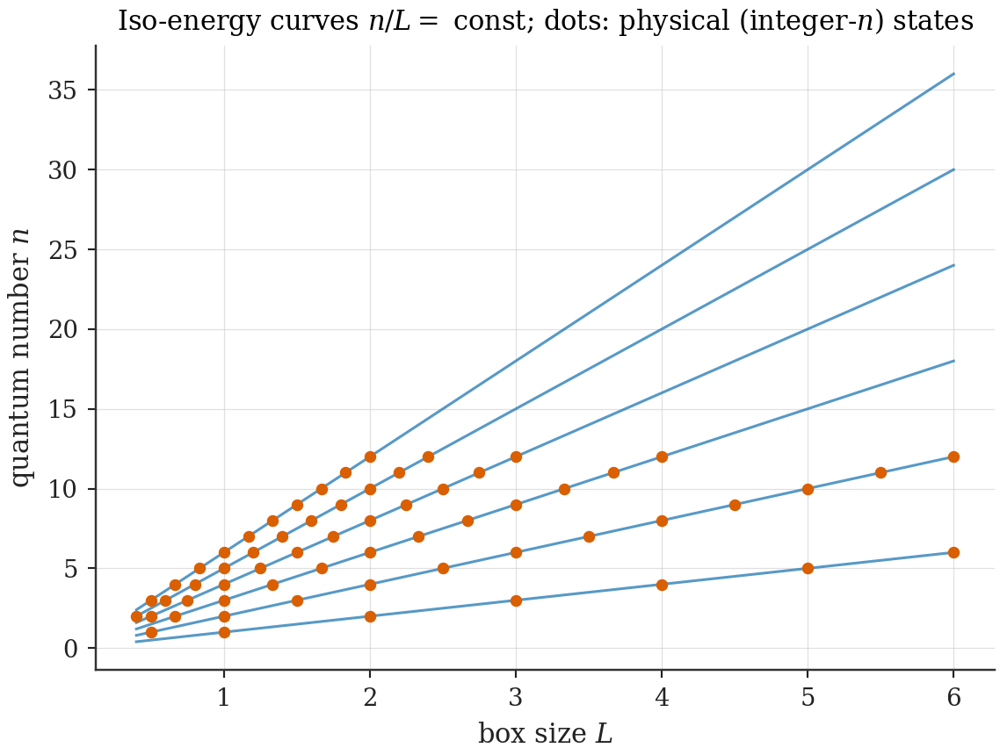
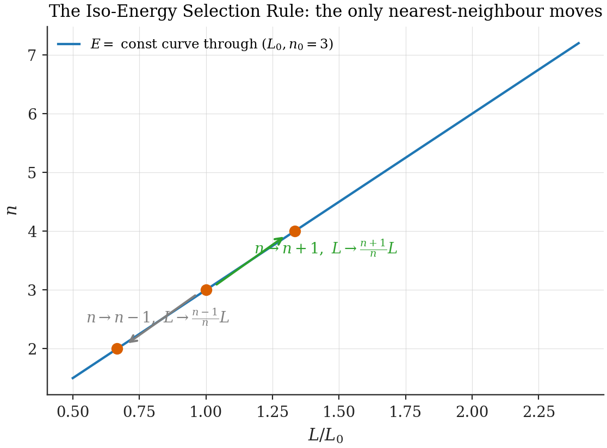

# Chapter 2 — The particle in a box and the iso-energy structure

---

Every framework has to start somewhere, and this one starts at the most thoroughly domesticated system in quantum mechanics. The choice is strategic: because the particle in a box holds no secrets, any structure we find in it is *certainly there* — the reader can check every step on a napkin — and the question becomes not "is this true?" but "why was this never taken seriously?" This chapter isolates the structural fact (a homogeneity of the spectrum), derives the one rule it implies for discrete geometry changes (the Iso-Energy Selection Rule), and is scrupulous about the boundary between mathematics and framework: two postulates are made here, they are flagged in boxes, and nothing else in Part I is assumed.

## 2.1 The spectrum and its homogeneity

A particle of mass $m$ confined to the interval $[0, L]$ by infinite walls has eigenfunctions and energies

$$\varphi_n(x; L) = \sqrt{\frac{2}{L}}\,\sin\!\Big(\frac{n\pi x}{L}\Big), \qquad E_n(L) = \frac{n^2\pi^2\hbar^2}{2mL^2}, \qquad n = 1, 2, 3, \ldots \tag{2.1}$$

Now the observation on which the thesis rests. The energy depends on its two labels only through the ratio $n/L$:

$$\boxed{\;E_{\lambda n}(\lambda L) \;=\; E_n(L) \qquad \text{for every } \lambda > 0.\;} \tag{2.2}$$

Stretch the box and promote the quantum number in proportion, and the energy does not move. A particle in mode 3 of a 3-nm box and a particle in mode 300 of a 300-nm box are, energetically, the same particle. The wavelength is the invariant content: $\lambda_{\text{dB}} = 2L/n$ is untouched by the rescaling, and the kinetic energy knows only the wavelength.

> **Toolbox: symmetry versus homogeneity.** It matters to say precisely what kind of fact (2.2) is. A *symmetry*, in the Noether sense, is an invertible transformation on a fixed state space commuting with the dynamics, and it earns a conserved charge. Equation (2.2) is not yet that: $n$ is a discrete label and $L$ is, so far, an external parameter — there is no fixed state space on which "$(n, L) \to (\lambda n, \lambda L)$" acts. What (2.2) is, exactly, is a **homogeneity of the spectrum function** $E(n, L)$: a degree-zero scaling property, true theorem, zero interpretive content. The entire framework consists of *deciding to take this homogeneity dynamically seriously* — promoting $L$ to a quantum label so that the scaling becomes an honest transformation. That promotion happens in Chapter 3, where its costs and dividends are accounted. The reader should hold the distinction firmly: the homogeneity is mathematics; the promotion is physics, and it is a **[Postulate]**.

## 2.2 Iso-energy curves

Draw the $(L, n)$ plane and the level sets of $E_n(L)$: the curves $n/L = \text{const}$, a pencil of straight lines through the origin (hyperbolae, if one plots against $E$ instead). Physical states are the integer-$n$ points; each line threads infinitely many of them.

*Figure 2.1 — The iso-energy structure. Lines: level sets $n/L = $ const of the box spectrum. Dots: physical (integer-$n$) states. Every line carries an infinite ladder of physically distinct configurations — different boxes, different modes — at exactly the same energy. The framework's elementary dynamics will be motion along these ladders. (Script: `ch02_iso_energy.py`.)*

Two remarks the reader should bank for later chapters. First, the *degeneracy is enormous and structured*: each energy supports a countable family of (mode, geometry) pairs, and degenerate families are where dynamics loves to act — degenerate perturbation theory, level repulsion, superradiance all live on such families. The iso-energy ladder is this thesis's degenerate family. Second — a deliberate forward echo — in Chapter 17 these same curves will be re-read, exactly, as *comoving field modes redshifting in an expanding universe*: $\omega_n = n\pi/L(t)$ with $n$ fixed and $L$ growing is a redshift law. The reader who remembers Figure 2.1's shape will experience Chapter 17 as recognition rather than novelty, which is the intended effect.

## 2.3 The Iso-Energy Selection Rule

Suppose, then, that geometry changes happen, and ask the homogeneity what changes are *energetically free*. Continuous motion along an iso-energy line is unavailable: $n$ is an integer, and (2.1) at fixed $n$ has no flat directions. The elementary moves are therefore discrete steps between integer points on one line.

> **Iso-Energy Selection Rule [Theorem, given the postulates below].** Among nearest-neighbour mode changes $n \to n \pm 1$, the unique accompanying box rescaling that preserves the energy is
>
> $$n \to n + 1,\;\; L \to \frac{n+1}{n}\,L \quad (\text{expansion}); \qquad n \to n - 1,\;\; L \to \frac{n-1}{n}\,L \quad (\text{contraction}). \tag{2.3}$$
>
> *Proof.* $E$ is constant iff $n/L$ is; with $\Delta n = \pm 1$ this fixes $L' = \frac{n \pm 1}{n}L$ uniquely. $\blacksquare$

The proof is one line; the honesty around it deserves a paragraph. Two ingredients in (2.3) are *not* derived:

> **[Postulate K1 — energy preservation].** The elementary geometry change preserves the active particle's kinetic energy. (Motivation: a step costing energy needs an energy source; iso-energy steps are the moves available "for free", and a closed system has nothing else to pay with. But availability is not necessity — K1 is a choice of dynamics.)
>
> **[Postulate K2 — nearest neighbour].** The elementary step is $\Delta n = \pm 1$. (Motivation: any $\Delta n = \pm k$ step telescopes into $k$ elementary ones — Chapter 3 proves composition is exact — so K2 is a minimality convention *given* K1. Its content is that no irreducible long jumps exist.)

The analogy that calibrates the rule's strength: from rotational symmetry one derives the selection rule $\Delta m \in \{0, \pm 1\}$ for dipole transitions — *given* that the perturbation is a dipole. Selection rules are always conditional on a dynamical input; (2.3) is conditional on K1–K2. What the homogeneity contributes is the *uniqueness* of the step once the inputs are granted — there is exactly one way to expand by one rung, and the rung spacing $\frac{n+1}{n}$ is not adjustable. The framework has no dials at this level, which is what will make its downstream numbers (the overlap tolls of Ch. 3, the hopping laws of Ch. 20) predictions rather than fits.

*Figure 2.2 — The two allowed moves. One iso-energy line through $(L_0, n_0 = 3)$ with the unique nearest-neighbour steps: $\hat T_+$ (expand, promote) and $\hat T_-$ (contract, demote). Every other nearest-neighbour move leaves the line and costs energy.*

## 2.4 What the rule does not determine

A selection rule is a statement about *what is allowed*, silent on *what happens*. Explicitly deferred, with their delivery addresses:

- **Amplitudes and rates.** Which allowed step occurs, with what probability, on what timescale: Ch. 3 (overlap amplitudes), Ch. 5 (timescale regimes), Ch. 6 (rates from first-order theory).
- **Direction.** Nothing here distinguishes expansion from contraction; the asymmetry is dynamical and many-body (Ch. 6).
- **The fate of other occupants.** The rule speaks of one particle; what happens to everything else in the box is the spectator problem (Ch. 6).
- **Which coupling implements the step.** Two natural operators will compete in Ch. 20, with general relativity hanging on the outcome.

One structural fact, however, is already fixed here, and it will matter twice (Ch. 7's symmetry breaking, Ch. 23's broken-Weyl phase):

> **Natural Boundary Theorem [Theorem].** The iso-energy ladder terminates below: from $n = 1$ there is no contraction step. The candidate target $n = 0$ has $\varphi_0 \equiv 0$ — not a state — and the formal rescaling $L \to 0$ annihilates the configuration. The ladder $n = 1, 2, 3, \ldots$ is half-infinite: geometry can always grow one more rung, and cannot always shrink one. *Proof:* immediate from (2.1) and (2.3). $\blacksquare$

A half-infinite ladder is an arrow waiting to happen. The kinematic floor by itself does not force directionality (a walker on a half-line need not drift); but when Chapter 6 adds the many-body suppression of every leftward step, the floor guarantees there is no mirror-image regime hiding at the other end. File it.

## 2.5 The dilation generator, announced

One more object belongs to this chapter by right, though its development is Chapter 3's. The continuous version of the rescaling in (2.2) is generated, on wavefunctions, by the **dilation generator**

$$\hat D \;=\; \tfrac12\,(\hat x\hat p + \hat p\hat x), \qquad e^{-i\epsilon\hat D/\hbar}\,\psi(x) \;=\; e^{-\epsilon/2}\,\psi\big(e^{-\epsilon}x\big) \tag{2.4}$$

— stretch the argument, renormalize the amplitude: exactly the operation that maps a box-$L$ eigenfunction onto a box-$e^\epsilon L$ eigenfunction of the same mode number. $\hat D$ is the operator avatar of the homogeneity, and the symmetrization in (2.4) (forced by Hermiticity) is its only nonobvious feature at this stage. Chapter 3 computes its matrix elements between box modes — a half page of trigonometric integrals whose punchline, improbably, is general relativity (Ch. 20).

## 2.6 Summary

A homogeneity of the box spectrum (2.2) **[Theorem]**, two flagged kinematic postulates (K1, K2), and their unique consequence, the **Iso-Energy Selection Rule** (2.3), with a half-infinite ladder (**Natural Boundary Theorem**) and a generator-in-waiting (2.4). The tension identified at the close: the rule mandates transitions in which *the state and the geometry change together*, and no Hilbert space yet exists in which such a transition is an operator. Building that space is the next chapter, and it is where the framework properly begins.

---

**Validation.** `ch02_iso_energy.py`: Figures 2.1–2.2. No quoted numerics beyond (2.1)–(2.3), which are exact.
