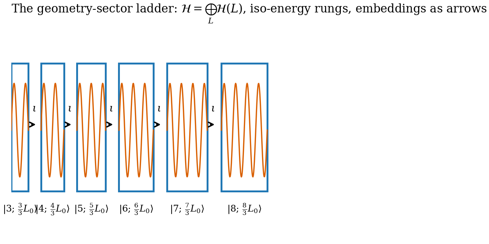
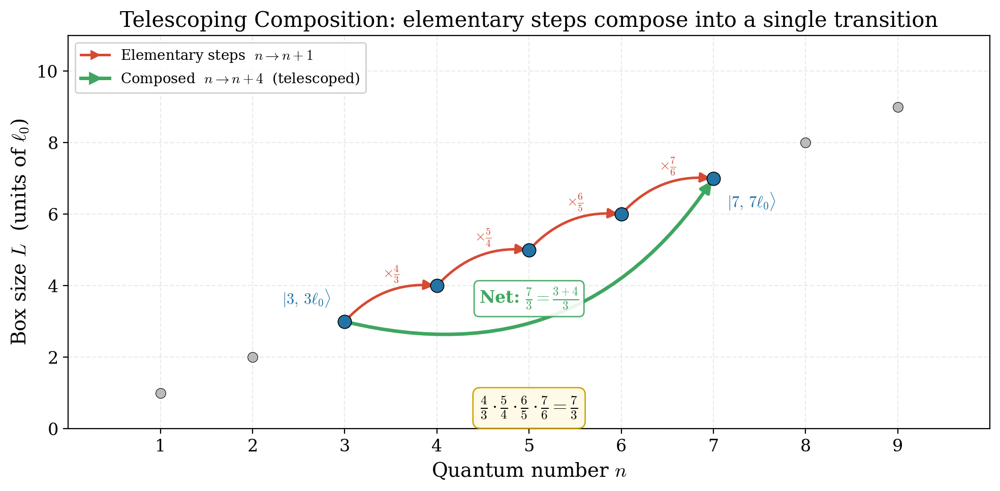
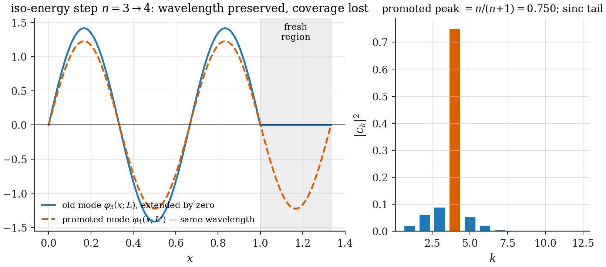

# Chapter 3 — Geometry as a quantum variable: sectors, transitions, overlaps

---

Chapter 2 ended with an observation and a tension. The observation: the box spectrum is invariant under the simultaneous rescaling of the quantum number and the box size. The tension: that statement is about *the state and the geometry together*, yet ordinary quantum mechanics keeps them on opposite sides of the formalism — the state lives in a Hilbert space, the geometry sits outside it as a parameter. As long as $L$ is a parameter, the iso-energy structure can only ever be a bookkeeping curiosity.

This chapter removes the tension by promoting the geometry to a quantum label. The resulting arena — a direct sum of Hilbert spaces, one per box size — is the single most important structural choice in this thesis. Everything later is built on it: the arrow of expansion (Ch. 6) is first-order perturbation theory on this arena; the baryogenesis quenches (Part II) are transitions between its sectors; the emergent cosmologies (Part III) are wavepacket dynamics on its ladder of geometries. We therefore take unusual care here: every definition is stated exactly, the two **[Postulate]** ingredients are flagged as such, and the chapter's three theorems are proved in full.

## 3.1 Why the arena must contain geometry

Consider what the iso-energy transition of Chapter 2 actually asks a state to do: the particle changes mode, $n \to n+1$, *and the box changes size*, $L \to \frac{n+1}{n}L$. No operator on the fixed-$L$ Hilbert space $L^2([0,L])$ can implement this — the final wavefunction does not even live on the same interval. One can try to dodge the problem by rescaling coordinates so that all boxes look like the unit interval, but the dodge merely relocates the box size into the Hamiltonian (this observation, made precise, becomes the *dictionary* of Ch. 17 — it is a feature, not a bug, but it does not remove the need for a dynamical $L$). If transitions between geometries are physical processes, the quantum formalism must contain states of *different geometries* as vectors in one space, so that superpositions, amplitudes, and probabilities between them are defined.

There is exactly one standard construction that does this without extra structure: the direct sum.

> **Toolbox: direct sums of Hilbert spaces.** Given Hilbert spaces $\mathcal H_1, \mathcal H_2, \ldots$, the direct sum $\bigoplus_i \mathcal H_i$ is the space of sequences $(\psi_1, \psi_2, \ldots)$, $\psi_i \in \mathcal H_i$, with $\sum_i \|\psi_i\|^2 < \infty$ and inner product $\langle \Phi, \Psi\rangle = \sum_i \langle \phi_i, \psi_i\rangle_i$. Vectors in different summands are orthogonal by definition. Physically: a label $i$ that no superposition can hide — a *superselection-like* index, except that here we will deliberately add dynamics that connects the summands. An operator may act within a summand (block-diagonal) or map one summand to another (block-off-diagonal); the transition operators below are of the second kind.

## 3.2 The Geometry-Sector Decomposition

> **Definition (Geometry-Sector Decomposition) [Postulate].** The arena of the theory is
>
> $$\mathcal H \;=\; \bigoplus_{L \in \mathcal L} \mathcal H_{\text{matter}}(L), \tag{3.1}$$
>
> where $\mathcal H_{\text{matter}}(L) = L^2([0,L])$ (one particle; many-body versions in Ch. 6) and $\mathcal L$ is the set of box sizes reachable from a reference configuration $(n_0, L_0)$ by iso-energy steps:
>
> $$\mathcal L \;=\; \Big\{\, \tfrac{k}{n_0}\,L_0 \;:\; k \in \mathbb N \,\Big\}. \tag{3.2}$$
>
> A state of the theory is a vector $\Psi = \sum_L \psi_L$; the geometry is a quantum label, and states of definite geometry are the vectors supported in a single sector.

Two comments before we use this.

*First, on what is being postulated.* The direct sum itself is forced once one accepts that different geometries are distinct physical configurations. What is genuinely postulated is (i) that the sector label is the box size (rather than, say, a continuous field — the lattice $\mathcal L$ is discrete because the iso-energy rule of Ch. 2 is); and (ii) that the *dynamics* connects neighbouring sectors only — the nearest-neighbour postulate of Ch. 2, now wearing its structural clothes. We collect both under the single label **[Postulate: sector arena]** and will not hide them.

*Second, on what is gained immediately.* "Superpositions of geometries" — the phrase that sounds most exotic in any quantum-gravity context — is now simply a vector with support in more than one summand. No interpretational machinery is needed. Chapter 4 will show such superpositions arising dynamically at small quantum numbers, and Part III will quantify how fast they decohere into classicality as $n$ grows.

*Figure 3.1 — The arena. Each rung is a full matter Hilbert space at fixed box size; the iso-energy lattice $\mathcal L$ spaces the rungs as $L_k = (n_0+k)L_0/n_0$. Arrows are the embedding maps $\iota$ (right: extension by zero; left: restriction). All dynamics in this thesis — the arrow of expansion, the charge-producing quenches, the emergent cosmologies — is traffic on this ladder. This diagram returns in Ch. 20 with the rungs reinterpreted as scale factors of a quantum universe.*

## 3.3 Embeddings: the unique "do-nothing" maps

To couple sectors we need a way of *comparing* states that live on different intervals. There is a distinguished pair of maps that require no choices at all.

> **Definition (embedding and restriction).** For $L < L'$ in $\mathcal L$:
>
> $$\iota_{L \to L'} : \mathcal H(L) \to \mathcal H(L'), \qquad (\iota_{L\to L'}\psi)(x) = \begin{cases}\psi(x), & 0 \le x \le L,\\[2pt] 0, & L < x \le L',\end{cases} \tag{3.3}$$
>
> (*extension by zero*), and its adjoint, the *restriction*
>
> $$\iota^\dagger_{L \to L'} = R_{L' \to L} : \mathcal H(L') \to \mathcal H(L), \qquad (R\,\psi)(x) = \psi(x)\big|_{[0,L]} . \tag{3.4}$$

Three elementary properties carry essentially all of Part I's physics, so we record them as a lemma.

> **Lemma 3.1 (embedding properties).**
> (a) $\iota$ is an isometry: $\|\iota\psi\| = \|\psi\|$ for every $\psi \in \mathcal H(L)$.
> (b) $R$ is a contraction: $\|R\psi\| \le \|\psi\|$, with equality iff $\psi$ vanishes on $[L, L']$.
> (c) $R\,\iota = \mathbb 1_{\mathcal H(L)}$, while $\iota R = P_{[0,L]}$, the projector onto states supported in the old region.
>
> *Proof.* (a) $\|\iota\psi\|^2 = \int_0^{L'}|\iota\psi|^2 = \int_0^L |\psi|^2$ since the extension vanishes on $[L,L']$. (b) $\|R\psi\|^2 = \int_0^L|\psi|^2 = \|\psi\|^2 - \int_L^{L'}|\psi|^2$. (c) Immediate from the definitions. $\blacksquare$

The asymmetry between (a) and (b) is the *entire microscopic origin of the arrow of expansion*: enlarging a box loses nothing, shrinking one cuts probability away. Chapter 6 turns this into a theorem about many-body transition rates; here we only flag it.

Why are these the right maps? Because of what "sudden" means. In a sudden geometry change the state has no time to adjust: the wavefunction the instant after is the wavefunction the instant before, read in the new box. Extension-by-zero (for expansion) and restriction (for contraction) are the *only* sector maps with that property. The sudden approximation — when it is valid, what corrections it acquires — gets its own interlude (Ch. 5); in this chapter it enters only through this uniqueness statement.

> **Toolbox: the sudden approximation in one paragraph.** If a Hamiltonian changes over a time $\tau$ short compared with every relevant internal period $2\pi/\omega_n$, the state cannot respond during the change: $|\Psi(t_0^+)\rangle = |\Psi(t_0^-)\rangle$, and all the physics is in re-expanding the unchanged state in the new eigenbasis. The opposite (adiabatic) limit drags the state along eigenstates. The dimensionless dial is $\omega_n\tau$; Ch. 5 quantifies the crossover and Ch. 17 will reveal it as the standard mode-splitting of cosmological particle production.

## 3.4 Transition operators and the Telescoping Composition Theorem

We can now define the elementary moves. It is essential to distinguish two layers: a *bare* (kinematic) operator that relabels configurations, and the *physical amplitude* that weights the move. Conflating them causes real damage — an instance of the identification-map confusions that Part II dissects at length (Ch. 10) — so we keep the layers apart notationally from the start.

> **Definition (bare transition operators).** On basis states of definite mode and geometry,
>
> $$\hat T_+\,|n;\,L\rangle = \big|n{+}1;\,\tfrac{n+1}{n}L\big\rangle, \qquad \hat T_-\,|n;\,L\rangle = \big|n{-}1;\,\tfrac{n-1}{n}L\big\rangle, \tag{3.5}$$
>
> extended linearly. $\hat T_\pm$ map a sector into its iso-energy neighbour; $\hat T_-$ annihilates $n = 1$ states (there is no $n = 0$ rung — the **Natural Boundary** of Ch. 2, which Ch. 7 will use).

The bare operators compose with startling simplicity.

> **Telescoping Composition Theorem [Theorem].** For every $k \ge 1$,
>
> $$\hat T_+^{\,k}\,|n_0;\,L_0\rangle \;=\; \Big|\,n_0+k;\; \frac{n_0+k}{n_0}\,L_0\,\Big\rangle. \tag{3.6}$$
>
> *Proof.* Each step multiplies the box size by $\frac{n+1}{n}$ at the current $n$. After $k$ steps the accumulated factor is the telescoping product
>
> $$\frac{n_0+1}{n_0}\cdot\frac{n_0+2}{n_0+1}\cdots\frac{n_0+k}{n_0+k-1} \;=\; \frac{n_0+k}{n_0},$$
>
> every intermediate numerator cancelling the next denominator. $\blacksquare$

The theorem says the iso-energy lattice is *globally consistent*: the final configuration depends only on the endpoints, never on the path history along one axis. (With several axes the bare operators commute as well — Ch. 18 — though *physical amplitudes* need not be path-independent; see §3.7.) It also justifies equation (3.2): the reachable sizes from $(n_0, L_0)$ are exactly $L_k = (n_0{+}k)L_0/n_0$, which is why the sector lattice $\mathcal L$ could be written down before any dynamics.

*Figure 3.2 — Telescoping. Three consecutive iso-energy steps; the intermediate box sizes cancel in pairs, and the endpoint is fixed by $(n_0, n_0+k)$ alone.*

## 3.5 The Geometric Overlap Theorem

The bare operators say where a transition *goes*; overlap integrals say how much amplitude *gets there*. Let the box expand from $L$ to $L' = sL$, $s > 1$. A state $\varphi_n(x; L) = \sqrt{2/L}\,\sin(n\pi x/L)$, embedded by $\iota$, redistributes over the new eigenbasis with coefficients

$$c_k(n, s) \;\equiv\; \big\langle \varphi_k(\cdot\,; L')\,\big|\, \iota\,\varphi_n(\cdot\,; L) \big\rangle \;=\; \int_0^{L} \varphi_k(x; L')\,\varphi_n(x; L)\, dx , \tag{3.7}$$

the integral stopping at $L$ because the embedded state vanishes beyond it. These are elementary integrals, and we evaluate them completely.

**General coefficient.** Substitute the mode functions and change variables to $u = x/L$:

$$c_k(n,s) = \frac{2}{\sqrt s}\int_0^1 \sin\!\Big(\frac{k\pi u}{s}\Big)\,\sin(n\pi u)\,du .$$

With $a \equiv k\pi/s$ and $b \equiv n\pi$, the product-to-sum identity gives

$$\int_0^1 \sin(au)\sin(bu)\,du = \frac{\sin(a-b)}{2(a-b)} - \frac{\sin(a+b)}{2(a+b)} .$$

Because $b = n\pi$ with integer $n$, $\sin(a \mp b) = (-1)^n \sin a$ for both signs, and the two terms combine over a common denominator:

$$\frac{\sin(a-b)}{2(a-b)} - \frac{\sin(a+b)}{2(a+b)} = (-1)^n \sin a \cdot \frac{b}{a^2 - b^2} .$$

Restoring $a, b$ and simplifying:

> **Geometric Overlap Theorem [Theorem].** For expansion by ratio $s$, the overlap coefficients are elementary:
>
> $$c_k(n, s) \;=\; \frac{2\,s^{3/2}}{\pi}\,\frac{(-1)^n\, n\,\sin(k\pi/s)}{k^2 - n^2 s^2}\,, \tag{3.8}$$
>
> for $k \ne ns$; when $k = ns$ is an integer (the *promoted mode*), the removable singularity gives
>
> $$c_{ns}(n, s) \;=\; \frac{1}{\sqrt s}\,. \tag{3.9}$$
>
> In particular, along the iso-energy step $s = \frac{n+m}{n}$ the promoted-mode overlap is
>
> $$\mathcal O_{n \to n+m} \;=\; \sqrt{\frac{n}{n+m}}\,. \tag{3.10}$$

*Proof of (3.9) and (3.10).* Two routes, which is itself instructive. **Limit route:** as $k \to ns$, $\sin(k\pi/s) = \sin\big(n\pi + (k - ns)\pi/s\big) = (-1)^n (k-ns)\,\pi/s + \mathcal O\big((k{-}ns)^3\big)$, and $k^2 - n^2s^2 = (k-ns)(k+ns)$; the factors of $(k - ns)$ cancel and the limit of (3.8) is $\frac{2 s^{3/2}}{\pi}\cdot\frac{n \,\pi/s}{2ns} = \frac{1}{\sqrt s}$. **Direct route:** the promoted mode has $k\pi/L' = (n+m)\pi \cdot \frac{n}{(n+m)L} = n\pi/L$ — *exactly the old wavenumber*. The integrand is then $\sqrt{\tfrac{2}{L'}}\sqrt{\tfrac{2}{L}}\sin^2(n\pi x/L)$, whose integral over $[0,L]$ is $\sqrt{\tfrac{4}{LL'}}\cdot\tfrac L2 = \sqrt{L/L'} = \sqrt{n/(n+m)}$. $\blacksquare$

The direct route exposes the physics: an iso-energy step preserves the *wavelength* of the active particle; the only cost is normalization — the old state simply fails to cover the new volume, and $\sqrt{L/L'}$ is precisely the amplitude penalty for that missing coverage. The remaining amplitude, $1 - n/(n+m)$ in probability, is distributed over the $k \ne ns$ modes by the sinc-like tail of (3.8) — this tail is what a spectator particle feels (Ch. 6), and its slow $1/k$ decay is what makes truncated mode sums treacherous (a warning that becomes a theorem in Ch. 11).

Two checks worth recording. **[Computed]** Completeness: $\sum_k |c_k(n,s)|^2 = 1$ for every $(n, s)$ tested ($10^{-12}$ at 4000 modes; `ch03_overlaps.py`) — as Lemma 3.1(a) demands. And explicitly *no Bessel functions appear*: the closed forms are square roots and sincs. (Bessel functions do appear in this thesis — in the *time evolution* on the ladder, Ch. 4 — and keeping the two appearances apart avoids a recurring confusion.)

*Figure 3.3 — Anatomy of an overlap. Old mode (blue) embedded in the expanded box, new promoted mode (orange, same wavelength, longer support), and the coefficient distribution $|c_k|^2$ (inset) with its dominant promoted peak and sinc tail.*

## 3.6 The dilation generator

The iso-energy structure has, so far, been implemented combinatorially: states hop between sectors. But Chapter 2's homogeneity is a *continuous* rescaling, and continuous rescalings have a generator. This section constructs it, computes its matrix elements exactly — a half-page calculation with, as it will turn out, an outsized destiny — and explains in what sense it is conserved.

**The operator.** The generator of scale transformations in one dimension is

$$\hat D \;=\; \tfrac12\,(\hat x\hat p + \hat p\hat x) \;=\; -i\Big(x\frac{d}{dx} + \frac12\Big), \tag{3.11}$$

the symmetrized product being forced by Hermiticity. Exponentiating, $e^{-i\epsilon \hat D}\psi(x) = e^{-\epsilon/2}\,\psi(e^{-\epsilon}x)$: the state is stretched by $e^{\epsilon}$ and renormalized — exactly the operation that carries a box-$L$ wavefunction to a box-$e^{\epsilon}L$ wavefunction. $\hat D$ is therefore the natural *infinitesimal* version of the sector-hopping $\hat T_\pm$, and the natural candidate for what physically couples neighbouring sectors.

**Matrix elements.** We need $\hat D$ between box modes. Since $\langle m|n\rangle = \delta_{mn}$, it suffices to compute $\langle m|\,x\,\frac{d}{dx}\,|n\rangle$. Write it out:

$$\Big\langle m\Big|\,x\frac{d}{dx}\Big|n\Big\rangle = \frac{2}{L}\cdot\frac{n\pi}{L}\int_0^L x\,\sin\!\Big(\frac{m\pi x}{L}\Big)\cos\!\Big(\frac{n\pi x}{L}\Big)dx .$$

Use $\sin A\cos B = \tfrac12[\sin(A{+}B) + \sin(A{-}B)]$ and the elementary integral $\int_0^L x \sin\!\big(\tfrac{k\pi x}{L}\big)dx = -\tfrac{L^2(-1)^k}{k\pi}$ (integer $k \neq 0$):

$$\Big\langle m\Big|\,x\frac{d}{dx}\Big|n\Big\rangle = \frac{n\pi}{L^2}\cdot\Big[-\frac{L^2(-1)^{m+n}}{(m{+}n)\pi} - \frac{L^2(-1)^{m-n}}{(m{-}n)\pi}\Big] = -\,n(-1)^{m+n}\Big[\frac{1}{m+n} + \frac{1}{m-n}\Big],$$

valid for $m \ne n$ (for $m = n$ the diagonal element of $x\,d/dx$ is $-\tfrac12$, cancelling the $+\tfrac12$ in (3.11): $\hat D$ has vanishing diagonal in a real basis, as antisymmetry requires). Combining the bracket:

> **Dilation-Generator Matrix-Element Lemma [Theorem].**
>
> $$\Big\langle m\Big|\,x\frac{d}{dx}\,\Big|n\Big\rangle \;=\; -\,\frac{2mn\,(-1)^{m+n}}{m^2 - n^2} \qquad (m \neq n), \tag{3.12}$$
>
> and on neighbouring rungs,
>
> $$\Big\langle n{+}1\Big|\,x\frac{d}{dx}\,\Big|n\Big\rangle \;=\; \frac{2n(n+1)}{2n+1} \;=\; \Big(n + \tfrac12\Big) - \frac{1}{4(2n+1)} \;\approx\; n + \tfrac12 . \tag{3.13}$$

**[Computed]** `ch03_overlaps.py` checks (3.13) at $n = 10, 40, 160$: values $10.4762$, $40.4938$, $160.4983$ against $2n(n{+}1)/(2n{+}1)$ — exact to machine precision.

Equation (3.13) deserves a sentence of foreshadowing, because it is one of the quiet hinges of the thesis. *The matrix element grows linearly in $n$.* When, in Chapter 20, we ask which physical operator couples neighbouring geometry sectors, the two natural candidates will be the bare embedding (whose hopping is asymptotically constant, by (3.10)) and the dilation generator (whose hopping grows as $n + \tfrac12$, by (3.13)). That single difference — constant versus linear — decides whether the emergent universe follows Milne-like orbits or *exactly the Kasner orbits of general relativity*. A half-page of trigonometric integrals here selects the dynamics of spacetime there.

**Conservation and the Ward identity.** On a fixed sector, $\hat D$ is not conserved — boxes break scale invariance, which is the whole point. What *is* exactly true is the statement tying $\hat D$ to the spectrum's homogeneity: along the simultaneous flow $(n, L) \to (\lambda n, \lambda L)$ the energy function is invariant (Ch. 2), and the corresponding operator statement is the Ward identity for matrix elements between sectors,

$$\big(E_m(L') - E_n(L)\big)\,\langle m; L'|\,\hat D\,|n; L\rangle\big|_{\text{iso}} = 0 ,$$

which is non-trivial precisely on iso-energy pairs, where the prefactor vanishes and the matrix element (3.13) survives unconstrained. In words: *the dilation generator is the operator that moves states along the level sets of the energy* — it is "conserved" in the only sense available on a discrete lattice of geometries, namely as the generator of the energy-preserving flow. This is the precise content we will need; we do not claim more. **[Theorem, in the stated sense]**

## 3.7 Bare operators versus physical amplitudes

A final clarification, cheap to state now and expensive to omit. The bare operators (3.5) are *relabelings*: they say which configuration follows which, and they telescope exactly (§3.4). The *physical amplitude* for a transition is a different object: it is set by the overlap structure (3.8)–(3.10) — equivalently by matrix elements of a coupling operator such as $g\,\iota$ or $g\,\hat D$ between sectors — and amplitudes along different paths between the same endpoints need *not* compose to the same number, because each step's overlap depends on the state of everything in the box (the spectators of Ch. 6), not only on the endpoint labels.

The slogan to carry forward: **kinematics telescopes; dynamics remembers.** Every overlap statement is relative to an identification map between Hilbert spaces, and specifying that map is part of the physics. This slogan returns twice with teeth: in Ch. 10, where an inconsistent identification map is shown to have manufactured an entire spurious CP phenomenology, and in Ch. 19, where the choice between the fixed-coordinates and embedding maps becomes the lattice analogue of choosing the lapse in general relativity.

## 3.8 Summary

The arena is $\mathcal H = \bigoplus_L \mathcal H(L)$ **[Postulate: sector arena]**, with extension-by-zero and restriction as the canonical inter-sector maps (isometry vs contraction — Lemma 3.1, the seed of the arrow). The bare transitions telescope (**Telescoping Composition Theorem**), the overlap amplitudes are elementary (**Geometric Overlap Theorem**: $\sqrt{n/(n+m)}$ promoted, sinc tails otherwise), and the dilation generator has exactly computable matrix elements growing as $n + \tfrac12$ (**Dilation-Generator Matrix-Element Lemma**) — a number to remember at Ch. 20.

Next, dynamics *within* the kinematics: put hopping amplitudes on the ladder and let states move (Ch. 4); then put many particles in the box and watch the ladder acquire a direction (Ch. 6).

---

**Validation.** `ch03_overlaps.py`: prints the $\mathcal O_{n\to n+m}$ table, verifies (3.8) against direct quadrature, completeness to $10^{-12}$, and (3.13) at $n = 10, 40, 160$. Figures 3.1–3.3 regenerated by the same script (`--figures`).
