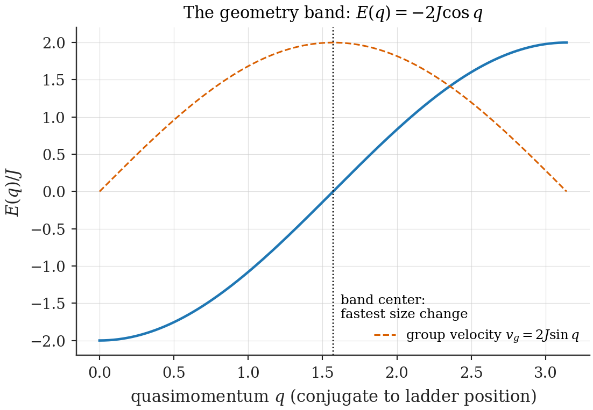
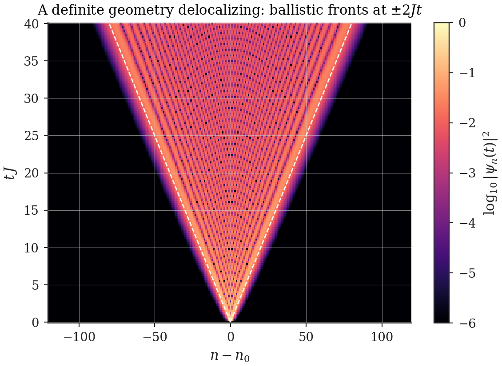
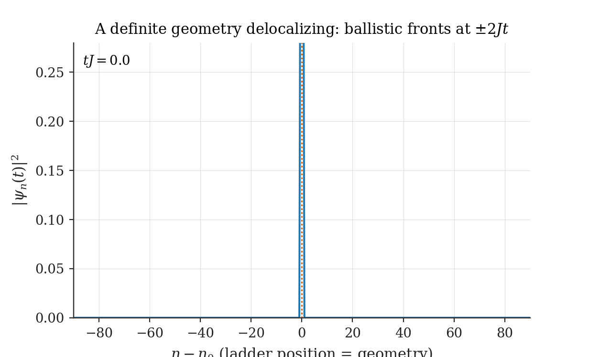
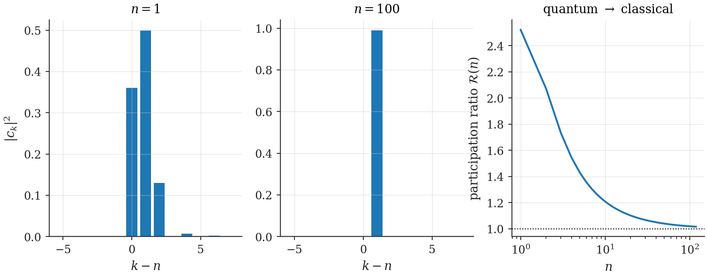

# Chapter 4 — Dynamics on the geometry ladder

---

Chapter 3 built the arena and weighed the doorways: sectors, embeddings, and the overlap amplitudes that price each iso-energy step. What it did not do is let anything *move*. This chapter turns the ladder of geometries into a dynamical system — a tight-binding chain, borrowed intact from solid-state physics — and extracts the three behaviours the rest of the thesis consumes: band propagation, the exactly solvable spreading of geometry wavepackets, and the crossover between quantum geometry (small $n$, superpositions of box shapes) and classical geometry (large $n$, sharp drift). Throughout, one warning is kept lit: the chain's *hopping law* is a dynamical choice, not a derived fact, and Chapter 20 will show that the choice decides whether the emergent universe is merely expansion-flavored or exactly general-relativistic.

## 4.1 From overlaps to a hopping Hamiltonian

The minimal dynamics on the sector ladder is the one every discrete quantum system suggests: amplitude to hop to the neighbouring rung, per unit time. Writing $|n\rangle$ for the iso-energy configuration $|n; \frac{n}{n_0}L_0\rangle$,

$$\hat H_{\text{TB}} \;=\; \sum_{n} t(n)\,\big(|n{+}1\rangle\langle n| \;+\; |n\rangle\langle n{+}1|\big), \tag{4.1}$$

with $t(n)$ the **hopping law**. What should $t(n)$ be? The embedding coupling of Ch. 3 ($V = g\,\iota$) prices the step at the promoted-mode overlap:

$$t_{\text{emb}}(n) \;=\; \bar\lambda\;\mathcal O_{n \to n+1} \;=\; \bar\lambda\,\sqrt{\frac{n}{n+1}} \;\xrightarrow{\;n \gg 1\;}\; \bar\lambda \quad (\text{asymptotically constant}), \tag{4.2}$$

and this chapter develops the constant-hopping case in full, because it is exactly solvable and every tool transfers. But the alternative is already on the table: coupling through the dilation generator prices the step at the Lemma of §3.6, $t_{D}(n) = g\,(n + \tfrac12)$ — *asymptotically linear*. Constant versus linear looks like a detail. Chapter 20 proves it is the difference between a Milne-like cosmology and Kasner's. Nothing in this chapter is wasted on either branch: band structure, group velocity, and packet phenomenology are hopping-law-agnostic concepts, recomputed there for the linear law.

> **Toolbox: tight-binding models in one page.** A particle on a discrete chain with amplitude $t$ to hop between neighbours is the hydrogen atom of solid-state physics. Its eigenstates are Bloch waves $|q\rangle = \sum_n e^{iqn}|n\rangle$ with energy $E(q) = 2t\cos q$ (sign conventions vary), quasimomentum $q \in (-\pi, \pi]$; localized packets move at the group velocity $v_g = dE/dq$ and spread diffractively. Everything is elementary because the model linearizes translation: one site, one neighbour, one amplitude. The single conceptual transplant needed here: **the "sites" are not places but geometries**. A walker on this chain is a universe changing size. The mathematics does not care; the interpretation will be everything.

## 4.2 Band structure

Take $t(n) = J$ constant (the large-$n$ embedding regime) on the half-infinite ladder $n \ge 1$. Bulk solutions are plane waves in the rung index; the floor at $n = 1$ (Natural Boundary) imposes a node at the virtual site $n = 0$, selecting standing waves $\langle n|q\rangle \propto \sin(qn)$:

$$E(q) \;=\; -\,2J\,\cos q, \qquad q \in (0, \pi), \tag{4.3}$$

a single band of width $4J$. Group velocity $v_g(q) = 2J\sin q$, maximal at band center $q = \pi/2$ — the fastest a geometry packet can travel is two rungs per unit of $1/J$ time, an emergent "speed limit" on size change. Two glosses, each consumed later:

*What $q$ is.* The quasimomentum conjugate to ladder *position* — i.e., to the size of the universe. It is not a momentum of anything material; it is the phase gradient of a superposition across geometries. Chapter 20's fixed points $\theta = \pm\pi/2$ (its $\theta$ is this $q$) are the band-center states of maximal size-change speed.

*What the band edges are.* At $q \to 0, \pi$ the group velocity vanishes: geometry packets built there *do not move* — standing universes, stable against drift though not against spreading. The existence of non-moving superpositions of sizes is a genuinely quantum-geometric prediction of the arena, of the same species as (and a precursor to) the geometry superpositions of §4.4.

*Figure 4.1 — The geometry band. Dispersion $E(q) = -2J\cos q$ on the iso-energy ladder; bandwidth $4J$; group velocity maximal at band center. The same cosine every condensed-matter text draws — with sites reinterpreted as universes.*

## 4.3 Time evolution: Bessel spreading

For constant hopping the dynamics is exactly solvable, and the solution earns this thesis's *only* legitimate Bessel functions — flagged as promised in Ch. 3.

> **Toolbox: the Bessel propagator.** For $\hat H = J\sum_n(|n{+}1\rangle\langle n| + \text{h.c.})$ on the infinite chain, the amplitude to travel $d$ rungs in time $t$ is
>
> $$\langle n_0 + d|\,e^{-i\hat Ht}\,|n_0\rangle \;=\; (-i)^{d}\,J_{d}(2Jt), \tag{4.4}$$
>
> with $J_d$ the Bessel function of order $d$. *Derivation in three lines:* in the Bloch basis the propagator is diagonal, $e^{-i(-2J\cos q)t}$; transforming back gives $\int_{-\pi}^{\pi}\frac{dq}{2\pi}e^{iqd}e^{2iJt\cos q}$, which is the integral representation of $i^d J_d(2Jt)$ up to phase conventions. (On the half-infinite ladder, add the image term $-(-i)^{d'}J_{d'}(2Jt)$, $d' = n + n_0$, enforcing the floor node — negligible for packets far from $n = 1$.) The Bessel function's two regimes are the physics: for $d < 2Jt$, oscillatory — the packet has arrived and interferes; for $d > 2Jt$, super-exponentially small — causally not yet reachable. The edge $d = 2Jt$ is the ballistic front moving at $v_g^{\max}$.

So an initially sharp geometry — a universe of definite size — does not stay sharp: it develops a light-cone-like front expanding two rungs per $1/J$, oscillatory wake behind, evanescent silence ahead. **[Computed]** `ch04_ladder_dynamics.py` evolves initial $|n_0\rangle$ exactly and overlays $|J_{n-n_0}(2Jt)|^2$: agreement at machine precision away from the floor; Fig. 4.2 is the carpet plot.

*Figure 4.2 — A definite geometry delocalizing. $|\langle n|\psi(t)\rangle|^2$ for an initially sharp rung: ballistic fronts at $n - n_0 = \pm 2Jt$, Bessel interference wake between them. (Script: `ch04_ladder_dynamics.py`.)*

*Animation 4.A — The same evolution, live: a universe of definite size dissolving into a superposition of sizes, its fronts riding the emergent speed limit $2J$. (`make_anims_v15.py`.)*

## 4.4 Geometry superpositions and the quantum-to-classical crossover

Now combine the two ingredients Part I has produced: the ladder dynamics above, and Ch. 3's overlap structure, which says each *physical transition* scatters amplitude beyond the promoted mode with the sinc-tail coefficients (3.8). Their joint content is the framework's statement about quantum geometry, and it comes with its own classical limit.

**Small $n$: geometry is quantum.** At $n \sim 1$–$5$ the promoted-mode weight $n/(n+1)$ is far from unity ($1/2$ at $n = 1$); a single step deposits comparable amplitude on several final modes, i.e. on several *box shapes*: the state after one transition is a genuine superposition of geometries. The honest measure is the participation ratio $\mathcal R(n) = 1/\sum_k |c_k|^4$ — the effective number of geometries superposed — which falls from $\mathcal R(1) = 2.52$ through $\mathcal R(5) = 1.43$ toward $1$ like $1 + \mathcal O(1/n)$ ($\mathcal R(100) = 1.02$) **[Computed]** (`ch04_ladder_dynamics.py`).

**Large $n$: geometry is classical.** At $n \gtrsim 50$ the step is nearly clean ($\mathcal O_{n\to n+1}^2 > 0.98$), packets drift at the group velocity, spread slowly relative to their drift, and the relational observables built on them are self-averaging (quantified in Ch. 20.5: corrections $\sim \mathrm{Var}(n)/\langle n\rangle^2$). A large universe behaves like a classical trajectory on the ladder *because the overlap cost of each step vanishes* — no decoherence postulate, no environment, no collapse: the crossover is written into the same closed-form coefficients that price the transitions. **[Interpretation]**, and a calibrated one: the claim is not that measurement-theory puzzles are solved, but that *this* framework's geometry sector turns classical by itself, smoothly, at computable rates.

**Where the dilation symmetry goes to die.** The deep-quantum end has one more structural feature: the homogeneity (2.2) acts on the ladder as $n \to \lambda n$, and at small $n$ the integers are too coarse to host it — there is no rung at $1.3 \times 2$. The dilation symmetry is *discretely broken* at the floor and *asymptotically restored* as $n \to \infty$, where the rung spacing $\Delta L/L = 1/n$ becomes infinitesimal. The pattern — exact scaling structure in the continuum limit, integer obstruction at the bottom — is the framework's microscopic echo of every lattice-to-continuum story in physics, and it localizes all "Planckian" weirdness at small $n$: exactly where Part III will find the quantum-gravity corrections (Ch. 20.5) and the cell-scale cutoff (Ch. 22).

*Figure 4.3 — The crossover. Overlap distributions $|c_k|^2$ after one iso-energy step at $n = 1$ (broad: a true superposition of box shapes) versus $n = 100$ (a single dominant geometry), with the participation ratio $\mathcal R(n)$ interpolating between the regimes.*

## 4.5 Summary

| Layer | Object | Status |
|---|---|---|
| Kinematics (Ch. 3) | sectors, embeddings, overlap costs | fixed, theorem-grade |
| Dynamics (this chapter) | hopping law $t(n)$ on the ladder | **a choice**: embedding ($\to$ const) vs generator ($\to n + \tfrac12$) |
| Phenomenology | band $E(q) = -2J\cos q$; Bessel fronts; quantum$\to$classical crossover in $n$ | derived given the law |

Two threads leave this chapter under tension. The walker on the ladder is still *symmetric* — nothing yet prefers up to down; Chapter 6 breaks that with many-body weight. And the hopping law is still *undetermined* — both candidates are natural; Chapter 20 holds the election, with general relativity on the ballot.

---

**Validation.** `ch04_ladder_dynamics.py`: exact evolution vs the Bessel propagator (machine agreement off the floor); the carpet plot (Fig. 4.2); band dispersion check; participation ratios ($\mathcal R(1) = 2.9 \to 1$); Figs. 4.1, 4.3.
