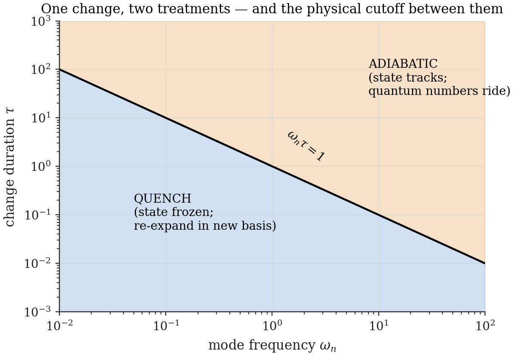

# Chapter 5 — Interlude: sudden, adiabatic, and the quench concept

---

The word *quench* will appear on nearly every page of Part II, and the sudden approximation has already done silent work in Chapter 3 (it is what made extension-by-zero and restriction the canonical sector maps). This short interlude pays the debt properly: the two limits of a time-dependent Hamiltonian, the dimensionless dial that separates them, and the one principle — boxed below — that this thesis elevates from folklore to operating rule, because Part II's central diagnosis (Ch. 11) is what happens when it is ignored.

## 5.1 Two limits of a changing Hamiltonian

Let $H(t)$ interpolate from $H_i$ to $H_f$ over a timescale $\tau$, and let the system start in an eigenstate $|\psi_i\rangle$ of $H_i$.

**The adiabatic limit** ($\tau \to \infty$). The adiabatic theorem **[Standard]**: if $H(t)$ changes slowly compared with every inverse spectral gap along the way, the state remains the instantaneous eigenstate continuously connected to $|\psi_i\rangle$, acquiring only phases (dynamical plus Berry). Sketch of why: in the instantaneous eigenbasis $\{|m(t)\rangle\}$, the exact evolution couples levels through $\langle m|\dot H|k\rangle/(E_k - E_m)$; slow $\dot H$ makes these terms rapidly oscillating relative to their size, and they average away — first-order transition amplitudes are suppressed as $1/(\text{gap}\cdot\tau)$. The state *tracks* the Hamiltonian.

**The sudden limit** ($\tau \to 0$). The opposite idealization: the Hamiltonian changes faster than any internal motion, so the state has no time to respond at all,

$$|\Psi(t_0^+)\rangle \;=\; |\Psi(t_0^-)\rangle, \tag{5.1}$$

and *all* the physics is in re-expanding the unchanged state in the new eigenbasis: $|\Psi\rangle = \sum_f |f\rangle\langle f|\psi_i\rangle$, with transition probabilities $|\langle f|\psi_i\rangle|^2$ — the overlap structure of Ch. 3, which is why the sudden limit and the embedding maps are the same idea. A change of Hamiltonian executed in the sudden limit is a **quench**.

The two limits are not symmetric in what they conserve. Adiabatic changes preserve *level occupation* (quantum numbers ride along; energy changes). Sudden changes preserve *the state* (energy distribution changes; the old wavefunction is simply re-described). Every confusion about "where the energy went" in a quench resolves by asking which limit is in force.

## 5.2 The dial, and the principle

Neither limit ever holds for a whole spectrum at once. For a change of duration $\tau$, the honest statement is mode by mode:

$$\omega_n\,\tau \ll 1: \;\text{this mode experiences a quench}; \qquad \omega_n\,\tau \gg 1: \;\text{this mode adjusts adiabatically}. \tag{5.2}$$

Any finite-$\tau$ change is sudden *only for the low modes*; sufficiently high modes always track. The crossover sits at $\omega_n \sim 1/\tau$, and its consequence for computation is important enough to box:

> **The cutoff principle.** Mode sums over quench-produced excitations are physically cut off at $\omega_n \sim 1/\tau$: above the crossover, "excitation" is an artifact of using the wrong (sudden) approximation for modes that actually adjusted. Truncation of such sums is therefore *physics, not numerics* — and conversely, **any observable whose value keeps depending on the cutoff as the cutoff is removed is the wrong observable**, full stop. The cure is never a cleverer cutoff; it is a better observable.

The principle has teeth in both directions. Used constructively, it justifies finite mode sums for genuinely cutoff-insensitive quantities (pair spectra below the crossover, Ch. 11's polarization integrand). Used diagnostically, it is the executioner of Part II's false signal: the truncated "charge asymmetries" of Ch. 11 fail exactly this test — their two equivalent forms disagree at every finite truncation — while the spectral-flow observable of Ch. 9 passes vacuously (it never sees a cutoff at all; Corollary 9.3 calls this *cutoff-theorem-protected*). And in Chapter 17 the dial (5.2) returns wearing its oldest clothes: it is precisely the criterion separating particle-producing from adiabatic modes in cosmological expansion — Parker's split — because, by the dictionary, a box quench *is* a step in a scale factor.

*Figure 5.1 — One change, two treatments. In the $(\omega_n, \tau)$ plane the line $\omega_n\tau = 1$ separates modes that experience the change as a quench (lower left: re-expand the frozen state) from modes that track it adiabatically (upper right: carry quantum numbers, adjust energy). Every finite-time change straddles the line; the crossover is the physical cutoff of quench mode sums.*

## 5.3 The framework's adiabatic parameter

Specialize to the iso-energy step. Two timescales compete: the duration $\tau_{\text{step}}$ of the geometry change itself (set, in the sector dynamics, by the coupling: $\tau_{\text{step}} \sim 1/g$ for the golden-rule traffic of Ch. 6), and the adjustment time of the *slowest relevant occupant*, $\tau_{\text{adj}} \sim 1/\omega_{n_2} = 2mL^2/(\pi^2 n_2^2)\hbar$ for a spectator in mode $n_2$. Their ratio is the framework's dial:

$$\eta_{\text{ad}} \;\equiv\; \frac{\tau_{\text{step}}}{\tau_{\text{adj}}} \;=\; \omega_{n_2}\,\tau_{\text{step}}. \tag{5.3}$$

| Regime | Behaviour | Where used |
|---|---|---|
| $\eta_{\text{ad}} \ll 1$ (sudden) | spectators frozen; embedding/restriction maps exact; norm theorems of Ch. 6 apply as stated | Ch. 6, Part II quenches |
| $\eta_{\text{ad}} \gg 1$ (adiabatic) | spectators track; contraction deficits shrink but steps slow correspondingly; occupation preserved | Ch. 6 caveat 2 |
| $\eta_{\text{ad}} \sim 1$ | neither idealization; Landau–Zener-type dressing of transition probabilities | Ch. 27, item 10 (the pump's adiabatic corrections) |

Two honesty notes close the interlude. First, the framework does not yet *derive* $\tau_{\text{step}}$ from deeper principles — the sector coupling $g$ is a parameter of Part I, slaved to matter content only in Ch. 21's constraint closure; until then, regime assignments are hypotheses about $g$, stated per use. Second, the sudden idealization has a known self-consistency limit — Ch. 6's Sudden-Contraction Divergence Theorem shows strict suddenness is energetically inconsistent for contraction — and the thesis's defensive posture there is exactly the one this chapter recommends: derive in the clean limit, flag the dressing, and confine all conclusions to features (signs, exponential scalings, quantized integers) that survive the crossover. Quantized spectral flow, in particular, is dressed but not destroyed by finite-$\tau$ corrections (Landau–Zener transmission multiplies, never fractionalizes, the unit) — which is why Part II's mechanism is built on it.

---

**Validation.** No native numerics (conceptual interlude). Figure 5.1 generated by `ch05_regimes.py` (trivial). The regime table's claims are exercised quantitatively in Ch. 6 (`ch06_golden_rule.py`: the $t \to 0$ convergence *is* the sudden limit being approached) and Ch. 27 item 10.
