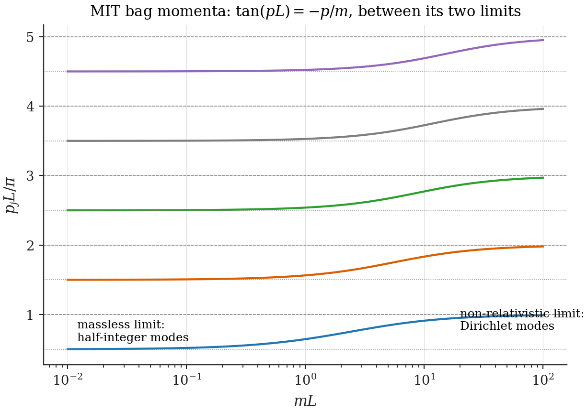
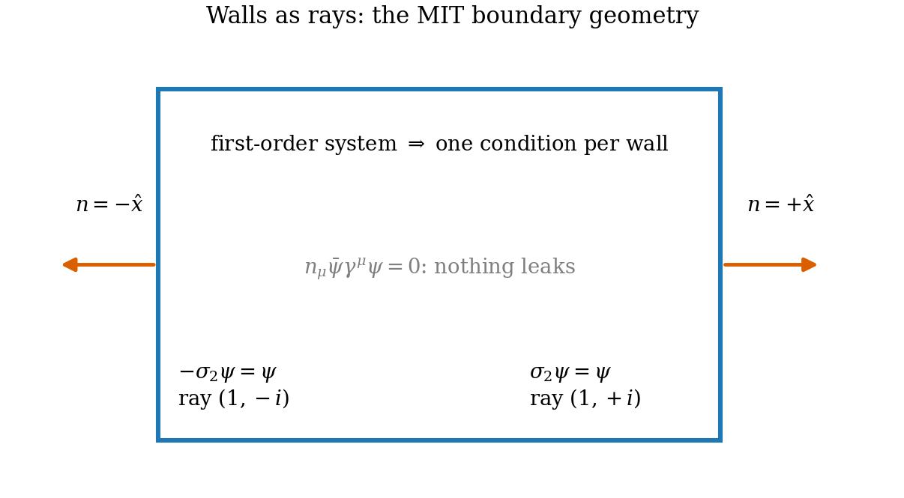
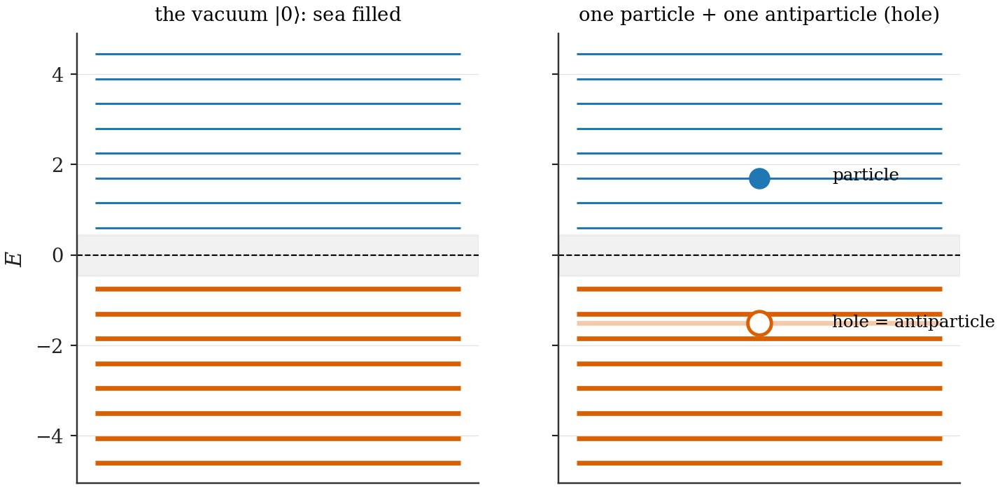

# Chapter 8 — Interlude: relativistic fermions in a finite box

---

## 8.1 Why the box must go relativistic

Part I asked how geometry changes; Part II will ask what those changes *create*. Three ingredients of that question are simply unavailable in non-relativistic quantum mechanics, and each names a section of this interlude. **Antiparticles**: a matter–antimatter asymmetry needs two charge branches, and only the relativistic spectrum has them ($E = \pm\sqrt{p^2 + m^2}$; §8.2). **CP violation**: the bias between the branches enters through the phase structure of the *mass term*, a possibility the Schrödinger equation does not offer (previewed in §8.4, owned by Ch. 10). **Pair creation**: a changing geometry repopulating the vacuum is a statement about mismatched Fock spaces, which requires second quantization in finite volume (§8.6, machinery in App. A). The chapter builds each tool from its motivation, then closes with the two sections everything in Part II stands on: the symmetrized charge operator (§8.7) and the bookkeeping of charge across a quench (§8.8).

## 8.2 The Dirac equation in 1+1D

Conventions (App. D, fixed for the whole thesis): signature $(+, -)$, and the two-dimensional Clifford representation

$$\gamma^0 = \sigma_3, \qquad \gamma^1 = i\sigma_2, \qquad \gamma_5 \equiv \gamma^0\gamma^1 = \sigma_1,$$

so $(\gamma^0)^2 = \mathbb 1$, $(\gamma^1)^2 = -\mathbb 1$, $\{\gamma^\mu, \gamma^\nu\} = 2\eta^{\mu\nu}$, $\{\gamma^\mu, \gamma_5\} = 0$ — the reader can verify each in one line of $2\times2$ algebra. From $\mathcal L = \bar\psi(i\gamma^\mu\partial_\mu - m)\psi$ with $\bar\psi = \psi^\dagger\gamma^0$, the Euler–Lagrange equation $i\gamma^\mu\partial_\mu\psi = m\psi$ rearranges to Schrödinger form $i\partial_t\psi = H\psi$ with

$$H \;=\; -\,i\,\sigma_1\,\partial_x \;+\; m\,\sigma_3 \tag{8.1}$$

(multiply by $\gamma^0$ and use $\gamma^0\gamma^1 = \sigma_1$). $H$ is Hermitian, two-component, first order — and its spectrum on the line is the chapter's first lesson. Plane waves $\psi = u(p)e^{ipx - iEt}$ require $(\sigma_1 p + \sigma_3 m)\,u = E\,u$, a $2\times2$ eigenproblem with eigenvalues and (unnormalized) eigenvectors

$$E_\pm(p) = \pm\sqrt{p^2 + m^2}\,, \qquad u_+(p) = \begin{pmatrix} E_+ + m \\ p \end{pmatrix}, \quad u_-(p) = \begin{pmatrix} -p \\ E_+ + m \end{pmatrix}. \tag{8.2}$$

Every momentum carries **two** energy branches separated by the gap $|E| < m$, and no superposition principle can wish the negative branch away: it is needed for completeness, and any confined wavefunction (a box state!) necessarily contains it. The branches mix under the position-dependent problems of Ch. 10–12 through exactly the spinor structures displayed in (8.2) — which is why they are displayed.

**Charge conjugation.** In this representation the operation

$$\psi_c \;=\; \sigma_1\,\psi^* \tag{8.3}$$

maps solutions to solutions with $E \to -E$ (check: conjugate (8.1), multiply by $\sigma_1$, use $\sigma_1\sigma_1^* = \mathbb 1$, $\sigma_1\sigma_3^*\sigma_1 = -\sigma_3$): the negative branch is the charge mirror of the positive one. **[Standard]** This little map has two big appearances ahead: it forces the symmetric ordering of §8.7, and its compatibility with boundary conditions is what pairs the spectrum into mirror twins (Ch. 10).

## 8.3 Confinement without infinite potentials: the MIT bag

How does one put a Dirac particle in a box? The Schrödinger reflex — demand $\psi = 0$ at the wall — fails: (8.1) is first order, so fixing *both* components at a point generically forces $\psi \equiv 0$ (one condition per wall is all a first-order system can bear). The physical reflex — a steep confining potential — fails more interestingly: a scalar-potential wall steeper than $\sim m$ produces transmission rather than confinement by pair creation across the gap (the Klein paradox), the relativistic vacuum's way of announcing that it cannot be pushed around by potentials. Confinement must instead be written as a *boundary condition*, and the requirement that picks it is current conservation: no probability flux through the wall,

$$n_\mu\,\bar\psi\gamma^\mu\psi\big|_{\text{wall}} = 0, \tag{8.4}$$

implemented by a *local, linear* condition on $\psi$. The minimal solution is the **MIT bag boundary condition** **[Standard]**:

$$-\,i\,n\!\cdot\!\gamma\,\psi \;=\; \psi \quad \text{at the wall}, \tag{8.5}$$

$n^\mu$ the outward spacelike normal. (Why (8.5) kills the current: for any $\psi$ satisfying it, $\bar\psi\,n\!\cdot\!\gamma\,\psi = \bar\psi\,(i\psi) = i\psi^\dagger\gamma^0\psi$, while taking the adjoint of (8.5) gives $\bar\psi\,n\!\cdot\!\gamma = -i\bar\psi$, whence $\bar\psi\,n\!\cdot\!\gamma\,\psi = -i\bar\psi\psi$ as well; the two expressions force $n_\mu\bar\psi\gamma^\mu\psi = 0$ and, as a by-product, $\bar\psi\psi|_{\text{wall}} = 0$ — the scalar density also vanishes at an MIT wall.)

**The 1+1D rays.** At $x = L$, $n = +\hat x$: $-i\gamma^1\psi = \sigma_2\psi = \psi$, confining $\psi(L)$ to the $+1$ eigenvector of $\sigma_2$ — the ray $(1, i)$. At $x = 0$, $n = -\hat x$: $-\sigma_2\psi = \psi$, the ray $(1, -i)$. One condition per wall, as a first-order system requires: confinement with no infinite anything.

**The spectrum.** Solve (8.1) on $[0, L]$ with the ansatz $\psi_1 = A\cos px + B\sin px$ and $\psi_2$ from the first-order system ($\psi_2 = \psi_1'/[i(E+m)]$, the $m_I = 0$ case of Ch. 10's eq. (10.6)). The ray at $x = 0$ fixes $B = A(E + m)/p$; the ray at $x = L$ then collapses — by the same algebra spelled out in full generality in §10.3 — to

$$\boxed{\;\tan(pL) \;=\; -\,\frac{p}{m}\;,} \tag{8.6}$$

with the two limits that calibrate intuition: $mL \to 0$ gives $\cos(pL) = 0$ — half-integer modes $p_j \to (j - \tfrac12)\pi/L$, the massless bag; $mL \to \infty$ gives $\sin(pL) \to 0$ — Dirichlet modes $p_j \to j\pi/L$, the non-relativistic box recovered. And the structural fact that powers Chapter 10: **the quantization condition (8.6) constrains only $p$** — for every root $p_j$, *both* $E = \pm\sqrt{p_j^2 + m^2}$ solve the boundary-value problem (the boundary algebra never fixes the sign of $E$; §10.4 re-proves this with the CP phase included). The MIT spectrum is exactly mirror-symmetric. **[Computed]** (8.6) and the limits are verified against the transfer-matrix solver in `ch08_bag_spectrum.py` (test A: $4\times10^{-8}$).

*Figure 8.1 — The MIT bag spectrum vs $mL$: half-integer (massless) modes at one end, Dirichlet (non-relativistic) modes at the other, both energy branches mirror-paired throughout. The phenomenologically loaded regime of Part II is the crossover $mL \sim 1$.*

*Figure 8.2 — Walls as rays. Outward normals, the boundary operators $\pm\sigma_2$, and the one-dimensional rays $(1, \mp i)$ they enforce; a first-order system carries exactly one condition per wall. (drawn)*

## 8.4 The chiral-bag family

The MIT condition is not alone; it is the origin of a one-parameter family, and meeting the family now removes all surprise from Chapter 12. Insert a chiral rotation into (8.5):

$$\boxed{\;-\,i\,n\!\cdot\!\gamma\;e^{i\theta\gamma_5}\,\psi \;=\; \psi\;} \tag{8.7}$$

— the **chiral bag** **[Standard]** (Chodos–Thorn lineage; its famous vacuum property arrives in Ch. 9). $\theta = 0$ is MIT. Physically: a wall reflects right-movers into left-movers; (8.7) says the reflection imprints a *chiral phase* $\theta$ — the wall's own angle in the $\gamma_5$ direction. Current confinement survives for every $\theta$: the adjoint argument under (8.5) goes through verbatim because $e^{i\theta\gamma_5}$ is unitary and anticommutes its way through $n\!\cdot\!\gamma$ (the by-product changes character, though: at a chiral wall it is the combination $\cos\theta\,\bar\psi\psi + \sin\theta\,\bar\psi i\gamma_5\psi$ that vanishes — the wall fixes a *direction* in the $(\bar\psi\psi,\ \bar\psi i\gamma_5\psi)$ plane, which is exactly the geometric seed of everything CP-odd in Part II).

**The rays, for general angles.** Work them out once, boxed, since Ch. 12 consumes them verbatim. At $x = L$: the boundary operator is $-i\gamma^1 e^{i\theta_L\gamma_5} = \sigma_2(\cos\theta_L + i\sigma_1\sin\theta_L) = \cos\theta_L\,\sigma_2 + \sin\theta_L\,\sigma_3$ (using $\sigma_2\sigma_1 = -i\sigma_3$); at $x = 0$ the same with an overall minus. Their $+1$ eigenvectors:

$$\boxed{\;v_L \propto \begin{pmatrix}\cos b \\ i\sin b\end{pmatrix},\;\; b = \frac{\pi}{4} - \frac{\theta_L}{2}; \qquad v_0 \propto \begin{pmatrix}\cos a \\ -\,i\sin a\end{pmatrix},\;\; a = \frac{\pi}{4} + \frac{\theta_0}{2}.\;} \tag{8.8}$$

(Verification by direct substitution is two lines per ray — done in §12.1 — and the $\theta = 0$ limits $a = b = \pi/4$ reproduce §8.3's $(1, \mp i)$.) **[Computed]** rays vs numerical eigendecomposition: `ch12_chiral_bag.py`.

A question the alert reader should ask now, holding it until Ch. 10: *the two walls each carry an angle — what happens to physics under a common shift of both?* The answer (nothing but a mass renormalization) and its converse (everything lives in the difference) organize the entire second half of Part II.

## 8.5 Three space dimensions: the spherical bag in brief

Part II's quantitative work is one-dimensional (slabs), but Chapter 10 must dissect a three-dimensional argument, so the spherical bag's skeleton is needed — compactly. In a central problem the Dirac Hamiltonian commutes with total angular momentum $\mathbf J$ and with the operator $\hat K = \gamma^0(\boldsymbol\Sigma\cdot\mathbf L + 1)$, whose integer eigenvalues

$$\kappa = \mp\big(j + \tfrac12\big) \;\in\; \{\pm1, \pm2, \ldots\} \qquad (\text{for } j = \ell \mp \tfrac12)$$

label the channels: $\kappa$ packages $(j, \text{parity})$, and each channel is $2|\kappa| = 2j + 1$-fold degenerate in $m_j$ — *the multiplicity bookkeeping that any channel-cancellation argument leans on.* The eigenspinor ansatz separates radial from angular structure,

$$\psi_{\kappa m}(\mathbf r) = \begin{pmatrix} g(r)\,\Omega_{\kappa m}(\hat r) \\ i f(r)\,\Omega_{-\kappa m}(\hat r)\end{pmatrix}, \tag{8.9}$$

with $\Omega_{\pm\kappa m}$ the spinor spherical harmonics — note carefully that the upper and lower components carry *opposite* $\kappa$: the operator $\boldsymbol\sigma\cdot\hat r$ maps $\Omega_{\kappa m} \leftrightarrow \Omega_{-\kappa m}$, and this exchange is precisely the structure that the chiral mass term will abuse in Ch. 10. Substituting (8.9) reduces the Dirac equation to the radial system **[Standard]**

$$g' = (E + m)\,f - \frac{1 + \kappa}{r}\,g, \qquad f' = -(E - m)\,g - \frac{1 - \kappa}{r}\,f, \tag{8.10}$$

regular solutions $g \propto j_{\ell}(pr)$, $f \propto \pm j_{\bar\ell}(pr)$ (spherical Bessel functions with the channel's orbital indices), and the MIT condition (8.5) on the sphere $r = R$ becomes the ratio condition

$$f(R) = -\,g(R), \tag{8.11}$$

one transcendental equation per channel. That is all Ch. 10 needs: channels labeled $\kappa$, degeneracy $2|\kappa|$, a two-component radial reduction valid *at zero CP phase*, and the warning flag planted on (8.9) — the reduction's validity at $\delta \neq 0$ is exactly what §10.5 will indict.

## 8.6 Second quantization in a box

Finally, fields. Let $\{\psi_k\}$ be the complete orthonormal eigenbasis of the bag (both branches, all channels), $H\psi_k = E_k\psi_k$. The field operator and its algebra:

$$\hat\psi(x) = \sum_k \hat c_k\,\psi_k(x), \qquad \{\hat c_k, \hat c^\dagger_{k'}\} = \delta_{kk'}, \quad \{\hat c_k, \hat c_{k'}\} = 0, \tag{8.12}$$

where the canonical anticommutator $\{\hat\psi(x), \hat\psi^\dagger(y)\} = \delta(x - y)$ holds *because of* the completeness identity

$$\sum_k \psi_k(x)\,\psi_k^\dagger(y) = \delta(x - y)\,\mathbb 1_{2\times2} \tag{8.13}$$

(App. A proves it and tracks what happens when sums are truncated — the technical root of Ch. 11). The Hamiltonian $\hat H = \sum_k E_k\,\hat c^\dagger_k \hat c_k$ is unbounded below as it stands; the stable construction is Dirac's: define the vacuum by *filling the sea*,

$$|0\rangle: \quad \text{every } E_k < 0 \text{ level occupied, every } E_k > 0 \text{ level empty},$$

and re-name operators to make excitations positive-energy: $\hat b_k = \hat c_k$ for $E_k > 0$ (**particle** annihilators) and $\hat d_k^\dagger = \hat c_k$ for $E_k < 0$ (**antiparticle** creators — removing a sea fermion creates a hole). Excitations: particles = filled positive levels; antiparticles = sea holes; both cost positive energy relative to $|0\rangle$.

*Figure 8.3 — The sea as ledger. Left: the filled sea defining $|0\rangle$. Right: one particle (occupied positive level) and one antiparticle (hole) — the excitations Part II counts. (drawn)*

An honesty paragraph before the chapter's payload. The sea is a *bookkeeping device*: every prediction it yields can be phrased as a normal-ordering prescription, and in unbounded space one may forget the picture entirely. But the bookkeeping has exactly **one irreducibly physical residue** — a quantity that survives every reformulation, depends only on the spectrum, and cannot be normal-ordered away because it *is* the comparison between orderings: the charge the vacuum itself carries. In a static world that residue is an ignorable constant. In this thesis the box changes, the spectrum shifts, and the residue becomes the whole story. It is the subject of the next section.

---

## 8.7 The charge operator must be symmetrized

Everything in Part II balances on how the charge of a state is counted, so we do this slowly and exactly.

The naive charge operator $\int dx\,\psi^\dagger\psi$ is not acceptable in the quantum theory: acting on the sea vacuum it returns the (divergent) number of filled levels — it counts the bookkeeping, not the physics. The standard reflex is to *normal order* with respect to the vacuum, but normal ordering hides a choice: *which* vacuum? In a static world the choice is invisible. In this thesis the box changes, the vacuum changes with it, and the choice becomes the entire question. We therefore need the ordering that is forced by symmetry rather than chosen by convenience.

Charge conjugation $C$ exchanges $\psi$ and its conjugate; the physical charge must be exactly $C$-odd, $\;\hat Q \xrightarrow{C} -\hat Q$, *as an operator identity, independent of any vacuum*. The unique bilinear with that property is the antisymmetrized (symmetrically ordered) combination:

$$\hat Q \;=\; \frac12 \int dx\,\big[\psi^\dagger\psi \;-\; \psi\,\psi^\dagger\big] \;=\; \frac12\int dx\, \big[\psi^\dagger,\psi\big]. \tag{8.1}$$

Under $C$ the two terms swap and the bracket flips sign; no reference to a state was made. **[Standard]** (this is Schwinger's ordering; in the solitonic literature it is the definition under which fractional fermion number was discovered — the thread we pick up in Ch. 9).

Now expand (8.1) in a complete bag eigenbasis. Write the field as

$$\psi(x) = \sum_{E_k > 0} \hat b_k\, \psi_k(x) + \sum_{E_k < 0} \hat d_k^\dagger\, \psi_k(x),$$

annihilators $\hat b_k$ for particles, *creators* $\hat d_k^\dagger$ for the negative branch (a hole created is an antiparticle). Insert into (8.1) and use orthonormality of the $\psi_k$:

$$\hat Q = \frac12\sum_{E_k>0}\big(\hat b_k^\dagger \hat b_k - \hat b_k \hat b_k^\dagger\big) \;+\; \frac12\sum_{E_k<0}\big(\hat d_k \hat d_k^\dagger - \hat d_k^\dagger \hat d_k\big).$$

Apply the CAR once in each sum ($\hat b\hat b^\dagger = 1 - \hat b^\dagger \hat b$, $\hat d\hat d^\dagger = 1 - \hat d^\dagger\hat d$):

$$\boxed{\;\hat Q \;=\; \sum_{E_k>0} \hat b_k^\dagger \hat b_k \;-\; \sum_{E_k<0} \hat d_k^\dagger \hat d_k \;+\; Q_{\text{vac}}, \qquad Q_{\text{vac}} \;=\; -\,\frac12\Big(\sum_{E_k>0}\!\!1 \;-\; \sum_{E_k<0}\!\!1\Big) \;=\; -\,\frac12\,\eta\;} \tag{8.2}$$

where $\eta \equiv \sum_k \operatorname{sgn}(E_k)$ is the **spectral asymmetry** — the (regulated; Ch. 9) count of how lopsided the spectrum is between its branches.

Equation (8.2) is the hinge of Part II, so let us state what it says with full force. The charge of a state is *particles minus antiparticles* — the familiar part — **plus a c-number that belongs to the vacuum itself**, fixed entirely by the spectrum of the Dirac operator. If the spectrum is symmetric under $E \to -E$, the vacuum is neutral and the naive counting is safe. If the spectrum is lopsided — one level pushed across zero, say — the vacuum *carries charge*, with no particle anywhere. Both the divergence of each sum in $Q_{\text{vac}}$ and its regularization are dealt with honestly in Ch. 9; the structure is what matters here.

## 8.8 Charge bookkeeping across a quench

One more preparation, cheap now and decisive later. Let the box change suddenly, $L \to L'$. Two complete eigenbases now exist — old and new — and expression (8.2) can be evaluated in either. The operator (8.1), however, is built from the field alone: *it does not know which basis we expand it in*. Moreover the quench Hamiltonian is bilinear in the field and commutes with $\hat Q$ — a sudden change of boundary parameters conserves total charge. So one conserved expectation value can be written two ways:

$$\langle \hat Q\rangle \;=\; \underbrace{\big(N_b - N_d\big)_{\text{old}} + Q_{\text{vac}}(L)}_{\text{old basis}} \;=\; \underbrace{\big(N_b - N_d\big)_{\text{new}} + Q_{\text{vac}}(L')}_{\text{new basis}} . \tag{8.3}$$

Everything Part II needs is already visible in (8.3): if the *measured* particle–antiparticle imbalance is counted against the new vacuum while the state began as the old vacuum, the imbalance is fixed by the *difference of vacuum charges* — a purely spectral quantity. Chapter 9 promotes this two-line observation to the master theorem of the thesis and draws its sweeping corollaries; Chapters 10–12 then ask the only remaining question, which turns out to have a sharp and surprising answer: *what does it take to make $Q_{\text{vac}}$ actually change?*

---

**Validation.** `ch08_bag_spectrum.py` (the `bag1d` transfer-matrix module + self-tests): MIT spectrum vs $\tan(pL) = -p/m$ roots; chiral-ray limits at $\theta = 0$; both-branch symmetry check. §8.7–8.8 are derivations with no native numerics; their consequences are validated wholesale in Ch. 9–12.
