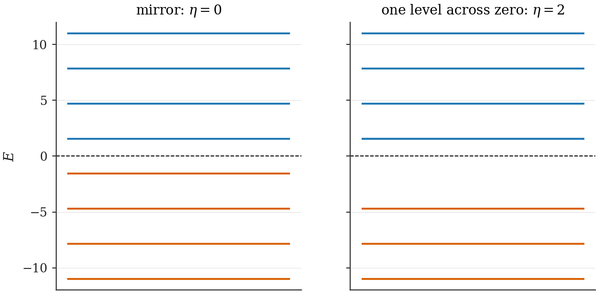
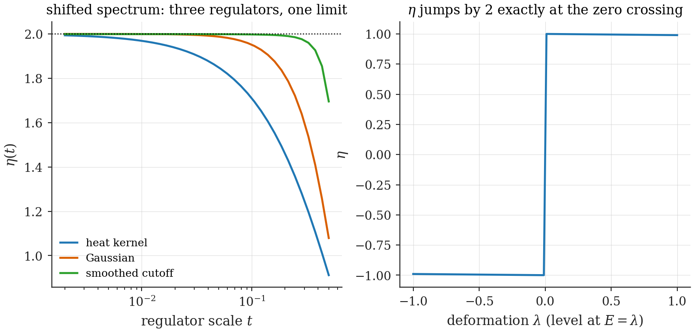

# Chapter 9 — Vacuum charge and the Spectral-Flow Master Theorem

---

Part II's driving question — *does an expanding box create more matter than antimatter?* — sounds like a question about pair-creation amplitudes, and the natural reflex is to compute Bogoliubov coefficients and sum their squares. This chapter proves that the reflex, while not wrong as a calculation, answers the wrong question. The *net charge* created by any sudden geometry change is fixed by a single spectral quantity, with no mode sum, no truncation, and no amplitude anywhere in sight. Once this theorem is in hand, the phenomenology of the following chapters becomes almost embarrassingly easy to organize: mechanisms that move the spectrum produce charge; mechanisms that do not, cannot — whatever their truncated mode sums appear to say.

## 9.1 The spectral asymmetry $\eta$, made finite

Section 8.7 produced the vacuum charge $Q_{\text{vac}} = -\tfrac12\eta$ with $\eta$ "$=$" $\sum_k \operatorname{sgn}(E_k)$ — a difference of two infinities. To make this a number we regulate, suppress high-energy levels smoothly, and remove the regulator:

> **Definition (regulated spectral asymmetry).**
>
> $$\eta \;=\; \lim_{t \to 0^+}\; \eta(t), \qquad \eta(t) \;=\; \sum_k \operatorname{sgn}(E_k)\, e^{-t|E_k|}. \tag{9.1}$$

The exponential is the **heat-kernel regulator**; the limit exists for the operators in this thesis, and — the property that earns the definition its keep — the limit is *regulator-independent*: any even, smooth, sufficiently decaying suppression $f(t|E_k|)$ with $f(0) = 1$ gives the same $\eta$ (App. B proves this for the class used here; the intuition is that $\eta$ measures an *infrared* imbalance, the high-$E$ tails of the two branches cancelling pairwise under any even damping).

> **Toolbox: $\eta$ on a solvable example.** Take the 1+1D massless MIT bag (§8.3): momenta $p_j = (j - \tfrac12)\pi/L$, $j = 1, 2, \ldots$, energies $\pm p_j$ — every positive level has a negative twin. Then $\eta(t) = \sum_j [e^{-tp_j} - e^{-tp_j}] = 0$ identically: a mirror-symmetric spectrum has $\eta = 0$ at every $t$, no limit needed. Now *shift one level by hand* across zero (move the lowest $-p_1$ level to $+p_1$): the count changes by $2$, $\eta = 2$, $Q_{\text{vac}} = -1$ — moving one level across zero changes the vacuum's charge by one unit. This cartoon is the entire mechanism of Part II; the rest is establishing when nature performs the shift. **[Computed]** `ch09_eta_toy.py` verifies both statements and the regulator-independence claim numerically (heat-kernel vs Gaussian vs sharp-cutoff-with-averaging: identical limits, Fig. 9.2).

*Figure 9.1 — What $\eta$ measures. Left: a mirror-symmetric spectrum, $\eta = 0$, neutral vacuum. Right: the same spectrum with one level pulled across zero; $\eta$ jumps by 2, the vacuum charge by $-1$. No particle has been created "into" any level — the *definition of vacuum* has shifted by one slot.*

## 9.2 Fractional vacuum charge: the standard anchors

That a vacuum can carry charge — even *fractional* charge — is not a speculation of this framework; it is established physics with a Nobel-grade pedigree, and anchoring to it is both honest and strategically wise.

**Jackiw–Rebbi (1976) [Standard].** A 1+1D Dirac field with a mass term that changes sign across a soliton has a single self-conjugate zero mode bound to the kink; charge-conjugation symmetry then forces the two degenerate vacua to carry charge $\pm\tfrac12$. Fermion number $\tfrac12$ — not as an expectation over fluctuations but as a sharp quantum number — was the first demonstration that $Q_{\text{vac}}$ is physical.

**Goldstone–Jaffe (1983) [Standard].** In the chiral bag model (the $\theta$-walls of §8.4, in 3+1D), the vacuum carries fermion number set by the wall's chiral angle — the famous resolution of where the baryon number "goes" when a skyrmion is fed into a bag. This is *exactly* the family of boundary conditions our framework's walls realize, and Ch. 12 will find its 1+1D shadow quantitatively: $Q_{\text{vac}} = -\Delta/2\pi$.

The point of the anchors: when this thesis claims "the vacuum charged up because the spectrum tilted", it is invoking a mechanism with four decades of consistency checks, not inventing one.

## 9.3 The Master Theorem

We now combine §8.7's operator identity with §8.8's bookkeeping into the central result of Part II.

> **Spectral-Flow Master Theorem [Theorem].** Let a Dirac field in a box undergo a *sudden* change of geometry and/or boundary parameters, $\Lambda \to \Lambda'$ (box size, wall angles, …), the change being bilinear in the field (no interactions switched on). Prepare the system in the vacuum of the initial parameters, $|0_\Lambda\rangle$. Measure, after the quench, the net charge relative to the *new* vacuum:
>
> $$\Delta Q_{\text{net}} \;\equiv\; \big\langle N_b - N_d \big\rangle_{\text{new basis}}\,.$$
>
> Then
>
> $$\boxed{\;\Delta Q_{\text{net}} \;=\; Q_{\text{vac}}(\Lambda) - Q_{\text{vac}}(\Lambda') \;=\; -\,\frac12\Big[\eta(\Lambda) - \eta(\Lambda')\Big]\;} \tag{9.2}$$
>
> — net charge production in a sudden quench is a purely spectral quantity.

*Proof, in full.* Three ingredients.

**(i) $\hat Q$ is conserved through the quench.** The charge operator (8.1) is built from the field at one instant; the quench Hamiltonians before and after are bilinear, $H = \int \psi^\dagger h_{\Lambda}\psi\,(+\,\text{c-number})$, and gauge invariance of each $h_\Lambda$ gives $[\hat Q, H_\Lambda] = 0$ for every $\Lambda$ along the change. Hence $\langle\hat Q\rangle$ is the same number the instant before and the instant after. (Suddenness is used only to say the *state* doesn't change at the instant of the quench; conservation holds regardless.)

**(ii) Evaluate $\langle\hat Q\rangle$ before, in the old basis.** The state is the old vacuum: no particles, no holes. By (8.2),

$$\langle \hat Q\rangle = 0 + Q_{\text{vac}}(\Lambda).$$

**(iii) Evaluate the same number after, in the new basis.** The same state, re-expressed in the new eigenbasis, contains particles and antiparticles (this is where all the Bogoliubov drama lives — and note that we never need to compute any of it). By (8.2) again,

$$\langle \hat Q\rangle = \big\langle N_b - N_d\big\rangle_{\text{new}} + Q_{\text{vac}}(\Lambda') = \Delta Q_{\text{net}} + Q_{\text{vac}}(\Lambda').$$

Equate (ii) and (iii). $\blacksquare$

The proof is short because the work was done in §8.7: once the charge operator is *forced* (not chosen) to be symmetrically ordered, the vacuum term is not optional, and charge conservation does the rest. Short as it is, the theorem has unusual destructive and constructive power, which we now unpack.

## 9.4 Corollaries, destructive and constructive

> **Corollary 9.1 (mirror spectra are sterile).** If both the initial and final spectra are symmetric under $E \to -E$, then $\eta(\Lambda) = \eta(\Lambda') = 0$ and
>
> $$\Delta Q_{\text{net}} = 0 \quad\text{exactly}$$
>
> — to all orders in every coupling and phase, at every truncation, for every quench between such spectra. Any truncated mode sum claiming otherwise is measuring something other than net charge (Ch. 11 identifies what).

> **Corollary 9.2 (charge production is level counting).** Deform parameters continuously from $\Lambda$ to $\Lambda'$. Levels move; $\eta$ changes *only* when a level crosses $E = 0$, jumping by $\pm 2$ per crossing. Hence
>
> $$\Delta Q_{\text{net}} \;=\; \#\{\text{levels crossing } 0 \text{ downward}\} \;-\; \#\{\text{levels crossing } 0 \text{ upward}\} , \tag{9.3}$$
>
> an *integer*: net charge production in this entire model class is **quantized**, and equals the **spectral flow** of the Dirac operator along the deformation path.

*(Derivation of 9.2: away from zero crossings the regulated sum (9.1) varies smoothly with $\Lambda$ but its $t \to 0$ limit is locally constant — paired tails cancel under the even regulator and small level motion is a relabeling; at a crossing, one $\operatorname{sgn}$ flips, moving $\eta$ by 2. App. B fills in the uniformity details.)*

> **Corollary 9.3 (robustness).** $\Delta Q_{\text{net}}$ depends only on the endpoint spectra (through $\eta$) — not on the quench speed profile within the sudden approximation, not on the mode basis, not on any cutoff. It is the rare observable in this subject that is *cutoff-theorem-protected*: Ch. 5's warning ("if it depends on the cutoff, it's wrong") cannot even be formulated against it.

Corollary 9.2 deserves a name in plain words: **to create charge, the geometry change must drag a level through zero energy.** Pair creation that merely populates symmetric branches — however violently — nets to zero charge. This converts Part II's program into a sharply posed hunt: find the parameter that drags levels through zero. Chapter 10 eliminates the obvious candidate (a bulk CP phase: it *cannot* move $\eta$, for two independent reasons, each proved exactly). Chapter 12 finds the real one (a *mismatch* of wall chiral angles: it moves $\eta$, by exactly the Goldstone–Jaffe fraction, and crossings occur at analytically computable box sizes).

*Figure 9.2 — $\eta(t)$ under three different regulators on the shifted-level toy spectrum of §9.1, extrapolating to the same integer limit. The spectral asymmetry is a property of the spectrum, not of the bookkeeping.*

## 9.5 What this means for "pair-creation asymmetries"

A reader arriving from the quantum-field-theory-in-curved-space literature may feel a tension: cosmological particle production (Parker; the moving-mirror literature — both return in Ch. 17) is real, and Bogoliubov sums measure it. There is no contradiction, and the distinction is worth one careful paragraph because the next two chapters live inside it.

A quench generically *does* create particles — in pairs. The Bogoliubov machinery correctly counts the **pairs**: $\langle N_b\rangle$ and $\langle N_d\rangle$ are separately nonzero, generically large, and physically meaningful (they carry energy, they back-react in a fuller theory). What the Master Theorem constrains is the **difference**: the net imbalance between branches. The difference is spectral; the sum is not. A truncated computation of the *difference*, however, inherits none of the protections of either: it is the small mismatch of two large, slowly converging, separately cutoff-sensitive quantities — numerically nonzero at any finite truncation for kinematic reasons, with a limit that (Ch. 11 proves) is a *boundary polarization integral*, not a charge. Three rules of practice follow, and they govern every computation in the rest of Part II:

1. **Net charge claims must be spectral-flow claims.** Compute $\eta$ from complete spectra, or count crossings; never subtract truncated mode sums and report the residue as charge.
2. **Bogoliubov sums are for pair content and distributions**, where they converge honestly and mean what they say.
3. **When the two disagree, the spectral computation wins by theorem**, and the disagreement itself is diagnostic data — it measures the polarization observable of Ch. 11.

## 9.6 Summary

Symmetric ordering forces a vacuum charge $Q_{\text{vac}} = -\tfrac12\eta$ (§8.7); charge conservation across a sudden quench then fixes the net production to $\Delta Q_{\text{net}} = -\tfrac12\Delta\eta$ (**Spectral-Flow Master Theorem**), which is zero between mirror spectra (Cor. 9.1), integer in general (Cor. 9.2), and cutoff-protected (Cor. 9.3). The hunt is now on for parameters that move levels through zero. First, a parameter that *seems* perfect for the job and fails for beautiful reasons: the bulk CP phase.

---

**Validation.** `ch09_eta_toy.py`: the mirror/shifted toy spectra, $\eta(t)$ under three regulators with Richardson extrapolation (Fig. 9.2), and a numerical illustration of Corollary 9.2 on a parametric family dragging one level through zero. The theorem itself is exact; its consequences are stress-tested numerically throughout Ch. 10–12 (machine-zero $\eta$ checks, the quantized pump, the control quench).
