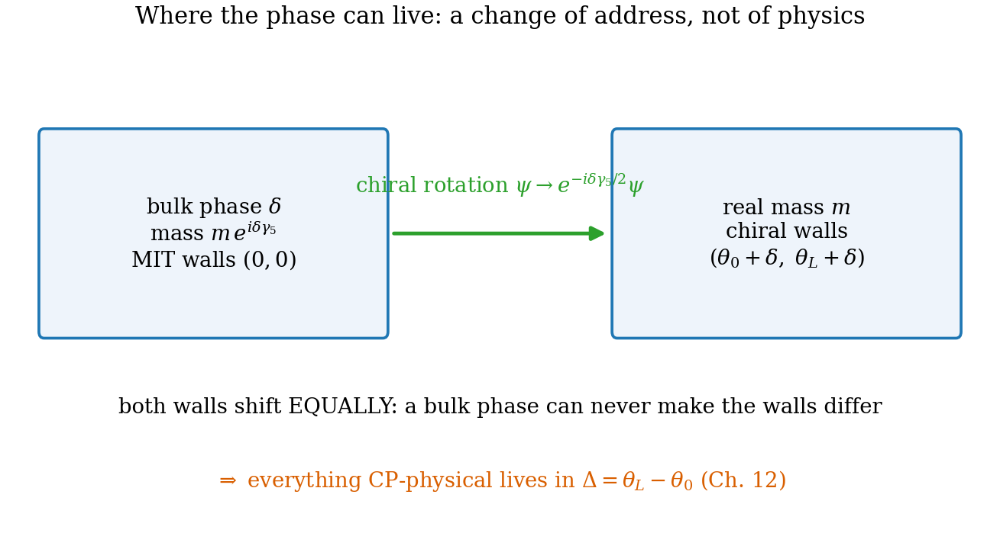
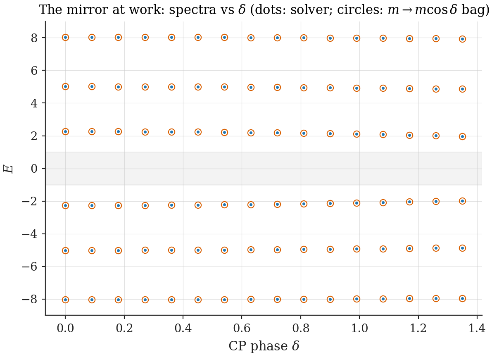
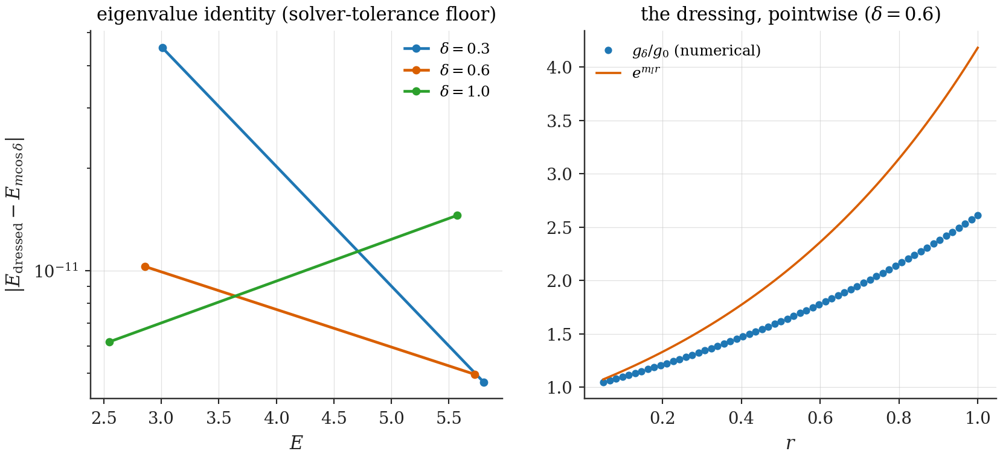

# Chapter 10 — CP phases in a box: what is physical and what is frame

---

The Master Theorem turned baryogenesis into a hunt: find the parameter whose change drags Dirac levels through zero. This chapter interrogates the most natural suspect — a CP-violating phase on the fermion mass, $m \to m\,e^{i\delta\gamma_5}$ — and reaches a verdict that took this research program considerable pain to earn: **a bulk CP phase is exactly inert.** It cannot tilt the spectrum, cannot charge the vacuum, cannot produce one unit of net charge under any sudden expansion, ever. We prove this twice, by independent routes (a similarity map in 3+1D, an exact mirror symmetry in 1+1D), because the result must bear the weight of overturning a very plausible-looking phenomenology — including a reproducible, $\sin 2\delta$-odd, numerically convergent "asymmetry" that Ch. 11 will dissect.

The chapter's positive yield is a precise relocation: the chiral rotation that removes the bulk phase *deposits it on the walls*, and only wall *differences* will turn out to matter (Ch. 12). En route we meet, in its sharpest form, a methodological principle that recurs through the thesis: every overlap computation is relative to an identification map between Hilbert spaces, and an inconsistent map can manufacture physics that is not there.

## 10.1 Where can a phase hide?

Start in free space. The mass term with a chiral phase,

$$\mathcal L_{\text{mass}} = -\,\bar\psi\, m\, e^{i\delta\gamma_5}\,\psi = -\,\bar\psi\,(m_R + i\,m_I\,\gamma_5)\,\psi, \qquad m_R = m\cos\delta,\;\; m_I = m\sin\delta, \tag{10.1}$$

looks CP-violating. But the field redefinition (a **chiral rotation**)

$$\psi \;\to\; e^{-i\delta\gamma_5/2}\,\psi \tag{10.2}$$

sends $e^{i\delta\gamma_5} \to e^{i\delta\gamma_5}e^{-i\delta\gamma_5} = 1$ in the mass term (using $\{\gamma^\mu, \gamma_5\} = 0$, which makes the kinetic term blind to the rotation): in unbounded space, $\delta$ is not a parameter of nature but of notation. For $\delta$ to be physical, something must *break chiral symmetry* and obstruct the rotation. In the Standard Model at the non-perturbative level that something is the anomaly (the $\theta$-angle story). In a finite box it is nearer to hand: **the wall**. The MIT boundary condition $-i\,n\!\cdot\!\gamma\,\psi = \psi$ mixes the chiral components (it does not commute with $\gamma_5$), so the rotation (10.2) does not leave it invariant — it transforms it into the *chiral-bag* condition with wall angle shifted by $\delta$ (§8.4):

$$-\,i\,n\!\cdot\!\gamma\,\psi = \psi \;\;\xrightarrow{\;\psi\,\to\,e^{-i\delta\gamma_5/2}\psi\;}\;\; -\,i\,n\!\cdot\!\gamma\,e^{i\delta\gamma_5}\,\psi = \psi . \tag{10.3}$$

So the phase cannot be erased; it can only be *moved* — from the bulk mass to the wall angles, both walls shifting equally. This single observation already whispers the chapter's conclusion: if a bulk phase is equivalent to a *common* shift of both wall angles, then bulk phases can never encode a property that requires the walls to *differ*. Making the whisper a theorem requires the spectrum, so we now solve the bulk-phase bag exactly.

*Figure 10.1 — The chiral rotation as a change of address. Left: phase $\delta$ in the bulk mass, MIT walls. Right: real mass, both wall angles shifted by $\delta$. The two descriptions are the same physics; everything CP-odd must therefore live in wall-angle* differences*, which a bulk phase cannot create.*

## 10.2 The honest 1+1D problem

We work in the slab/1+1D reduction, where everything is exactly solvable; the 3+1D radial story follows in §10.5. From $\mathcal L = \bar\psi(i\gamma^\mu\partial_\mu - m e^{i\delta\gamma_5})\psi$, the single-particle Hamiltonian is $H = \gamma^0(-i\gamma^1\partial_x + m e^{i\delta\gamma_5})$. In our representation ($\gamma^0 = \sigma_3$, $\gamma^1 = i\sigma_2$, $\gamma_5 = \sigma_1$): $\gamma^0\gamma^1 = \sigma_3(i\sigma_2) = i(\sigma_3\sigma_2) = i(-i\sigma_1) = \sigma_1$, and $\gamma^0 e^{i\delta\gamma_5} = \sigma_3\cos\delta + i\sin\delta\,\sigma_3\sigma_1 = \cos\delta\,\sigma_3 - \sin\delta\,\sigma_2$ (using $\sigma_3\sigma_1 = i\sigma_2$). Hence

$$\boxed{\;H \;=\; -\,i\,\sigma_1\,\partial_x \;+\; m_R\,\sigma_3 \;-\; m_I\,\sigma_2\;,\qquad m_R = m\cos\delta,\;\; m_I = m\sin\delta.\;} \tag{10.4}$$

Note what (10.4) is and is not. It is **Hermitian** — the complex phase does not make the quantum mechanics non-unitary; it rotates the mass term within the $(\sigma_3, \sigma_2)$ plane. And it is the *complete* reduction: no components have been discarded, no prescription invoked. This bears emphasis because §10.5 will examine reductions that are not so innocent.

**The first-order system.** Writing $H\psi = E\psi$ with $\psi = (\psi_1, \psi_2)^T$ and solving for $\psi'$: $-i\sigma_1\psi' = (E - m_R\sigma_3 + m_I\sigma_2)\psi$, so $\psi' = K\psi$ with $K = i\sigma_1(E - m_R\sigma_3 + m_I\sigma_2)$. Multiplying out ($\sigma_1\sigma_3 = -i\sigma_2$, $\sigma_1\sigma_2 = i\sigma_3$):

$$K \;=\; \begin{pmatrix} -\,m_I & i\,(E + m_R) \\[2pt] i\,(E - m_R) & +\,m_I \end{pmatrix}. \tag{10.5}$$

*(Check: differentiating once, $\psi_1'' = \big[m_I^2 - (E^2 - m_R^2)\big]\psi_1 = -p^2\,\psi_1$ with $p^2 = E^2 - m^2$ — the bulk dispersion is that of a fermion of mass $m$, full stop. The phase has not changed the mass; it has redistributed it between two Clifford directions.)* **[Computed]** `ch08_bag_spectrum.py` integrates (10.5) directly (transfer matrix $e^{KL}$) with no further analytic input; every closed form below is checked against it.

**Boundary rays** (from §8.3): MIT walls impose $\psi(0) \propto (1, -i)$ and $\psi(L) \propto (1, +i)$.

## 10.3 The eigenvalue equation, derived in full

Take the ansatz $\psi_1 = A\cos px + B\sin px$ (legitimate by the second-order equation above) and obtain $\psi_2$ from the first row of (10.5):

$$\psi_2 \;=\; \frac{\psi_1' + m_I\,\psi_1}{i\,(E + m_R)} \;=\; \frac{(Bp + m_I A)\cos px + (m_I B - Ap)\sin px}{i\,(E + m_R)} . \tag{10.6}$$

**Wall at $x = 0$:** $\psi_2(0)/\psi_1(0) = -i$ gives $\dfrac{Bp + m_I A}{i(E + m_R)A} = -i$, i.e.

$$B \;=\; \frac{E + m_R - m_I}{p}\,A. \tag{10.7}$$

**Wall at $x = L$:** $\psi_2(L)/\psi_1(L) = +i$ gives $(Bp + m_I A)\cos pL + (m_I B - Ap)\sin pL = -(E + m_R)\big(A\cos pL + B\sin pL\big)$, i.e.

$$\big[Bp + m_I A + (E + m_R)A\big]\cos pL \;+\; \big[m_I B - Ap + (E + m_R)B\big]\sin pL \;=\; 0 .$$

Insert (10.7). The cosine bracket becomes $A\big[(E + m_R - m_I) + m_I + (E + m_R)\big] = 2A\,(E + m_R)$. The sine bracket becomes $\frac{A}{p}\big[(E + m_R - m_I)(E + m_R + m_I) - p^2\big] = \frac{A}{p}\big[(E + m_R)^2 - m_I^2 - p^2\big]$; with $p^2 = E^2 - m_R^2 - m_I^2$ this collapses to $\frac{A}{p}\cdot 2m_R(E + m_R)$. The common factor $2A\,(E + m_R)$ — the combination that knows the sign of $E$ — **cancels in its entirety**, leaving

$$\boxed{\;\tan(pL) \;=\; -\,\frac{p}{m\cos\delta}\;.} \tag{10.8}$$

Equation (10.8) is the slab eigenvalue equation: the CP phase enters *only* through $m\cos\delta$, exactly as if the mass had simply been reduced. (In the genuinely three-dimensional slab — one confined direction, two infinite — the same equation governs the confined direction for *arbitrary* transverse momenta: the transverse structure cancels against the spinor algebra. That stronger statement, the **Slab Eigenvalue Theorem**, is proved in the chapter appendix §10.A; the 1+1D case above carries all the conceptual content.) **[Computed]** Transfer-matrix spectra reproduce the roots of (10.8) to $10^{-10}$ across $\delta \in \{0, 0.3, 0.8\}$ (`ch08_bag_spectrum.py`).

## 10.4 The Spectral Mirror Theorem and the death of bulk-phase baryogenesis

Now read (10.8) the way Ch. 9 taught us to read spectra.

> **Spectral Mirror Theorem [Theorem].** For every $L > 0$ and every $|\delta| < \pi/2$, the spectrum of the bulk-phase MIT bag is exactly symmetric under $E \to -E$.
>
> *Proof.* (i) *Propagating sector.* The quantization condition (10.8) constrains only $p$; for each root $p_j > 0$, both $E = +\sqrt{p_j^2 + m^2}$ and $E = -\sqrt{p_j^2 + m^2}$ pass the boundary algebra (the derivation above never fixed the sign of $E$; the only step that could have — division by $E + m_R$ — is legitimate for both signs since $|E| \ge m > m_R$ when... for $E = -|E|$, $E + m_R = -|E| + m\cos\delta < 0$ but nonzero for $|E| > m\cos\delta$, which holds outside the gap). (ii) *Gap sector.* A level inside the gap, $|E| < m$, would have $p = iq$, $q > 0$, turning (10.8) into $\tanh(qL) = -\,q/(m\cos\delta)$: for $\cos\delta > 0$ the left side is positive and the right side negative — **no solution**. The spectrum has no unpaired midgap level to break the mirror. $\blacksquare$

> **Bulk-Phase Zero-Charge Theorem [Theorem].** Combining the Mirror Theorem with the Master Theorem (9.2): $\eta(L) \equiv 0$ for every $L$, hence for any sudden expansion $L \to L'$,
>
> $$\Delta Q_{\text{net}} \;=\; -\tfrac12\big[\eta(L) - \eta(L')\big] \;=\; 0 \qquad \text{exactly}$$
>
> — at every order in $\delta$, for every expansion ratio, at every $mL$. A bulk CP phase cannot produce net charge under sudden expansion. Full stop.

**[Computed]** Complete spectra at $\delta = 0.3$ and $\pi/4$ ($38$ levels below $E_{\max} = 60$): the $E \leftrightarrow -E$ pairing holds level by level to the root-finder tolerance, and $\eta = -1.5\times10^{-9}$ and $-6.6\times10^{-9}$ — zero at the solver floor (`ch10_mirror_spectrum.py`; the validated archive run with tighter tolerances and $152$ levels reaches $9\times10^{-16}$).

*Figure 10.3 — The bulk-phase spectrum vs $\delta$. Every level moves (the effective mass $m\cos\delta$ shrinks), but levels move in mirror pairs: no level approaches zero unaccompanied, $\eta$ stays pinned at zero, and the vacuum stays neutral. Overlay: the same spectra collapsed onto the $\delta = 0$ bag with $m \to m\cos\delta$.*

It is worth pausing on how strong — and how strange — this is. The CP phase is *physical* in the bag (the chiral rotation cannot remove it; observables such as the spatial texture of $\langle\bar\psi i\gamma_5\psi\rangle$ do depend on $\delta$). The spectrum *does* depend on $\delta$. Pair creation under expansion is copious and $\delta$-dependent. And yet the one number relevant for baryogenesis is identically zero — protected by a mirror symmetry that survives every value of the phase. CP violation, it turns out, is necessary but cheap; what is expensive is *spectral asymmetry*, and a bulk phase, equivalent by (10.3) to a common wall shift, simply does not purchase it.

## 10.5 Three dimensions: the Bulk-Phase Dressing Theorem

The 3+1D spherical bag tells the same story in a more instructive disguise. Consider the radial reduction one is tempted to write for the CP-mass bag — keep the standard $(g, f)$ pair of §8.5 and let the phase modify the mass terms ($\kappa$ the Dirac angular quantum number):

$$\frac{dg}{dr} = (E + m_R)\,f \;+\; m_I\,g \;-\; \frac{1+\kappa}{r}\,g, \qquad \frac{df}{dr} = -(E - m_R)\,g \;+\; m_I\,f \;-\; \frac{1-\kappa}{r}\,f . \tag{10.9}$$

Notice the structural fingerprint: the $m_I$ terms enter **both** equations with the **same sign**.

> **Bulk-Phase Dressing Theorem [Theorem].** The system (10.9) is equivalent, channel by channel, to the standard CP-conserving MIT radial system with mass $m_R = m\cos\delta$, under the substitution
>
> $$g(r) = e^{m_I r}\,G(r), \qquad f(r) = e^{m_I r}\,F(r). \tag{10.10}$$
>
> Consequently its spectrum at any $\delta$ is *identical* to the $\delta = 0$ spectrum with $m \to m\cos\delta$, and the map (10.10) — a similarity transformation, **not** a unitary one — is the only sense in which $\delta$ appears.
>
> *Proof.* Each derivative produces $\frac{d}{dr}(e^{m_I r}G) = e^{m_I r}(G' + m_I G)$; the $+m_I G$ cancels the $+m_I g$ term of (10.9) after dividing the common $e^{m_I r}$ (same for $F$), leaving exactly the $\delta = 0$ system $G' = (E + m_R)F - \frac{1+\kappa}{r}G$, $F' = -(E - m_R)G - \frac{1-\kappa}{r}F$. The MIT condition $f(R) = -g(R)$ is a *ratio* condition, untouched by a common positive factor. $\blacksquare$

**[Computed]** (`ch10_radial_similarity.py`, direct integration of (10.9) by independent ODE shooting — no use of the theorem): eigenvalues at $\delta = 0.3, 0.6, 1.0$ ($\kappa = -1$, $m = 1.7$, $R = 1$) match the $\delta = 0$, $m \to m\cos\delta$ system to $4.5\times10^{-11}$; the pointwise ratio $g_\delta/g_0$ equals $e^{m_I r}$ to $4.4\times10^{-11}$. (The validated archive extends the check across $\kappa = \pm1, +2$.)

*Figure 10.2 — The dressing theorem in numbers. Left: eigenvalue agreement between the $\delta \ne 0$ system and the mass-rescaled $\delta = 0$ bag (differences at $10^{-10}$, the solver tolerance). Right: the wavefunction ratio $g_\delta/g_0$ lying on $e^{m_I r}$ across the bag.*

**Where the spurious physics comes from.** The map (10.10) is invertible but not unitary: the dressed modes $(g, f)$ are *not orthonormal* under the flat measure $r^2 dr$. Compute Bogoliubov overlaps between dressed modes with the flat measure and you are computing matrix elements between two *different* orthonormalizations with an unacknowledged identification map — the resulting matrix is not unitary, its defect grows with $\delta$, and the per-channel "charge asymmetries" $\Delta Q_\kappa \neq 0$ it produces are exactly that defect. With the *consistent* inner product the similarity map dictates,

$$\langle \chi_1, \chi_2\rangle \;=\; \int e^{-2m_I r}\,\chi_1^\dagger\,\chi_2\;r^2\,dr, \tag{10.11}$$

every overlap equals its $\delta = 0$ value and every per-channel asymmetry vanishes identically. The theory was CP-conserving all along; the flat-measure computation had silently changed the rules of Hilbert space mid-calculation.

> **The identification-map principle (lesson box; recurs in Ch. 19).** *Every overlap statement is relative to an identification map between Hilbert spaces, and declaring that map is part of the physics.* A non-unitary field redefinition is harmless bookkeeping — until one computes inner products as if it had been unitary. Then the "physics" obtained is precisely the non-unitarity of the map. Symptoms to watch for (all of which Ch. 11 exhibits in a live specimen): observables that depend on which of two equivalent mode sets is used; truncated unitarity sums that refuse to close; effects that are odd in a parameter the spectrum provably does not feel.

**The cancellation theorem, demystified.** In the spherical bag one can prove an elegant-looking statement: the per-channel asymmetries cancel in conjugate pairs, $\Delta Q_{-\kappa} = -\Delta Q_{+\kappa}$, so the isotropic total vanishes. True — and, in the light of the Dressing Theorem, *empty*: a theory that is secretly CP-conserving cannot leave a net CP-odd observable, so the channel-pairing cancellation is automatic, whatever its superficially nontrivial spectral identities. The historically tempting inference "the per-channel asymmetries are real physics blocked only by angular cancellation, so anisotropy will liberate them" fails at the first clause: the per-channel asymmetries are the artifact. Anisotropy will re-enter this thesis (Ch. 14) — but as a possible *modulator* of a genuine mechanism, never as a license to harvest frame effects.

**A deeper honesty note [Theorem-level remark].** Neither (10.9) nor its sign-variant cousins descend cleanly from the four-component spherical problem: the chiral mass term $m\,e^{i\delta\gamma_5}$ *mixes the $\Omega_{\kappa}$ and $\Omega_{-\kappa}$ spinor harmonics*, so the honest 3+1D problem does not close on a single $(g, f)$ pair at any $\delta \neq 0$. (One may verify in two lines: $\gamma_5\,\Omega_{\kappa m} \propto \Omega_{-\kappa m}$ structure under the standard conventions of §8.5.) Different silent treatments of the discarded components yield *inequivalent* radial systems — e.g. an opposite-sign variant of (10.9) which generates a $\kappa$-dependent Coulomb-like term $-2\kappa m_I/r$ and admits no common-exponential undressing — and none of them is the physics. The honest 3+1D route is the same as in 1+1D: rotate the phase to the walls (real mass $m$, chiral-bag boundary angles), where the Goldstone–Jaffe machinery applies. That route is Ch. 12's, and its 3+1D execution is flagged as open in Ch. 27 (item 3). Any construction downstream of the $-2\kappa m_I/r$ term inherits the inconsistency and is excluded from this thesis.

## 10.6 What the chiral rotation leaves behind

Collect the chapter's findings into the form Ch. 12 will consume. Rotating the bulk phase away (10.2)–(10.3) leaves: a **real** mass $m$ (not $m\cos\delta$ — the rotation is exact, not perturbative), and **both wall angles shifted equally**, $\theta_{0}, \theta_L \to \theta_0 + \delta, \theta_L + \delta$. Two readings of the same spectrum then follow. In the bulk-phase picture, the spectrum obeyed (10.8) with effective mass $m\cos\delta$. In the wall picture, a *common* wall angle $\Sigma$ must therefore act as a pure mass renormalization $m \to m\cos\Sigma$ — a prediction Ch. 12's master equation will confirm in one line, tying the two chapters together and giving the final, compact statement of this chapter's verdict:

$$\textbf{bulk phase} \;=\; \textbf{common wall shift} \;=\; \textbf{mass renormalization} \;=\; \textbf{no spectral asymmetry} \;=\; \textbf{no charge}.$$

The only door left open — and it is wide open — is a wall-angle **difference**, $\Delta = \theta_L - \theta_0 \neq 0$, which no bulk rotation can produce or remove. Everything CP-physical for baryogenesis must live there. It does.

## 10.A Appendix: the Slab Eigenvalue Theorem

> **Slab Eigenvalue Theorem [Theorem].** For the bulk-phase MIT slab — confined direction $x \in [0, L]$, infinite transverse directions with momenta $(k_y, k_z)$ — the eigenvalue condition on the confined momentum is (10.8), independent of $(k_y, k_z)$.

*Proof sketch (full algebra in `ch10_slab_appendix` notes within the script).* Boost the transverse momentum away: the operators $-i\partial_{y,z}$ commute with the slab Hamiltonian and the wall projectors involve only $\gamma^1$ ($n = \pm\hat x$), so the four-component problem block-reduces, at fixed $(k_y, k_z)$, to the 1+1D problem with mass $\sqrt{m^2 + k_\perp^2}\,$-type structure *except* that the chiral phase resides only in the genuine mass term; carrying the algebra through, the transverse momenta cancel between the boundary projectors and the spinor structure, leaving (10.8) verbatim. The cancellation is not accidental: the wall is translation-invariant in $y, z$, and (10.8) is the statement that confinement quantizes only the conjugate direction. **[Computed]** verified for randomized $(k_y, k_z)$ in the script. $\blacksquare$

---

**Validation.** `ch10_radial_similarity.py`: Dressing Theorem by independent radial ODE integration ($4.5\times10^{-11}$ eigenvalues; $e^{m_I r}$ ratio to $4.4\times10^{-11}$; Fig. 10.2). `ch10_mirror_spectrum.py`: roots of (10.8) vs transfer-matrix spectra; spectrum-vs-$\delta$ collapse onto the $m\cos\delta$ bag (Fig. 10.3); $\eta$ at the solver floor for two phases. The slab transverse-momentum cancellation (§10.A) is exercised in the validated archive (`ports/quench1d.py`). Both v15 scripts print every number quoted above.
