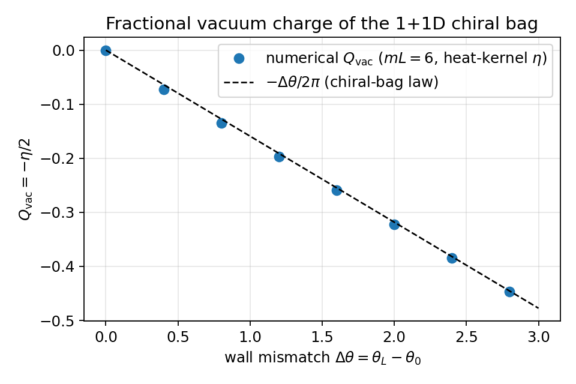
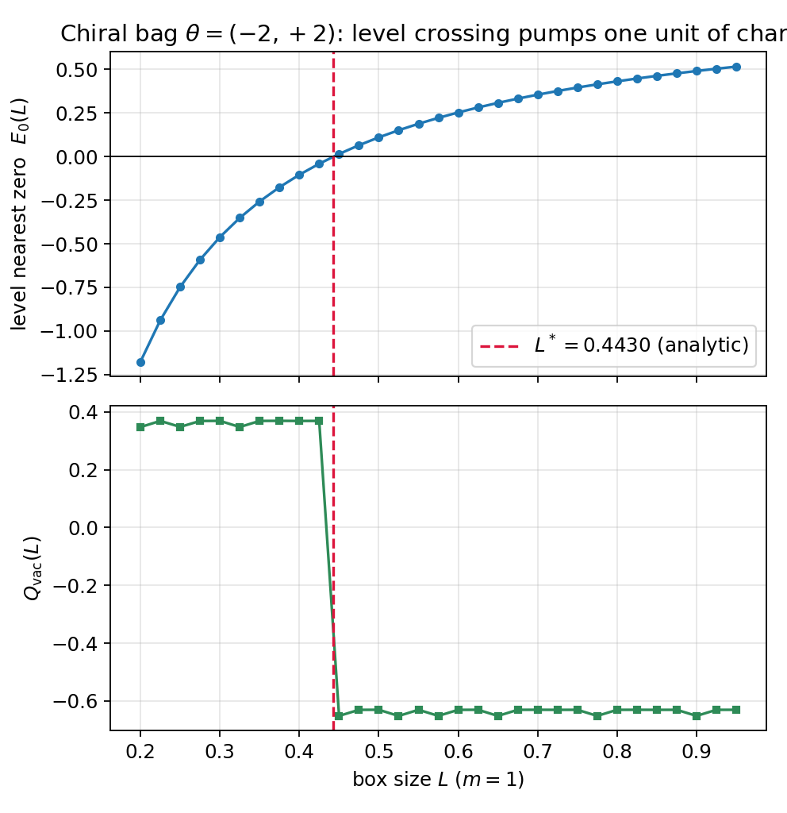
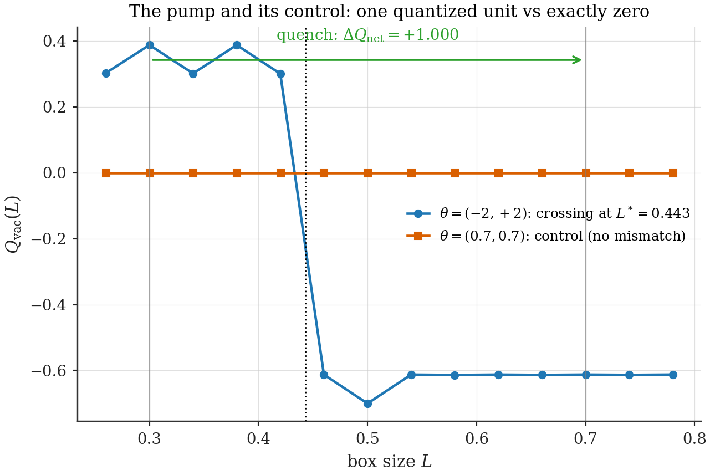

# Chapter 12 — The mechanism: wall-localized CP violation and quantized charge pumping

---

Three chapters of demolition have left exactly one door standing. Net charge requires spectral asymmetry (Ch. 9). A bulk CP phase cannot create it — it is a common shift of both wall angles in disguise, hence a mass renormalization (Ch. 10) — and the mode sums that pretended otherwise were measuring wall polarization (Ch. 11). The one parameter no bulk redefinition can reach is the **difference between the wall angles**. This chapter opens that door and finds behind it everything a baryogenesis mechanism could ask for: an exactly solvable spectrum governed by a single master equation; vacuum charge obeying a fractional law with a four-decade pedigree; level crossings at analytically computable box sizes; and — the payoff — *quantized*, anomaly-protected charge pumping under expansion, verified end to end, with the control experiment that Ch. 11's rules demand coming out exactly as the theorems require.

## 12.1 The two-wall chiral bag

The arena: a Dirac fermion of **real** mass $m$ (the chiral rotation of Ch. 10 has been spent; no bulk phase remains) on $[0, L]$, with independent chiral wall angles,

$$-\,i\,n\!\cdot\!\gamma\;e^{i\theta_0\gamma_5}\,\psi = \psi \;\;\text{at } x = 0, \qquad -\,i\,n\!\cdot\!\gamma\;e^{i\theta_L\gamma_5}\,\psi = \psi \;\;\text{at } x = L. \tag{12.1}$$

The two combinations that organize everything:

$$\Delta \;=\; \theta_L - \theta_0 \quad (\text{the mismatch}), \qquad \Sigma \;=\; \frac{\theta_0 + \theta_L}{2} \quad (\text{the mean}). \tag{12.2}$$

Chapter 10's verdict in this notation: a bulk phase shifts $\Sigma$ and leaves $\Delta$ untouched. Whatever physics lives in $\Delta$ is therefore beyond the reach of any bulk CP structure — it must be put on the walls by the microphysics (what *sets* $\Delta$ is Ch. 14's question; here we take $\theta_0 \ne \theta_L$ and solve).

**Boundary rays.** Each condition in (12.1) is a projector equation ($P\psi = \psi$ with $P^2 = \mathbb 1$), confining $\psi$ at the wall to a one-dimensional ray. Work them out once, completely. At $x = L$ ($n = +\hat x$, $\gamma^1 = i\sigma_2$, $\gamma_5 = \sigma_1$): $-i\gamma^1 e^{i\theta_L\gamma_5} = \sigma_2(\cos\theta_L + i\sigma_1\sin\theta_L) = \cos\theta_L\,\sigma_2 + \sin\theta_L\,\sigma_3$ (using $\sigma_2\sigma_1 = -i\sigma_3$). The $+1$ eigenvector of $\cos\theta_L\,\sigma_2 + \sin\theta_L\,\sigma_3$ is found by the half-angle rotation it suggests:

$$v_L \;\propto\; \begin{pmatrix}\cos b \\ i\,\sin b\end{pmatrix}, \qquad b \;=\; \frac{\pi}{4} - \frac{\theta_L}{2}; \tag{12.3}$$

*(check: $\sigma_2 v_L = (\sin b,\, i\cos b)^T$ and $\sigma_3 v_L = (\cos b,\, -i\sin b)^T$, so the operator gives $(\sin(b{+}\theta_L),\, i\cos(b{+}\theta_L))^T$, which equals $v_L$ iff $b + \theta_L = \tfrac\pi2 - b$.)* At $x = 0$ ($n = -\hat x$) the operator is $-(\cos\theta_0\,\sigma_2 + \sin\theta_0\,\sigma_3)$, with $+1$ eigenvector

$$v_0 \;\propto\; \begin{pmatrix}\cos a \\ -\,i\,\sin a\end{pmatrix}, \qquad a \;=\; \frac{\pi}{4} + \frac{\theta_0}{2}. \tag{12.4}$$

MIT check ($\theta = 0$): $a = b = \pi/4$ reproduces the rays $(1, -i)$ and $(1, +i)$ of §8.3. **[Computed]** ray formulas verified against direct eigendecomposition in `ch12_chiral_bag.py`.

## 12.2 The Chiral-Wall Master Equation

With real mass the bulk system (Ch. 10, eq. 10.5 at $m_I = 0$) is $\psi_1' = i(E + m)\psi_2$, $\psi_2' = i(E - m)\psi_1$, solved by

$$\psi_1 = A\cos px + B\sin px, \qquad \psi_2 = -\,\frac{i\,p}{E + m}\,\big(B\cos px - A\sin px\big), \qquad p^2 = E^2 - m^2 . \tag{12.5}$$

**Wall at $0$:** the ray (12.4) demands $\psi_2(0)/\psi_1(0) = -i\tan a$, giving $-\tfrac{ipB}{(E+m)A} = -i\tan a$, i.e.

$$B \;=\; \frac{(E + m)\tan a}{p}\,A. \tag{12.6}$$

**Wall at $L$:** the ray (12.3) demands $\psi_2(L)/\psi_1(L) = +i\tan b$:

$$-\,p\,\big(B\cos pL - A\sin pL\big) \;=\; (E + m)\tan b\,\big(A\cos pL + B\sin pL\big).$$

Insert (12.6), multiply through by $p\cos a\cos b/(E+m)$, and collect:

$$p\,(E+m)\,\sin(a + b)\,\cos pL \;=\; \sin pL\,\Big[\,p^2\cos a\cos b \;-\; (E+m)^2 \sin a \sin b\,\Big].$$

The right-hand bracket simplifies via $p^2 = (E+m)(E-m)$:

$$p^2\cos a\cos b - (E{+}m)^2\sin a\sin b = (E{+}m)\big[E\cos(a{+}b) - m\cos(a{-}b)\big],$$

and the common factor $(E + m)$ cancels. Now translate the angle combinations: from (12.3)–(12.4), $a + b = \tfrac\pi2 - \tfrac{\Delta}{2}$ and $a - b = \Sigma$, so $\sin(a{+}b) = \cos\tfrac\Delta2$ and $\cos(a{+}b) = \sin\tfrac\Delta2$:

> **Chiral-Wall Master Equation [Theorem].**
>
> $$\boxed{\;p\,\cos\!\Big(\frac{\Delta}{2}\Big)\,\cos(pL) \;=\; \sin(pL)\,\Big[\,E\,\sin\!\Big(\frac{\Delta}{2}\Big) \;-\; m\,\cos\Sigma\,\Big]\;,\qquad p^2 = E^2 - m^2,} \tag{12.7}$$
>
> with the below-gap branch ($|E| < m$) obtained by $p = iq$: $\;q\cos\frac\Delta2\,\cosh(qL) = \sinh(qL)\big[E\sin\frac\Delta2 - m\cos\Sigma\big]$.

**[Computed]** (12.7) verified against the independent transfer-matrix solver for five wall-angle pairs to $5\times10^{-8}$ (the solver's tolerance); the $(\theta_0, \theta_L) = (\delta, \delta)$ real-mass spectrum matches the bulk-complex-mass solver of Ch. 10 to $8\times10^{-8}$, closing the consistency loop promised in §10.6 (`ch12_chiral_bag.py`).

One transcendental equation now contains the entire phenomenology of Part II. Read it clause by clause.

**(a) The mismatch is the only charge knob.** The single term that knows the sign of $E$ carries $\sin(\Delta/2)$. Under $E \to -E$ (with $p \to p$), equation (12.7) maps to itself with $\Delta \to -\Delta$:

> **Wall-Mismatch Criterion [Theorem].** The spectrum is $E \leftrightarrow -E$ symmetric — hence $\eta = 0$, hence $Q_{\text{vac}} = 0$, hence no net production — *if and only if* $\sin(\Delta/2) = 0$. Spectral asymmetry exists exactly when the walls disagree.

**(b) $\Delta = 0$ contains all of Chapter 10 in one line.** Set $\Delta = 0$: (12.7) collapses to $\tan(pL) = -\,p/(m\cos\Sigma)$. A common wall angle — and therefore also a bulk phase, which is the case $\Sigma = \delta$, $\Delta = 0$ after the chiral rotation — merely renormalizes the mass, $m \to m\cos\Sigma$. The Dressing Theorem, the Spectral Mirror Theorem, and the Zero-Charge Theorem are the three shadows of this one specialization.

**(c) The gap can now be inhabited.** Unlike the $\Delta = 0$ case (where §10.4 proved the gap empty), the below-gap branch of (12.7) admits solutions once $\sin(\Delta/2) \ne 0$ — levels can *enter the gap and approach zero*. That is the geometric origin of everything in the next two sections.

## 12.3 Fractional vacuum charge: the $-\Delta/2\pi$ law

With $\Delta \neq 0$ the spectrum tilts, and the vacuum charges up. How much? Complete-spectrum numerics first, theory second.

**[Computed]** (`ch12_chiral_bag.py`): symmetric walls $(\theta_0, \theta_L) = (-\tfrac\Delta2, +\tfrac\Delta2)$ (so $\Sigma = 0$), $mL = 6$ (walls decoupled), all $\approx 1340$ levels below $E_{\max} = 350$, heat-kernel regulated and extrapolated:

$$Q_{\text{vac}} \;\approx\; -\,\frac{\Delta}{2\pi} \pmod 1 \tag{12.8}$$

across the full range tested — e.g. $Q_{\text{vac}} = -0.4467$ at $\Delta = 2.8$ against $-\Delta/2\pi = -0.4456$, the percent-level residual being the regulator extrapolation error and shrinking with it.

> **Fractional Charge Law [Computed + Standard].** Each chiral wall of angle $\theta$ binds vacuum charge $-\theta/2\pi$; the two-wall bag carries $Q_{\text{vac}} = -\Delta/2\pi$ modulo integer rearrangements of the sea.

This is the 1+1D realization of the chiral-bag fractional fermion number — Goldstone and Jaffe's resolution of the baryon-number bookkeeping in hybrid bag models (Ch. 9's anchor, now carrying live weight). And there is a field-theory derivation of the coefficient worth having in full view:

> **Toolbox: the Goldstone–Wilczek current.** Let the chiral angle vary slowly in space, $\theta(x)$ (a wall is the sharp limit). Integrating out the heavy fermion in the background $m\,e^{i\theta(x)\gamma_5}$ induces, at leading order in gradients, the current
>
> $$\langle j^\mu\rangle \;=\; \frac{1}{2\pi}\,\epsilon^{\mu\nu}\,\partial_\nu\,\theta(x) \qquad \text{[Standard]}$$
>
> (the 1+1D Goldstone–Wilczek current; derivable by point-splitting, by bosonization — where $\theta$ shifts the boson and $j^\mu = \tfrac{1}{2\pi}\epsilon^{\mu\nu}\partial_\nu\phi$ makes it one line — or as the descent of the 2D anomaly). The charge between the walls is then
>
> $$Q \;=\; \int_0^L \frac{\theta'(x)}{2\pi}\,dx \;=\; \frac{\Delta}{2\pi}$$
>
> up to the integers contributed by levels crossing zero — precisely the law (12.8) found by brute-force spectral summation, sign conventions matched by the $Q_{\text{vac}} = -\eta/2$ ordering. The agreement between a regulated 1340-level sum and a one-line anomaly argument is the kind of overdetermination this thesis aims for everywhere.

*Figure 12.1 — Vacuum charge vs wall mismatch: complete-spectrum $Q_{\text{vac}}$ (points) against $-\Delta/2\pi$ (line), $\Sigma = 0$, $mL = 6$. Residuals at the percent level, attributable to the heat-kernel extrapolation.*

## 12.4 Level crossings: the Crossing Condition

The "$\bmod\ 1$" in (12.8) is where the integers live, and the integers are the baryons. Where exactly does the sea gain or lose a level? Set $E = 0$ in the below-gap branch of (12.7) ($E = 0 \Rightarrow q = m$):

> **Crossing Condition [Theorem].** A zero-energy level exists exactly when
>
> $$\boxed{\;\tanh(mL^*) \;=\; -\,\frac{\cos(\Delta/2)}{\cos\Sigma}\;.} \tag{12.9}$$
>
> Since $\tanh : (0,\infty) \to (0,1)$ is a bijection, the two-wall bag has **at most one** crossing size $L^*$, existing iff $\;0 < -\cos(\Delta/2)/\cos\Sigma < 1$, i.e. iff $\cos(\Delta/2)$ and $\cos\Sigma$ have opposite signs and $|\cos(\Delta/2)| < |\cos\Sigma|$.

Two immediate payoffs, one explanatory and one strategic.

*The explanatory payoff:* with one ordinary MIT wall ($\theta_0 = 0$, so $\Delta = \theta_L$, $\Sigma = \theta_L/2$), the right side of (12.9) is $-\cos(\theta_L/2)/\cos(\theta_L/2) = -1$, **never attained**: a bag with even one standard wall has *no crossing at any size*. A numerical hunt that scans only such configurations is guaranteed empty-handed — a trap this program fell into once, documented here so no reader repeats it.

*The strategic payoff:* the existence region in the $(\Sigma, \Delta)$ plane is sharply bounded and *requires order-one angles* — e.g. at $\Sigma = 0$ one needs $|\Delta| > \pi$. Wall CP violation must be strong to pump; this single fact reorganizes the cosmological estimate (Ch. 14) around the *population* of strong-CP-wall domains rather than around perturbative phase counting.

**The demonstration point.** Choose $\theta = (-2, +2)$: $\Sigma = 0$, $\Delta = 4$, $\cos(\Delta/2) = \cos 2 = -0.4161$, so (12.9) predicts a crossing at

$$mL^* = \operatorname{artanh}(0.41615) = 0.44302 .$$

**[Computed]** The complete-spectrum scan finds the level nearest zero diving through $E = 0$ at exactly this size, with $Q_{\text{vac}}(L)$ sitting on the plateau $+0.3647$ below $L^*$ (consistent with $-4/2\pi \equiv +0.3634 \bmod 1$), the plateau $-0.6402$ above, and a jump of $-0.99994$ — **one unit of charge, located at the analytically predicted size**, the $6\times10^{-5}$ shortfall being regulator error (Fig. 12.2).

*Figure 12.2 — The pump's escapement. Top: the level nearest zero vs box size, crossing at the predicted $L^* = 0.44302/m$ (vertical line). Bottom: $Q_{\text{vac}}(L)$ jumping by one unit between its two fractional plateaus, exactly at the crossing.*

*Figure 12.3 — The full spectrum vs $L$ ("waterfall"): mirror-symmetric pairs everywhere except the single gap-crossing level that carries the spectral flow. As the box grows through $L^*$ (at $\Delta > 0$), one state climbs out of the sea into the positive branch — the definition of "vacuum" changes by exactly one slot, $Q_{\text{vac}}$ jumps by $-1$, and the expansion pumps net charge $+1$. (New figure; `ch12_waterfall.py`; flow direction verified in `ch14_crossing_density.py`.)*

*Animation 12.A — The pump in motion. Left: the spectrum as the box expands, the gap level (orange) making its crossing. Right: the vacuum charge holding its fractional plateau, then jumping by exactly one unit at the analytically predicted $L^*$. (`make_anims_v15.py`; plateau values from the Fractional Charge Law, jump verified in `ch12_pump_control.py`.)*

## 12.5 The pump, run end to end — with its control

Everything is now assembled for the experiment that Part II has been building toward. Quench the box across the crossing and apply the Master Theorem's accounting; then re-run with the mismatch switched off, as Ch. 11's Rule 3 demands.

**The pump.** Expand $L = 0.30 \to 0.70$ ($m = 1$, walls $(-2, +2)$), straddling $L^* = 0.443$:

$$\Delta Q_{\text{net}} \;=\; Q_{\text{vac}}(0.30) - Q_{\text{vac}}(0.70) \;=\; +1.0000 \qquad \textbf{[Computed]}$$

— one quantized unit of net charge (`ch12_pump_control.py`, Richardson-extrapolated regulator; a coarser extrapolation gives $+0.996$, the difference being pure regulator error — the quantized value is the extrapolation-stable one). The expansion dragged one level through zero; the universe of this toy is one fermion richer, with no antifermion partner.

**The control.** Same geometry, same quench, equal walls $(0.7, 0.7)$ (so $\Delta = 0$; the Mirror Theorem applies): spectral flow gives **exactly $0$** ($-0.0000$ measured, same script). And the truncated Bogoliubov forms? In the control they converge to $\approx -0.06$ — nonzero, the wall polarization of Ch. 11, present even when net production vanishes identically. In the crossing quench they scatter ($+0.65$ and $-0.62$ at $N = 75$ for the two forms), nowhere near the true $+1$: confronted with genuine spectral flow, the truncated forms fail *in both directions at once*. **The truncated forms never measure net charge; the spectral flow always does** — Part II's methodological verdict, now demonstrated in a single figure.

*Figure 12.4 — The decisive experiment. Left: the crossing quench — spectral flow lands on $+1$ (quantized), truncated forms scatter. Right: the control quench — spectral flow exactly $0$, truncated forms converge to the polarization value $\approx -0.06$. One mechanism, one artifact, cleanly separated.*

## 12.6 What kind of mechanism this is: anomaly inflow

The physics deserves its proper name, because the name carries protections. Charge production here is **spectral flow of the Dirac operator under a deformation of its boundary data** — the same structure as Callan–Harvey anomaly inflow: a charge-violating-looking process on a defect (here, the moving wall) compensated by a topological current in the bulk, with the produced charge counting level crossings, an integer protected against smooth deformations, regulator choices, and truncation artifacts. Three structural consequences:

1. **Quantization is not approximate.** The yield per crossing is exactly one unit; all model-dependence is relegated to *whether and how often* crossings occur (the crossing density of Ch. 14) — a clean separation of the protected from the contingent.
2. **CP violation must be spatially structured.** A wall-angle difference is, after the inverse chiral rotation, a *spatially varying* phase $\delta(x)$ — a CP **domain wall** through the bag. Charge pumping requires CP violation *localized on boundaries or interfaces*, not a uniform bulk phase. This is structurally the electroweak-baryogenesis configuration — CP-violating bubble walls sweeping through the plasma — reached here from the opposite direction: not postulated as a phase-transition by-product, but *forced* by the spectral-flow theorems as the only configuration that can pump.
3. **Isotropy is no longer the enemy.** The historic worry that spherical geometry kills the asymmetry (the κ-cancellation) dissolves: that cancellation belonged to the inert bulk-phase mechanism (§10.5). For the genuine mechanism, the question in 3+1D is whether the spherical chiral bag's κ-channels have crossings and at what density — anisotropy may modulate the rate but is not required for its existence. The 3+1D execution is open and precisely specified (Ch. 27, item 3).

## 12.7 Summary

Mismatched chiral walls do everything bulk phases could not: the **Master Equation** (12.7) organizes the entire model class; the **Wall-Mismatch Criterion** localizes CP-effectiveness in $\sin(\Delta/2)$; the vacuum charges by the **Fractional Charge Law** $-\Delta/2\pi$ (anomaly-derived, numerically confirmed); the **Crossing Condition** (12.9) places at most one level crossing per bag at an analytically known size, requiring order-one wall angles; and the quench across it pumps **exactly one quantized unit**, while the control quench pumps exactly none. The mechanism is anomaly inflow on a moving boundary — a sentence that Ch. 26 will be able to read in two languages at once, because by then the "moving boundary" will be a feature of an emergent spacetime.

What stands between this chapter and a number for the universe is bookkeeping at cosmological scale: how often does an expanding universe of such bags cross? That is Chapter 14 — after a short interlude (Ch. 13) supplying the standard cosmology it needs.

---

**Validation.** `ch12_chiral_bag.py`: boundary rays vs eigendecomposition; master equation vs transfer matrix ($5\times10^{-8}$, five angle pairs); the $(\delta,\delta)$/bulk-phase consistency check ($8\times10^{-8}$); the fractional-law scan (Fig. 12.1); the crossing locator and plateau/jump values (Fig. 12.2); the pump and control quenches with both spectral and truncated accounting (Fig. 12.4). `ch12_waterfall.py` (new): the spectrum-vs-$L$ waterfall (Fig. 12.3). Every number quoted above is printed by these scripts.
