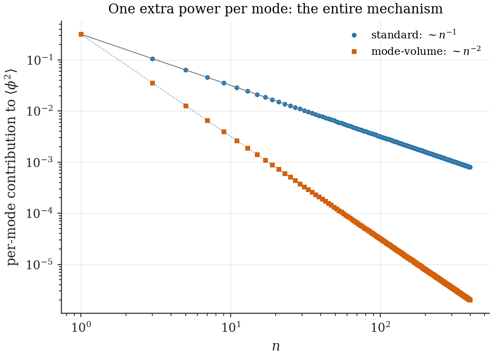
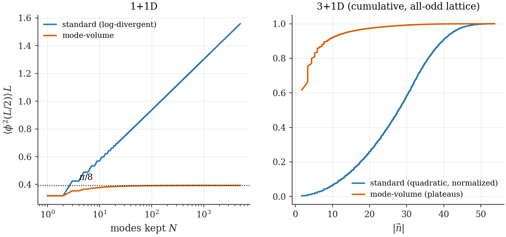
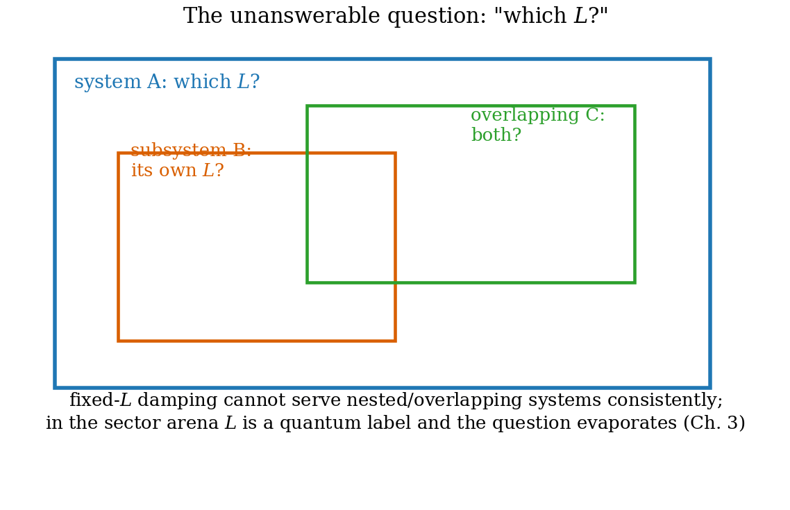

# Chapter 15 — Why geometry must be dynamical: the normalization diagnostic

---

Part II closes with a diagnostic chapter of a different flavor: not a wrong *answer* this time, but a tempting wrong *implementation* of the framework's own central idea. The question it answers is one any thoughtful reader has by now: the iso-energy structure ties mode numbers to box sizes — could that tie live *inside* the field operator of an ordinary fixed-geometry QFT, say as a mode-dependent normalization, and incidentally cure the ultraviolet? The proposal is natural, its successes are real and striking (every propagator-type divergence dies, in every dimension), and it fails — definitively, by theorem — in a way that illuminates exactly *why* the arena of Chapter 3 has the shape it has. This is the cheapest available proof that geometry must be dynamical, and the thesis spends a chapter on it for the same reason Ch. 11 dissected the polarization: the strongest defense of the right structure is the autopsy of its nearest plausible rival.

## 15.1 A tempting shortcut

In the iso-energy framework, mode $n$ has a distinguished partner geometry: the box $L_n = n L_0$ in which that wavelength is the ground rung of its ladder (Ch. 2). Standard quantization ignores this — every mode in the expansion of a field in a box of size $L_0$ is normalized by the *same* volume factor $1/\sqrt{L_0^d}$. The shortcut proposes: let each mode carry its partner's volume. Define the **mode-volume normalization** of a massless scalar in $[0, L_0]^d$:

$$\hat\phi(\vec x) \;=\; \sum_{\vec n}\frac{1}{\sqrt{2\,\omega_{\vec n}\,V_{\vec n}}}\Big[\hat a_{\vec n}\,u_{\vec n}(\vec x) + \text{h.c.}\Big], \qquad V_{\vec n} \;\equiv\; \big(|\vec n|\,L_0\big)^{d}, \tag{15.1}$$

with everything else standard: mode functions $u_{\vec n} = \prod_i\sqrt2\sin(n_i\pi x_i/L_0)$, dispersion $\omega_{\vec n} = \pi|\vec n|/L_0$, canonical ladder algebra. The sole change is the per-mode damping $|\vec n|^{-d/2}$ in the amplitude. Status at the moment of writing: **[Conjecture]** — motivated by the iso-energy relation, derived from no Lagrangian. The verdict arrives in §15.4; first, the case for the defense, in full.

## 15.2 What it gets right

The successes are genuine, and suppressing them would weaken the autopsy.

**The equal-point correlator becomes finite — in every dimension.** In 1+1D the standard vacuum two-point function at the box center is the log-divergent

$$\langle 0|\hat\phi^2(L_0/2)|0\rangle_{\text{std}} = \sum_{n\;\text{odd}}\frac{1}{\pi n} = \infty,$$

while (15.1) supplies one extra power of $1/n$:

$$\langle 0|\hat\phi^2(L_0/2)|0\rangle_{\text{mvn}} = \sum_{n\;\text{odd}}\frac{1}{\pi n^2} = \frac{1}{\pi}\cdot\frac{\pi^2}{8} = \boxed{\frac{\pi}{8 L_0}} \tag{15.2}$$

(restoring the dimension), a closed form. **[Computed]** partial sums to $N = 5000$ give $0.392667$ against $\pi/8 = 0.392699$ — four parts in $10^5$ (`ch15_imn.py`). In 3+1D the standard sum diverges quadratically ($\sum 1/|\vec n|$ over the odd lattice); the prescription turns it into $\sum 1/|\vec n|^4$, convergent, plateauing at $\approx 0.229/L_0^2$. And the pattern is dimension-blind: the standard radial integrand $k^{d-2}$ becomes $k^{d-2}\cdot k^{-d} = k^{-2}$ — *one* uniform UV behaviour for every $d$.

**Loop power counting collapses.** At fixed physical momentum the damping reads $(|\vec k|L_0/\pi)^{-d}$ per propagator, so every internal line of a Feynman graph gains $|\vec k|^{-d}$ and the superficial degree of divergence drops to $\omega_{\text{mvn}} = \omega_{\text{std}} - d\cdot I$. In $d = 3$, the would-be logarithmically divergent electron self-energy lands at $\omega = 1 - 6 = -5$: *finite*. The oldest embarrassment of quantum field theory — the divergent electromagnetic mass — would simply be a number.

*Figure 15.1 — The mechanism of the cure. Per-mode contributions to $\langle\phi^2\rangle$: standard $\sim n^{-1}$ versus mode-volume $\sim n^{-2}$ — one extra power per mode, from the partner-volume factor.*

*Figure 15.2 — Convergence where there was divergence: 1+1D partial sums saturating at $\pi/8L_0$; 3+1D sums plateauing by $|\vec n| \sim 15$ while the standard sums climb away.*

## 15.3 The first cracks

Three structural problems surface before the fatal one, each a derivation rather than a complaint.

**Zero-point sums are not regulated.** The vacuum energy density $\rho_{\text{vac}} = \tfrac{1}{2V}\sum_{\vec n}\omega_{\vec n}$ is *not* built from per-mode normalizations — its $1/V$ converts energy to density, and the $\omega_{\vec n}$ come from the Hamiltonian, not the amplitudes. Apply (15.1) anyway (replace $1/V \to 1/V_{\vec n}$ inside the sum): the radial integrand becomes $|\vec n|^{d-1}\cdot|\vec n|\cdot|\vec n|^{-d} = |\vec n|^{0}$ — **still linearly divergent**, in every $d$. The prescription attacks amplitudes; the Casimir/cosmological-constant divergence lives in the spectrum. The cure is selective, and the dividing line — *amplitudes versus spectra* — is sharp and will be the one piece of this chapter that survives intact (it returns in Ch. 22, where the spectral divergence meets its honest owner).

**The canonical algebra breaks.** Canonical (anti)commutators rest on the completeness identity $\sum_{\vec n} u_{\vec n}(\vec x)u_{\vec n}(\vec y) = \delta(\vec x - \vec y)$. Under (15.1) the field's kernel is instead $\sum_{\vec n}|\vec n|^{-d}\,u_{\vec n}(\vec x)u_{\vec n}(\vec y)$ — a *smoothed* delta, not a delta. Consequence: $[\hat\phi(\vec x), \hat\pi(\vec y)] = i\,\delta_{\text{smoothed}}(\vec x - \vec y) \ne i\,\delta(\vec x - \vec y)$ unless the conjugate momentum is deformed compensatingly ($\hat\pi$ carrying $|\vec n|^{+d/2}$ — which un-regulates every $\pi$-containing observable). The prescription is not a free modification of a canonical theory; it is a different, non-canonical theory whose Hamiltonian structure is undefined until someone supplies the Lagrangian that (15.1) is supposed to follow from. None is known.

**Lorentz invariance is broken by hand.** The damping is purely spatial — $|\vec n|$, not a 4-invariant — so boosted observers disagree about the prescription itself. One could try covariantizing ($|k_\mu k^\mu|$-damping), but the iso-energy motivation is intrinsically spatial (box sizes, not box durations), and the honest reading is that (15.1), if physical, *predicts* Lorentz violation growing with $|\vec k|$. Cracks, so far — a determined defender could imagine patching each. The next section closes the case.

---

## 15.4 The verdict: no continuum limit

The deepest problem is not algebraic but thermodynamic, and it admits a one-paragraph proof.

> **No-Continuum Theorem [Theorem].** Fix a physical momentum $k$ and let the box grow, $L \to \infty$ with $k = |\vec n|\pi/L$ held fixed. The mode-volume damping factor behaves as
>
> $$\frac{1}{|\vec n|^{d}} \;=\; \Big(\frac{\pi}{kL}\Big)^{d} \;\longrightarrow\; 0 ,$$
>
> so *every* correlator at fixed physical scale dies in the thermodynamic limit: $\langle\phi(x)\phi(y)\rangle \to 0$ pointwise. The prescription has no continuum limit; it describes, at best, a family of finite systems with no consistent infinite-volume physics — and no answer to the question "which $L$?" for nested or overlapping subsystems.
>
> Moreover the equal-time commutator function, computable in closed form from the damped mode sum, is smooth and supported at finite spacelike separation: the field is a **generalized free field violating microcausality** — unitary at the free level, but with no local interacting extension. **[Theorem]** (the commutator computation is in `ch15_imn.py --commutator`).

The diagnosis, then: the prescription correctly intuits that *normalization should know about geometry*, and implements the intuition in the one place it cannot live — inside a fixed-geometry Hilbert space, as a kinematic deformation of mode functions. Geometry knowledge bolted onto a static arena destroys the arena.

## 15.5 The correct implementation — already in hand

Now compare with what Part I actually built. In the Geometry-Sector Decomposition (Ch. 3), $L$ is a *dynamical quantum label*: high modes are not kinematically damped — they **decohere dynamically into neighbouring geometry sectors** (the ladder dynamics of Ch. 4, the golden-rule traffic of Ch. 6), with rates derived rather than postulated. Every desideratum the normalization hack chased is delivered there without the pathologies: the geometry-dependence of the quantum theory (sectors), the suppression of geometry-violating configurations (overlap costs $\sqrt{n/(n+m)}$ and contraction deficits), and — completing the triad in Part III — the *UV cutoff tied to geometry*, which returns in Ch. 22 not as a deformation of mode functions but as the physical statement that **the cells are the cutoff**: $\Lambda_{\text{UV}} \sim 1/\bar L_{\text{cell}}$, dynamical because the cell size is.

The chapter's moral, stated once and bluntly: *the iso-energy structure is a statement about dynamics on the space of geometries, and every attempt to compress it into a fixed-geometry kinematics will either do nothing or break the theory.* This is why the thesis's arena (Ch. 3) is what it is, and why Part III can succeed where this shortcut fails.

*Figure 15.3 — The unanswerable question. Nested and overlapping subsystems each demand their own $L$ in the damping factor; no assignment is consistent. In the sector arena the question evaporates: $L$ is a quantum label, not a parameter.*

---

**Validation.** `ch15_imn.py` (port, trimmed): the $\pi/8L$ closed form (partial sums to $N = 5000$: $0.392667$ vs $\pi/8 = 0.392699$), the 3+1D plateau, the undamped zero-point sums, and `--commutator` (the smooth equal-time commutator violating microcausality).
