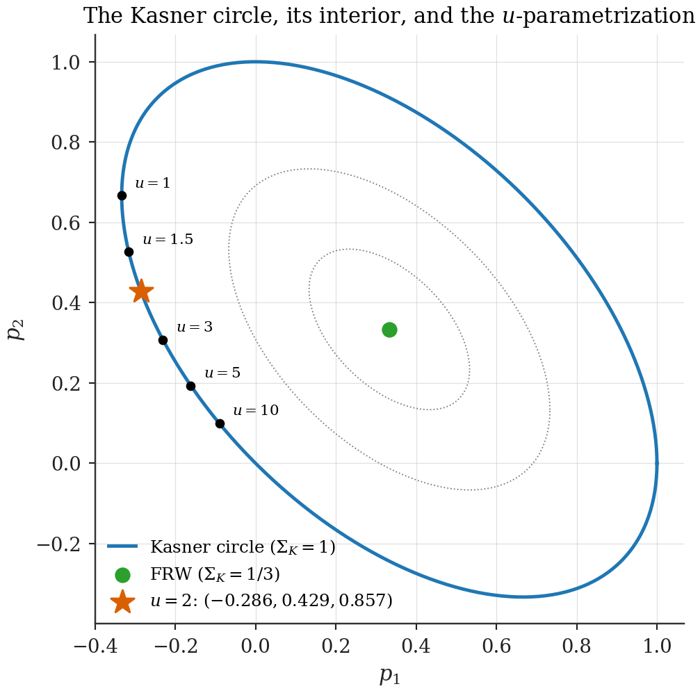
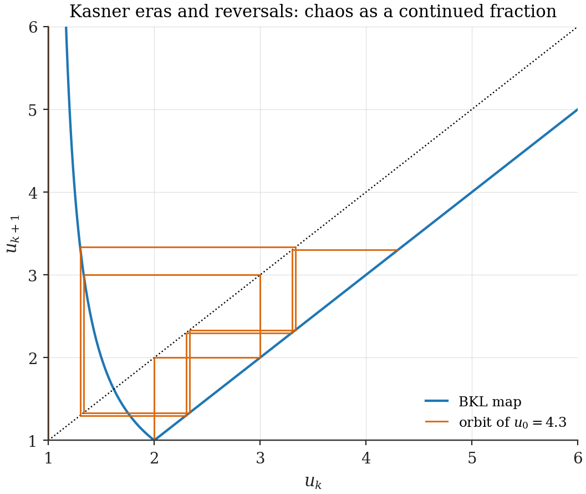
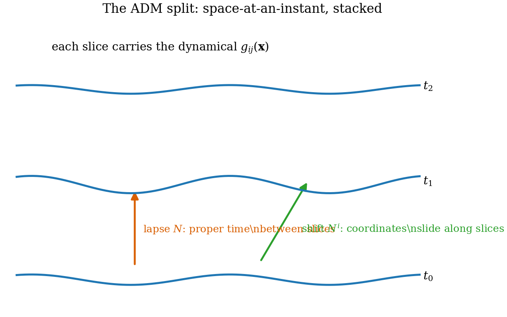

# Chapter 16 — Interlude: the general-relativity toolbox

---

Part III will claim that a lattice of quantum boxes *does general relativity* — Kasner orbits, Friedmann cosmology, Newtonian attraction, BKL chaos, a graviton. Claims of that kind are only as sharp as the reader's command of what they assert. This interlude supplies, self-containedly, every piece of GR the later chapters measure against: nothing exotic, no derivations beyond what gets consumed, and the framing chosen — sometimes idiosyncratically — for the consumer chapter named in each section tag.

## 16.1 Metric, curvature, action *(used everywhere)*

A **metric** $g_{\mu\nu}(x)$ is the field that assigns lengths and durations: $ds^2 = g_{\mu\nu}dx^\mu dx^\nu$. All of gravity is the statement that this field is dynamical. Three derived objects carry its geometry. The **Christoffel symbols** $\Gamma^\lambda_{\mu\nu} = \tfrac12 g^{\lambda\rho}(\partial_\mu g_{\rho\nu} + \partial_\nu g_{\rho\mu} - \partial_\rho g_{\mu\nu})$ define parallel transport — how to compare vectors at neighbouring points. The **Riemann tensor** $R^\rho{}_{\sigma\mu\nu} = \partial_\mu\Gamma^\rho_{\nu\sigma} - \partial_\nu\Gamma^\rho_{\mu\sigma} + \Gamma\Gamma - \Gamma\Gamma$ measures the failure of transport around closed loops — *curvature is path-dependence of comparison*. Its traces, the **Ricci tensor** $R_{\mu\nu} = R^\lambda{}_{\mu\lambda\nu}$ and **Ricci scalar** $R = g^{\mu\nu}R_{\mu\nu}$, measure focusing: $R_{\mu\nu}u^\mu u^\nu$ is the rate at which a ball of test particles with 4-velocity $u$ shrinks.

Dynamics: the **Einstein–Hilbert action**

$$S_{EH} \;=\; -\,\frac{1}{16\pi G}\int d^4x\,\sqrt{-g}\;R \;+\; S_{\text{matter}}[g, \Psi], \tag{16.1}$$

whose stationarity under $\delta g^{\mu\nu}$ gives Einstein's equations. The variation in three displayed steps: $\delta(\sqrt{-g}) = -\tfrac12\sqrt{-g}\,g_{\mu\nu}\delta g^{\mu\nu}$; $\delta R = R_{\mu\nu}\delta g^{\mu\nu} + (\text{total derivative})$ (the Palatini identity — the $\Gamma$-variations assemble into a divergence and drop on a closed manifold); and defining $T_{\mu\nu} = \tfrac{2}{\sqrt{-g}}\tfrac{\delta S_{\text{matter}}}{\delta g^{\mu\nu}}$:

$$R_{\mu\nu} - \tfrac12\,R\,g_{\mu\nu} \;=\; 8\pi G\,T_{\mu\nu}. \tag{16.2}$$

**The weak-field reading** *(used in Ch. 24)*: for a static source, writing $g_{00} = 1 + 2\Phi$, $g_{ij} = -(1 - 2\Phi)\delta_{ij}$ with $|\Phi| \ll 1$, the $00$-equation collapses to $\nabla^2\Phi = 4\pi G\rho$ — Newton — and the *spatial* metric statement is the one Ch. 24 measures: **space is dilated near mass**, $\delta\ln\sqrt{g_{\text{spatial}}} \propto -\Phi > 0$ in a potential well.

**The Weyl split** *(used in Ch. 18, 25)*: Riemann decomposes into the Ricci part (fixed pointwise by matter through (16.2)) and the trace-free **Weyl tensor** $C^{\mu}{}_{\nu\rho\sigma}$ — the *free* part of geometry, which propagates: tidal fields across empty space, light bending, gravitational waves all live in Weyl. Conformally flat metrics ($g = \Omega^2\eta$) have $C \equiv 0$ — the fact behind Ch. 18's obstruction theorem.

## 16.2 The 3+1 split: ADM *(used in Ch. 19, 21, 25)*

Canonical structure requires slicing spacetime into space-at-an-instant. Foliate by hypersurfaces $t = $ const with induced spatial metric $g_{ij}$ (6 components); the remaining 4 metric components are repackaged as the **lapse** $N$ (proper time elapsed per unit coordinate time for an observer riding the slices) and the **shift** $N^i$ (how spatial coordinates slide between slices):

$$ds^2 = N^2 dt^2 - g_{ij}\,(dx^i + N^i dt)(dx^j + N^j dt). \tag{16.3}$$

Lapse and shift are not dynamical: they are the *choices* of how to slice and label — four functions of gauge. (Ch. 19 finds their lattice ancestor in the identification-map freedom of overlap bookkeeping.) The slices' embedding is measured by the **extrinsic curvature** $K_{ij} = \tfrac{1}{2N}(\dot g_{ij} - \nabla_i N_j - \nabla_j N_i)$ — essentially the velocity of the spatial metric — and the action (16.1) becomes, up to boundary terms,

$$S = \frac{1}{16\pi G}\int dt\,d^3x\;N\sqrt{g}\;\Big[K_{ij}K^{ij} - K^2 + R^{(3)}\Big] \tag{16.4}$$

(Gauss–Codazzi does the bookkeeping; we take the result): kinetic energy quadratic in $\dot g_{ij}$, potential energy the spatial curvature $R^{(3)}$. This is gravity as a Hamiltonian system on the space of 3-geometries — the form every Part III simulation speaks.

## 16.3 The Hamiltonian constraint *(used in Ch. 21 — the framing matters)*

Vary (16.4) with respect to the lapse $N$. Because $N$ has no time derivatives, its equation of motion is a **constraint** holding at every instant:

$$\mathcal H_{\text{grav}} + \mathcal H_{\text{matter}} \;=\; 0. \tag{16.5}$$

Read it the way Chapter 21 will import it: **the total energy of a closed universe vanishes** — geometry's energy is not positive. Where the negativity sits is visible in (16.4)'s kinetic term $K_{ij}K^{ij} - K^2$: the trace part (uniform expansion, the conformal mode) enters with the *opposite sign* from the shape parts. Specialize to FRW ($g_{ij} = a^2\delta_{ij}$, $K_{ij} = H g_{ij}$ with $H = \dot a/a$): the gravitational Hamiltonian density is

$$\mathcal H_{\text{grav}} \;=\; -\,3\,\kappa\,H^2, \qquad \kappa \equiv \frac{1}{8\pi G}, \tag{16.6}$$

manifestly negative, and (16.5) becomes

$$3\,\kappa\,H^2 \;=\; \rho \qquad\Longleftrightarrow\qquad H^2 = \frac{8\pi G}{3}\,\rho \tag{16.7}$$

— **the constraint is the Friedmann equation**: the energy budget *is* the expansion law. This is the single structural statement Ch. 21 imports into the box model (and Ch. 22 then grounds: the negative sign of geometry's energy is *measured* there from matter loops).

## 16.4 The DeWitt supermetric *(used in Ch. 19, 25)*

The kinetic term of (16.4) defines an inner product on metric velocities: $K_{ij}K^{ij} - K^2 = G^{ijkl}K_{ij}K_{kl}$ with the **DeWitt supermetric**

$$G^{ijkl} \;=\; \tfrac12\big(g^{ik}g^{jl} + g^{il}g^{jk}\big) - g^{ij}g^{kl}. \tag{16.8}$$

Diagonalize it at $g = \delta$: on the 6-dimensional space of symmetric perturbations $h_{ij}$, the trace direction $h_{ij} \propto \delta_{ij}$ has eigenvalue $-2$ *(the sign!)* while the five trace-free directions have eigenvalue $+1$. The signature is $({-}, {+}, {+}, {+}, {+}, {+})$: **the conformal (volume) direction is timelike in the space of geometries; the five shape directions are spacelike.** Plain words: the volume behaves like a *clock*, the shapes like *propagating things measured against it*. This indefinite signature is simultaneously the notorious conformal-factor problem of Euclidean gravity and the structural reason gravitational waves are trace-free. Flag for Part III, where this split is *derived* twice: kinematically — flat-but-energetic versus geometric-but-iso-energy sectors (Ch. 19) — and dynamically, with the exact coefficient and the negative sign as outputs of matter loops (Ch. 22 in 1D, Ch. 25 in 3D).

## 16.5 FRW cosmology *(used in Ch. 17, 21)*

Homogeneous isotropic universes: $ds^2 = dt^2 - a^2(t)\,d\vec x^2$ (flat case), with all dynamics in the **scale factor** $a(t)$. The constraint is (16.7); the second Friedmann (acceleration) equation, equivalently the $ii$-Einstein equation or energy conservation $\dot\rho = -3H(\rho + p)$:

$$\frac{\ddot a}{a} = -\frac{4\pi G}{3}\,(\rho + 3p). \tag{16.9}$$

For a fluid $p = w\rho$, conservation gives the dilution law $\rho \propto a^{-3(1+w)}$, and (16.7) integrates to the power laws Part III's simulations chase:

$$a(t) \;\propto\; t^{\frac{2}{3(1+w)}}: \qquad \text{matter } (w = 0):\; t^{2/3}; \qquad \text{radiation } (w = \tfrac13):\; t^{1/2}; \qquad \text{stiff } (w = 1):\; t^{1/3}. \tag{16.10}$$

Field modes on FRW: comoving wavenumbers $k$ are constant; physical frequencies **redshift**, $\omega = k/a(t)$. (Ch. 17 will hold this sentence against Figure 2.1.)

## 16.6 Bianchi I and Kasner *(used in Ch. 20)*

Drop isotropy, keep homogeneity and flat slices: **Bianchi I**,

$$ds^2 = dt^2 - a_1^2(t)\,dx^2 - a_2^2(t)\,dy^2 - a_3^2(t)\,dz^2, \tag{16.11}$$

three independent scale factors — precisely a rectangular box with three side lengths, which is why this is the box model's natural test bed. Write $H_a = \dot a_a/a_a$ and $V = a_1a_2a_3$. Einstein's equations reduce to one constraint and three evolution equations:

$$\sum_{a<b} H_a H_b = 8\pi G\,\rho, \qquad \frac{d}{dt}\big(V H_a\big) = 8\pi G\,V\,\tfrac12(\rho - p)\;\;\text{per axis}. \tag{16.12}$$

**Kasner's vacuum solution (1921), in four lines.** With $\rho = p = 0$: each $VH_a$ is constant $\equiv c_a$; summing, $\dot V = \sum_a c_a$, so $V = (\sum c_a)\,t$ — *linear* volume growth; then $H_a = c_a/V = p_a/t$ with $p_a \equiv c_a/\sum_b c_b$, integrating to

$$a_a(t) \;=\; t^{\,p_a}, \qquad \sum_a p_a = 1 \;(\text{automatic}), \qquad \sum_a p_a^2 = 1 \;(\text{the constraint}), \tag{16.13}$$

where the second condition follows from inserting $H_a = p_a/t$ into the constraint and using $\sum_{a<b}p_ap_b = \tfrac12[(\sum p)^2 - \sum p^2]$. The two conditions (16.13) define the **Kasner circle**. Its standard rational parametrization, used by every BKL bookkeeping:

$$p_1 = \frac{-u}{1 + u + u^2}, \qquad p_2 = \frac{1 + u}{1 + u + u^2}, \qquad p_3 = \frac{u(1 + u)}{1 + u + u^2}, \qquad u \ge 1. \tag{16.14}$$

The signature fact, checkable from (16.14) at a glance: away from the degenerate point $(1, 0, 0)$, **exactly one exponent is negative** — a vacuum anisotropic universe *must* contract along one axis while expanding along two. No isotropic intuition produces this; finding it in a quantum simulation is finding general relativity (Ch. 20 does, to three digits).

**Matter interiors.** Stiff matter ($p = \rho$, Jacobs 1968) keeps $a_a = t^{p_a}$, $\sum p_a = 1$, but moves the constraint inward: $\sum p_a^2 = 1 - 16\pi G\rho_0 < 1$ — solutions fill the **disc**, down to the center $p = (\tfrac13, \tfrac13, \tfrac13)$ = isotropic FRW at $\sum p_a^2 = \tfrac13$. Softer matter ($p < \rho$) makes the exponents time-dependent: anisotropy decays, the universe **isotropizes** — the behaviour Ch. 20's embedding-coupled ladder reproduces.

**Relational (clock-free) form** — *defined exactly as the simulations measure it.* With $\alpha_a = \ln a_a$,

$$p_a(t) \;\equiv\; \frac{\dot\alpha_a}{\sum_b \dot\alpha_b}, \qquad \Sigma_K(t) \;\equiv\; \sum_a p_a(t)^2. \tag{16.15}$$

Any clock reparametrization cancels between numerator and denominator; $\sum_a p_a = 1$ holds identically; and the single diagnostic number $\Sigma_K$ reads: $1$ = vacuum Kasner circle, constant-in-$(1/3, 1)$ = stiff interior, $\tfrac13$ = FRW, monotone flow toward $\tfrac13$ = isotropization. Chapter 20's entire measurement program is the pair (16.15).

*Figure 16.2 — The Kasner circle in the $(p_1, p_2)$ plane: the vacuum locus $\sum p_a = \sum p_a^2 = 1$ with the $u$-parametrization marked, the FRW center, and the stiff-matter interior. The $u = 2$ point $(-\tfrac27, \tfrac37, \tfrac67)$ — Ch. 20's target — is starred.*

## 16.7 Bianchi IX and BKL chaos *(used in Ch. 24)*

Replace Bianchi I's flat slices with the 3-sphere's homogeneous geometry: **Bianchi IX**, the "Mixmaster" universe. Its spatial curvature contributes potential terms — in BKL time $\tau$ ($dt = a_1a_2a_3\,d\tau$, $\alpha_i = \ln a_i$):

$$2\,\alpha_1'' = \big(a_2^2 - a_3^2\big)^2 - a_1^4 \quad (+\,\text{cyclic}), \tag{16.16}$$

plus the corresponding constraint. The dynamics near the singularity is a drama in two recurring acts. While all right-hand sides are negligible, (16.16) is free motion — straight lines in $\alpha$-space: **a Kasner epoch**. But on any Kasner orbit one axis contracts ($p_1 < 0$ ⇒ $a_1$ *grows* toward the singularity as $t \to 0$), so its wall term $a_1^4$ eventually ignites and the trajectory reflects — **a bounce** — onto a new Kasner epoch with permuted roles. The reflection law is exact (the bounce is an exactly solvable Bianchi II interpolation) and is most beautifully written in the parameter $u$ of (16.14):

$$\boxed{\;u \;\to\; u - 1 \quad (u \ge 2), \qquad u \;\to\; \frac{1}{u - 1} \quad (1 < u < 2).\;} \tag{16.17}$$

Iterated, the map (16.17) is the continued-fraction (Gauss) map in disguise — ergodic, mixing, *chaotic*: the generic approach to a spacelike singularity is an infinite, never-repeating sequence of Kasner epochs (Belinskii–Khalatnikov–Lifshitz). The second branch — the **era reversal**, where the roles of growing and shrinking $u$ swap — is the step that makes the sequence chaotic rather than a countdown, and it is the step Ch. 24's simulation must (and does) get right to $6\times10^{-4}$.

*Figure 16.3 — Chaos in one map. The BKL recursion (16.17) drawn as a cobweb: long $u \to u - 1$ staircases (Kasner eras) punctuated by $u \to 1/(u-1)$ reversals (new eras), conjugate to the continued-fraction expansion of $u_0$.*

## 16.8 Quantum fields on changing geometries *(used in Ch. 17)*

**Parker's particle production.** A field mode on FRW obeys, in conformal time, an oscillator equation with time-dependent frequency $\omega(t) = k/a(t)$. Two regimes, set by the now-familiar dial: modes with $\omega \gg |\dot a/a|$ track adiabatically (no quanta produced — the WKB vacuum rides along); modes with $\omega \lesssim |\dot a/a|$ cannot track — their "vacuum" before and after differ, related by a Bogoliubov transformation, and the *out* observer counts quanta in the *in* vacuum: **the expansion of space creates particles**, mode by mode, exactly where adiabaticity fails. This is Ch. 5's boxed principle wearing its original (1968) clothes, and the sudden quenches of Part II are its step-function limit — a point Ch. 17 makes into a dictionary entry rather than an analogy.

**Moving mirrors (Davies–Fulling).** In 1+1D every metric is conformally flat ($ds^2 = \Omega^2(dt^2 - dx^2)$ — two metric functions, two coordinate freedoms), and massless fields are conformally invariant — so a field bounded by *moving mirrors* in flat space reproduces a field in an *arbitrary* 2D curved spacetime: trajectory ↔ geometry. Accelerating mirrors radiate (the flat-space shadow of Hawking radiation); the only conformal-symmetry breaker is a mass, entering through the invariant combination $m\Omega$ — the reason Part II's physics organized itself into the single variable $mL$, as Ch. 17 will note with satisfaction.

## 16.9 Triads and frame gauging *(used in Ch. 18, 23)*

The metric can be factorized into a **triad** (dreibein) — three orthonormal-frame vectors per point:

$$g_{ij} \;=\; e^a_{\,i}\,e^a_{\,j}, \qquad a = 1, 2, 3. \tag{16.18}$$

Nine triad components for six metric ones: the surplus three are the local $SO(3)$ rotations of the frame, $e^a_i \to R^{ab}e^b_i$, which leave $g$ untouched — pure gauge. Why bother with the redundant variable? Because *spinors couple to frames, not metrics*: there is no spinor representation of the diffeomorphism group, and the Dirac operator on curved space is built from $e^a_\mu$ and the **spin connection** $\omega^{ab}_\mu$ (the gauge field of local frame rotations). This makes gravity look like a gauge theory, and the resemblance is a theorem: **Kibble–Sciama** — gauge the local Lorentz/frame group (translations realized as diffeomorphisms), write the lowest-order invariant action, and the result is Einstein–Cartan theory,

$$S = -\frac{1}{16\pi G}\int e\;e^\mu_a\,e^\nu_b\;R^{ab}{}_{\mu\nu}(\omega), \tag{16.19}$$

(the curvature of $\omega$ contracted with two inverse vielbeins — structurally a Yang–Mills-type invariant), which reproduces general relativity exactly whenever spin sources are negligible: torsion is then forced to vanish algebraically and $\omega$ becomes the Levi-Civita connection. In the standard treatment the vielbein is the *postulated* fundamental variable. The box-cell model of Ch. 18 will *derive* it — cell edge vectors, with (16.18) appearing as bookkeeping and the $SO(3)$ redundancy visible as edge-relabeling — which is the structural fact Ch. 23 builds the gauge story on.

*Figure 16.1 — The 3+1 split. Spatial slices, the lapse ticking proper time between them, the shift sliding coordinates along them; the spatial metric as the dynamical variable. (drawn)*

---

**Validation.** `ch16_kasner_circle.py`: Figures 16.2–16.3 (the circle with the $u$-parametrization; the BKL cobweb). All physics statements are **[Standard]**; the chapter's derivational claims (the four-line Kasner derivation, the chemical content of (16.13)–(16.17)) are checked against the simulations that consume them in Ch. 20–24.
