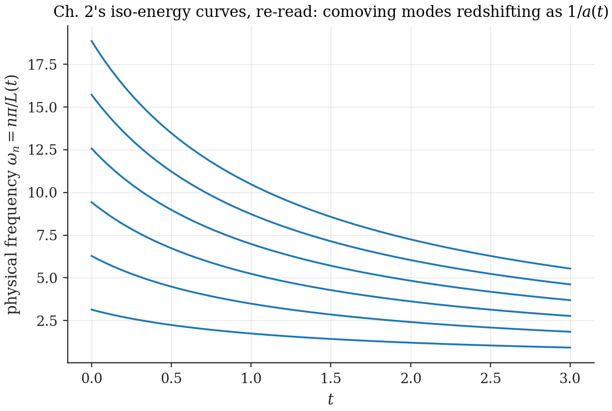

# Chapter 17 — The dictionary: a box is a metric, expansion is cosmology

---

## 17.1 The claim

Part III rests on a statement that sounds like an analogy and is in fact an identity, and the difference between those two words carries the rest of this thesis. The statement: **a box of size $L$ and a box of fixed unit size with spatial metric $g_{\xi\xi} = L^2$ are not two systems that resemble each other — they are one system in two coordinate systems.** Nothing in Part I or Part II was "like" cosmology. It *was* cosmology, written in the coordinates where the walls move and the metric is trivial rather than the coordinates where the walls are fixed and the metric does the moving. The dictionary below is a change of variables, exact in every detail, with three immediate consequences: the iso-energy curves of Ch. 2 are comoving modes redshifting; the sudden quenches of Part II are step-function scale-factor particle production, a standard topic since Parker — with the bag walls and the CP structure as this framework's genuine additions; and in 1+1D the correspondence is *total*: any wall trajectory realizes a fermion in an arbitrary two-dimensional spacetime. After this chapter, "does the box model produce gravity?" stops being a hopeful question about emergence and becomes a sharp question about *which* metric dynamics the sector traffic of Part I selects. The remaining chapters of Part III answer it: Kasner's (Ch. 20), Friedmann's (Ch. 21), Newton's (Ch. 24), and — at one loop — Einstein's (Ch. 25).

## 17.2 The dictionary, derived

The computation is two lines, and the thesis insists on doing it in both directions so that no residue of "analogy" survives. Take the box Hamiltonian $H = -\tfrac{1}{2m}\partial_x^2$ on $[0, L]$ and pull it back to the *fixed* unit interval by the substitution $x = L\xi$, $\xi \in [0, 1]$ (wavefunction measure absorbed by $\psi(x) = \tilde\psi(\xi)/\sqrt L$):

$$H \;=\; -\,\frac{1}{2m\,L^2}\,\partial_\xi^2 \qquad \text{on } \xi \in [0, 1]. \tag{17.1}$$

Now read the same operator as intrinsic geometry: a free particle on a fixed coordinate interval equipped with a constant spatial metric $g_{\xi\xi}$ has the Laplace–Beltrami Hamiltonian $-\tfrac{1}{2m}\Delta_g = -\tfrac{1}{2m}g^{\xi\xi}\partial_\xi^2$ (Ch. 16.1; the $\sqrt g$ factors are constants and cancel). The two operators are *identical* — same domain, same boundary conditions, same spectrum, same everything — if and only if

$$\boxed{\;g_{\xi\xi} \;=\; L^2, \qquad ds^2 = L^2\,d\xi^2.\;} \tag{17.2}$$

> **Dictionary Theorem [Theorem].** "A box of size $L$" and "a box of unit coordinate size with spatial metric $g_{\xi\xi} = L^2$" are the same statement, related by a diffeomorphism. There is no physics in the choice of description.

**[Computed]** `ch17_dictionary_check.py` discretizes both operators independently and compares spectra: agreement at $2\times10^{-16}$ — the dignity of a numerical check for a statement that is exact, included because P7 admits no exceptions.

**Three dimensions.** The same pullback on a rectangular box gives the inverse-metric pairing that Part III runs on:

$$E \;=\; \frac{\pi^2}{2m}\,n_a\,n_b\,g^{ab}, \qquad g = \mathrm{diag}(L_x^2,\ L_y^2,\ L_z^2), \tag{17.3}$$

manifestly coordinate-invariant ($n_a$ a covector under relabeling of the cell frame, $g^{ab}$ an inverse metric — their pairing a scalar; Ch. 18 extends this to arbitrary parallelepipeds).

**The dynamical upgrade.** Let the size depend on time. In the fixed ("comoving") coordinate $\xi$, the system of (17.1) with $L \to L(t)$ lives in the spacetime

$$ds^2 \;=\; dt^2 \;-\; L(t)^2\,d\xi^2 \tag{17.4}$$

— a (1+1)-dimensional FRW universe (Ch. 16.5) with scale factor

$$a(t) \;=\; L(t).$$

Comoving wavenumbers are fixed, $k_n = n\pi$; physical frequencies redshift, $\omega_n(t) = n\pi/L(t)$. And now look back at Figure 2.1 — the iso-energy curves $n/L = $ const that founded the whole framework — and read them with cosmological eyes:

*Figure 17.2 — A figure the reader has seen before. The iso-energy curves of Ch. 2, re-drawn as physical frequencies $\omega_n = n\pi/L(t)$ along an expansion history: they are comoving modes redshifting as $1/a$. The framework's founding observation was a cosmological redshift law in disguise.*

## 17.3 The quenches of Part II, relocated

Apply the dictionary to Part II and watch its kinematics acquire a pedigree. A *sudden expansion* $L \to L'$ is, in the metric description, a **step-function scale factor** — and a field's response to a step in $a(t)$ is the textbook limiting case of cosmological particle production (Parker; Ch. 16.8): out-modes counted in the in-vacuum, Bogoliubov coefficients, pairs. The sudden/adiabatic dial $\omega_n\tau \lessgtr 1$ of Chapter 5 *is* Parker's adiabaticity split — one principle, now under its third name, and the cutoff principle boxed there is revealed as the standard statement that high-$k$ cosmological modes are not excited by smooth expansion.

So the honest genealogy of Part II reads: its *kinematics* — quenches, Bogoliubov machinery, pair creation from expansion — is standard quantum field theory in (the simplest possible) curved spacetime. Its *novelties* are exactly two, and both are boundaries: the bag walls, which make the Dirac operator's spectrum the carrier of an anomaly-protected observable (spectral flow, Ch. 9), and the wall-localized CP structure, which is what that observable responds to (Ch. 12). In dictionary language, Chapter 12's result compresses to a sentence with a distinguished future: *a cosmological expansion epoch, crossing a level of its boundary Dirac operator, pumps one unit of charge.* Chapter 26 will finish that sentence — the boundary will belong to an emergent spacetime whose dynamics Part III is about to derive.

## 17.4 In 1+1D the equivalence is total: moving mirrors

The dictionary so far matches boxes to *spatially flat* FRW geometries. In two spacetime dimensions it goes much further. Every 2D metric can be written $ds^2 = \Omega^2(t, \xi)\,(dt^2 - d\xi^2)$ — conformally flat, because two metric functions meet two coordinate freedoms (Ch. 16.8) — and a *massless* fermion is conformally invariant, blind to $\Omega$. Consequence: a 1+1D box with *arbitrary* smooth wall trajectories realizes a massless fermion in an *arbitrary* two-dimensional spacetime. The correspondence is the Davies–Fulling moving-mirror construction **[Standard]**, the workhorse of 2D Hawking-radiation modeling — and Part II sits inside it as the piecewise-static case.

The single conformal-symmetry breaker is the mass, which couples through the invariant combination $m\,\Omega$ — i.e., through the product of mass and local scale. This explains, with retroactive satisfaction, a pattern the reader will have noticed: every result of Part II organized itself into the one dimensionless variable $mL$ — the bag's spectrum ($\tan pL = -p/m$ is a relation in $pL$ and $mL$), the crossing condition ($\tanh mL^*$), the pump's geometry. The dictionary says why: $mL = m\Omega$ *is* the only conformally meaningful dial a massive 1+1D problem possesses.

## 17.5 What is gauge and what is physics

The dictionary also settles, exactly, which of Part I's structures is *geometry* and which is *gauge*. A global rescaling of $L$ at fixed quantum numbers changes the spectrum: physics. The *simultaneous* rescaling $(n, L) \to (\lambda n, \lambda L)$ does not: gauge. In metric language the latter reads

$$g_{ij} \;\to\; e^{2\epsilon}\,g_{ij} \quad\text{with matching relabeling of } n_a$$

— a **global Weyl rescaling** under which the spectrum is invariant. This is the precise, dictionary-certified statement of Ch. 2's homogeneity, and it is the *starting point for gauging*: what happens when $\epsilon$ is allowed to vary from cell to cell is the business of Ch. 23, where the Weyl gauge field, the compensator, and — through the triad of Ch. 18 — the full frame-group route to Einstein gravity are assembled. The dictionary's parting gift is a warning it issues for free: a *single* box has only the conformal dial $L$; a lattice of cells (Ch. 18) has six metric components per point — and the gap between one dial and six components is, exactly, the gap between scalar gravity and general relativity. Part III lives in that gap.

---

**Validation.** `ch17_dictionary_check.py` (new): moving-wall vs metric spectra; redshift of comoving modes along $L(t)$ trajectories (Fig. 17.2 data).
