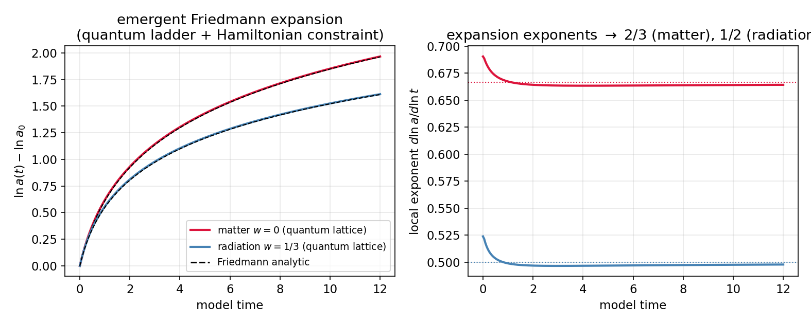
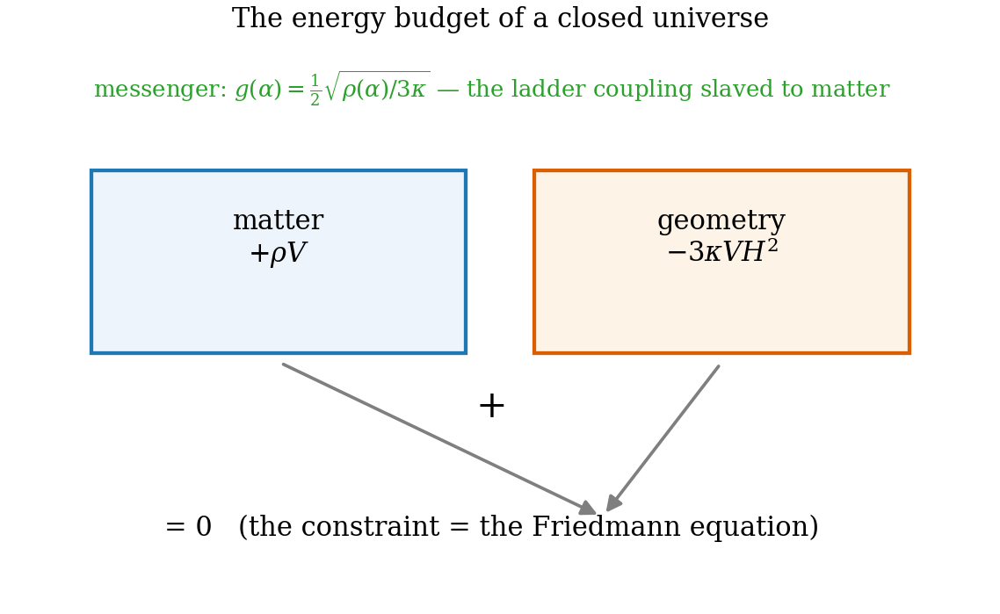
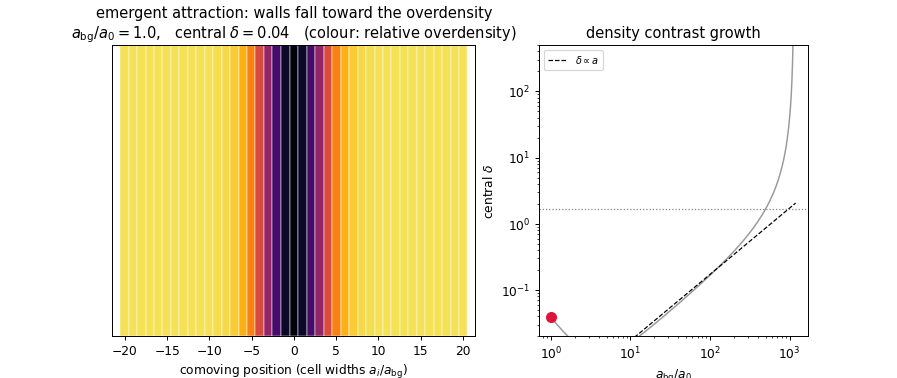
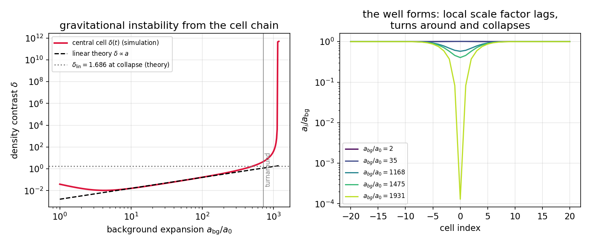

# Chapter 21 — Closing the constraint: Friedmann universes and emergent attraction

---

Chapter 20 put the model on the right *orbit family* — but an orbit family is a kinematic statement. Which orbit a universe takes — how fast it expands for a given matter content, whether it sits on the vacuum circle or in the matter interior — is fixed in general relativity by the **Hamiltonian constraint**: the statement that the total energy of geometry plus matter vanishes, the geometry's kinetic energy entering with a negative sign (Ch. 16.3). This chapter imposes that constraint on the generator-coupled ladder — imported as the chapter's single structural **[Postulate]**, its microscopic derivation deferred with a precise attack plan (Ch. 27, item 1) — and shows that the quantum ladder then becomes a *Friedmann universe* to sub-percent accuracy: expansion decelerating because matter dilutes, at the rate matter dictates. The same closure, applied cell by cell to an inhomogeneous chain, then produces the thing Part I never had: **attraction** — overdensities growing at exactly the Newtonian rate, turning around, and collapsing at the classic spherical-collapse threshold. Matter pulling matter together, inside the model, with no force law postulated.

## 21.1 What the constraint adds — and what it costs

For isotropic FRW (Ch. 16.3), GR's constraint reads

$$\mathcal H_{\text{grav}} + \mathcal H_{\text{matter}} = 0, \qquad \mathcal H_{\text{grav}} = -\,3\kappa\,V H^2, \quad \kappa = \frac{1}{8\pi G}, \tag{21.1}$$

equivalent to Friedmann's equation $3\kappa H^2 = \rho$. Three ingredients, separately accounted:

- the **form** (total energy zero, geometry negative along the volume direction): imported here **[Postulate]** — though no longer arbitrary: the geometry's own energy *is* negative along compression, by measurement (Ch. 22, $\kappa_{\text{grad}}^{\text{vac}} < 0$), so the sign is the model's own; what remains open is the exact-balance statement;
- the **dynamics** it governs: derived (the ladder of Ch. 20, $\dot\alpha = 2g$);
- the **stiffness** $\kappa$ setting the units: computable from matter loops (Ch. 22), used here as given.

The honest framing matters for the defense: this chapter does not derive Friedmann from nothing — it shows that the *one* standard structural statement, grafted onto the model's own derived dynamics, yields the *entire* quantitative phenomenology of homogeneous and (at leading order) inhomogeneous cosmology. The graft is small and the yield is large; Ch. 27 narrows what remains to a finite conservation test.

## 21.2 Constraint closure on the ladder

The generator-coupled ladder expands at $\dot\alpha = 2g$ (Ch. 20, the fixed-point law) — with *constant* $g$, a de Sitter-like exponential: nothing yet tells the coupling about matter. The constraint is precisely that missing instruction. Impose $3\kappa\,\dot\alpha^2 = \rho$ with matter diluting as $\rho = \rho_0\,e^{-3(1+w)(\alpha - \alpha_0)}$:

$$3\kappa\,(2g)^2 = \rho(\alpha) \qquad\Longrightarrow\qquad g(\alpha) \;=\; g_0\,e^{-\frac{3(1+w)}{2}(\alpha - \alpha_0)}, \qquad g_0 = \tfrac12\sqrt{\rho_0/3\kappa}. \tag{21.2}$$

The coupling is **slaved to the local matter density** — the ladder's hopping becomes a self-consistent functional of what the cells contain. The ladder's own equation of motion $\dot\alpha = 2g(\alpha)$ then integrates in closed form:

$$\alpha(t) = \alpha_0 + \frac{2}{3(1+w)}\ln\!\Big(1 + \tfrac{3(1+w)}{2}H_0 t\Big) \qquad\Longleftrightarrow\qquad a(t) \propto t^{\frac{2}{3(1+w)}}, \quad H_0 = 2g_0, \tag{21.3}$$

— exactly the Friedmann power laws: $a \propto t^{2/3}$ for matter ($w = 0$), $t^{1/2}$ for radiation ($w = \tfrac13$). **[Theorem, given (21.1)]**

**The quantum verification.** A genuine wavepacket on a 3600-rung ladder, hopping $t(n) = g\,(n + \tfrac12)\sqrt{n/(n+1)}$ with $g$ updated self-consistently from the constraint at every step (240 updates across the run): **[Computed]** (`ch21_friedmann.py`) maximum deviation $|\alpha_{\text{quantum}} - \alpha_{\text{Friedmann}}| = 0.009$ over $\Delta\alpha \approx 2.0$ for matter and $0.009$ over $1.6$ for radiation — sub-percent agreement across two e-folds — with the local exponent $d\ln a/d\ln t$ converging to $2/3$ and $1/2$ respectively. The expanding quantum box, constraint-closed, *is* a Friedmann universe.

*Figure 21.2 — Quantum ladder vs analytic Friedmann for matter and radiation: $\alpha(t)$ overlay (deviation $\le 0.009$) and the running exponent locking onto $2/3$ and $1/2$.*

*Figure 21.1 — The constraint as bookkeeping. Geometry's (negative) kinetic energy balancing matter's (positive) density at every instant; the coupling $g(\alpha)$ as the messenger between them.*

## 21.3 Inhomogeneity at leading order: the separate-universe chain

The model's universe is a *lattice* of cells, each carrying its own geometry — which makes it natively suited to the leading approximation of inhomogeneous cosmology, the **separate-universe picture**: each region evolves as its own FRW patch with its own density, gradients entering at next order (this is exact in the long-wavelength limit and standard in structure-formation theory; Toolbox below). The honest first inhomogeneous simulation is therefore a chain of cells, each obeying its own constraint-closed dynamics (21.2), with an initial overdensity across the middle.

> **Toolbox: the separate-universe approximation.** For perturbations of wavelength far exceeding all causal kernels, a perturbed region cannot be distinguished, locally, from an unperturbed universe with slightly different parameters; evolving each region with its own Friedmann equations *is* perturbation theory at leading order in gradients. The model's cell structure implements this without further approximation — the inter-cell coupling that generates the next order is exactly the gradient stiffness measured in Ch. 22.

> **Cell-Growth Theorem [Theorem].** Let the background obey $\ddot a = -\tfrac{4\pi G}{3}\bar\rho\,a$ and a perturbed cell $a_p = a(1 - \lambda)$, $\lambda \ll 1$. Mass conservation per comoving volume gives the density contrast $\delta = 3\lambda$. Subtracting the two acceleration equations and linearizing:
>
> $$\ddot\lambda + 2H\dot\lambda = \tfrac{4\pi G}{3}\bar\rho\,\delta \qquad\Longrightarrow\qquad \boxed{\;\ddot\delta + 2H\dot\delta - 4\pi G\,\bar\rho\,\delta = 0\;} \tag{21.4}$$
>
> — the textbook growth equation of cosmological structure formation, obtained here *purely by comparing neighbouring cells*. In matter domination ($a \propto t^{2/3}$, $4\pi G\bar\rho = \tfrac{2}{3t^2}$) the growing mode is
>
> $$\delta \;\propto\; t^{2/3} \;\propto\; a$$
>
> — density contrast grows linearly with the scale factor: matter falls toward overdensities at exactly the Newtonian rate. $\blacksquare$

Beyond linear order, the cell picture keeps paying: an overdense patch is a slightly closed universe — it expands ever slower than the background, reaches **turnaround** ($\dot a_p = 0$) when its linearly-extrapolated contrast is $\delta_{\text{lin}} = 1.062$, and recollapses when $\delta_{\text{lin}} = 1.686$ — the spherical-collapse threshold underlying all of structure formation (numbers derived in the Toolbox of the script's documentation, not quoted from folklore). **[Standard]**

## 21.4 The collapse simulation: watching a potential well form

**[Computed]** (`ch21_collapse.py`): forty-one cells, central contrast $\delta(0) = 0.08$ with a Gaussian profile, synchronized constraint-consistent initial data, run over a factor $\sim 2000$ of background expansion:

- the central contrast grows with $d\ln\delta/d\ln a = 1.08$ across the linear window — theory: $1$, the excess being the decaying-mode transient plus incipient nonlinearity;
- it peels upward off the linear law, **turns around** at $a_{\text{bg}}/a_0 = 1168$, and **collapses** at $1863$ — bracketing the spherical-collapse predictions as the thresholds dictate;
- every cell in the Gaussian tail lags proportionally less: the profile of $a_i/a_{\text{bg}}$ dips smoothly toward the center — **a potential well forming**, deepest where the matter is (the quantitative weak-field identification $\delta\alpha = -\Phi_{\text{Newton}}$ is Ch. 24's first section).

The animation shows the unmistakable picture: in comoving coordinates the cell walls drift toward the overdensity from both sides — *matter attracting matter* — until the central cells crash while the outskirts keep expanding. This is gravitational instability — the mechanism that turned a smooth early universe into galaxies — running inside a model whose microscopic content is particles in boxes and an iso-energy rule.

*Animation 21.A — Emergent attraction in motion: comoving cell walls falling toward the central overdensity beside the growing density contrast $\delta(a)$, through turnaround and collapse.*

*Figure 21.3 — The full arc. Left: central contrast vs scale factor — linear growth ($\delta \propto a$), the peel-off, turnaround and collapse markers at the threshold values. Right: the $a_i/a_{\text{bg}}$ profile at successive epochs — the well deepening around the matter.*

## 21.5 Summary and the price tag

Constraint closure converts the Kasner-capable ladder into a quantitative Friedmann cosmology (sub-percent over two e-folds, correct matter and radiation exponents) and, applied cell-wise, yields emergent attraction with the full arc — $\delta \propto a$, turnaround at $1.062$, collapse at $1.686$ — of gravitational instability. The bill for all of it is one imported structural statement (21.1) and one number, the stiffness $\kappa$, which entered only as a unit. The next chapter computes that number from the model's own matter content — sign first, magnitude after — and in doing so converts the constraint's "geometry energy is negative" from postulate to measurement.

---

**Validation.** `ch21_friedmann.py` (port): the constraint-closed quantum ladder vs (21.3) for $w = 0, \tfrac13$ (Fig. 21.2; deviations and exponents as quoted). `ch21_collapse.py` (port): the 41-cell chain (Fig. 21.3; growth exponent, turnaround/collapse epochs), trajectory archive `data/ch21_collapse_traj.npz`; `ch21_anim_collapse` job renders the animation. All quoted numbers printed by the scripts.
