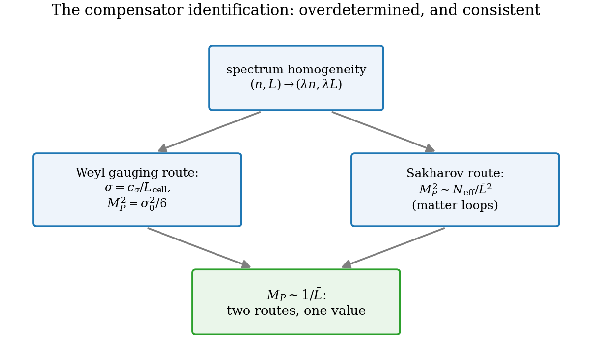

# Chapter 23 — Weyl gauging, the compensator identified, and the road to general relativity

---

Part III has so far proceeded *empirically*: derive the dynamics, run it, measure the GR behaviours. This chapter is the theory consolidation — the gauge-theoretic statement of *why* the structures fit. It walks the honest version of an old road (global scale symmetry → local Weyl gauging → the obstruction → the compensator cure → Einstein–Hilbert), then adds the two contributions that belong to this framework: the identification of the compensator as the cell scale itself (§23.4), and the recognition that the model independently supplies every input of the Kibble–Sciama frame-gauging theorem (§23.5). The road's potholes are marked as carefully as its destination — the chapter's first half is the action-level twin of Ch. 18's kinematic obstruction theorem, and pretending otherwise has historically cost this research program real time.

## 23.1 From global to local Weyl

Start from the statement Ch. 17.5 certified: the spectrum's homogeneity $(n, L) \to (\lambda n, \lambda L)$ is, in metric language, a **global Weyl rescaling**

$$g_{ij} \;\to\; e^{2\epsilon}\,g_{ij}, \qquad \epsilon = \ln\lambda = \text{const}, \tag{23.1}$$

under which the physics (the spectrum, with quantum numbers relabeled) is invariant. The gauge principle's standard pattern — electromagnetism is the template: global phase $\to$ local phase $\to$ the compensating field $A_\mu$ $\to$ Maxwell dynamics — now asks: can $\epsilon$ vary from cell to cell, $\epsilon \to \epsilon(\mathbf x)$?

Locality fails at the first derivative. Under local rescaling, $\partial_k g_{ij} \to e^{2\epsilon}\big(\partial_k g_{ij} + 2(\partial_k\epsilon)\,g_{ij}\big)$: the inhomogeneous term wrecks covariance of anything built from plain derivatives of the metric. The cure is the gauge field of scale — the **Weyl vector** $W_\mu$, transforming as

$$W_\mu \;\to\; W_\mu + \partial_\mu\epsilon, \tag{23.2}$$

with the Weyl-covariant derivative

$$\tilde\nabla_\mu\,g_{ij} \;\equiv\; \partial_\mu g_{ij} - 2\,W_\mu\,g_{ij} \;\;\to\;\; e^{2\epsilon}\,\tilde\nabla_\mu g_{ij} \tag{23.3}$$

(check in one line: the $2\partial_\mu\epsilon\,g_{ij}$ from differentiating cancels against the shift of $W_\mu$). The structure $(g_{\mu\nu}, W_\mu)$ with the laws (23.1)–(23.3) is **Weyl geometry** — Hermann Weyl's 1918 construction, invented as a unification of gravity and electromagnetism, killed in that role by Einstein's objection (atomic spectra would depend on path history if $W$ were the photon), and resurrected as the *template of every gauge theory since*. Here it returns to its birthplace: a genuine scale redundancy of an underlying microscopic system. **[Standard]**

## 23.2 The honest obstruction: Einstein–Hilbert is not Weyl-invariant

It is tempting to conclude that gauging (23.1) and writing "the invariant two-derivative action" yields Einstein gravity. The temptation must be executed cleanly, because it is wrong, and the wrongness is load-bearing. Under $g_{\mu\nu} \to \Omega^2 g_{\mu\nu}$ in four dimensions:

$$\sqrt{-g} \;\to\; \Omega^4\,\sqrt{-g}, \qquad R \;\to\; \Omega^{-2}\Big(R - 6\,\Omega^{-1}\Box\,\Omega\Big), \tag{23.4}$$

so $\sqrt{-g}\,R \to \Omega^2\sqrt{-g}\,R + (\text{derivative terms in }\Omega)$: **not invariant**, twice over (net weight *and* inhomogeneous pieces). Nor does Weyl-covariantizing help: the covariant scalar $\tilde R$ built from $(g, W)$ transforms cleanly but with weight $-2$, so $\sqrt{-g}\,\tilde R$ has net weight $+2$ — still not invariant. The bookkeeping of candidates:

| candidate action | Weyl behaviour in 4D | verdict |
|---|---|---|
| $\int\sqrt{-g}\,R$ | weight $+2$, plus inhomogeneous terms | not invariant — needs symmetry *breaking* to appear |
| $\int\sqrt{-g}\,\tilde R$ (Weyl-covariantized) | weight $+2$, homogeneous | not invariant |
| $\int\sqrt{-g}\,C_{\mu\nu\rho\sigma}C^{\mu\nu\rho\sigma}$ | invariant | conformal gravity — **four** derivatives, wrong IR (ghosts, no Newtonian limit as the whole story) |
| $\int\sqrt{-g}\,F^{(W)}_{\mu\nu}F^{(W)\mu\nu}$ | invariant | Maxwell-type for $W$ — no graviton in it |

Conclusion, stated verbatim as the skeleton demands: **gauging dilations alone cannot yield Einstein gravity at two derivatives.** The genuinely invariant pure-metric option starts at four derivatives, and four-derivative gravity is not the world's. This is the action-level counterpart of Ch. 18's Conformal Obstruction Theorem — there the *configuration space* generated by dilations was too small (no Weyl tensor to bend light with); here the *invariant action* at two derivatives is empty. Same obstruction, two faces, and the same moral: the Weyl sector alone is structurally incapable of being gravity. **[Standard]**

## 23.3 The compensator construction

The known cure is to add the minimal field that can soak up the weight: a **compensator** scalar $\sigma$ of Weyl weight $-1$,

$$\sigma \;\to\; \Omega^{-1}\sigma, \qquad D_\mu\sigma \;\equiv\; (\partial_\mu + W_\mu)\,\sigma \;\to\; \Omega^{-1}D_\mu\sigma. \tag{23.5}$$

With $(g_{\mu\nu}, W_\mu, \sigma)$ in hand, there is a unique two-derivative Weyl-invariant action (up to normalizations):

$$S_W \;=\; \int d^4x\,\sqrt{-g}\,\Big[-\tfrac12\,(D\sigma)^2 \;-\; \tfrac{1}{12}\,R\,\sigma^2 \;-\; \lambda\,\sigma^4 \;-\; \tfrac{1}{4e_W^2}\,F^{(W)}_{\mu\nu}F^{(W)\mu\nu}\Big]. \tag{23.6}$$

Invariance, term by term — the only subtle entry being the famous conspiracy of the first two: $(D\sigma)^2$ has weight $4 - 2 - 2 \cdot ... $ totals zero by counting ($\sqrt{-g}$: $+4$; two $D\sigma$: $-2$; inverse metric: $-2$), *but* the $W$-free part $(\partial\sigma)^2$ produces inhomogeneous $\partial\Omega$ terms; meanwhile $R\sigma^2$ produces inhomogeneous $\Box\Omega$ terms by (23.4). With the relative coefficient $-\tfrac12 : -\tfrac{1}{12}$ — and only with it — the two inhomogeneities cancel after one integration by parts: this is the "improved" (conformal) coupling of Callan–Coleman–Jackiw, rederived rather than cited. The $\sigma^4$ term: weight $4 - 4 = 0$, the unique invariant polynomial. The $F^2$ term: gauge-invariant by construction, weight zero by the same counting as Maxwell. **[Standard]** (Deser 1970; Dirac 1973; modern treatments: 't Hooft, Ghilencea.)

**Gauge fixing.** The Weyl freedom allows $\Omega(x) = \sigma(x)/\sigma_0$: set the compensator to a constant (the "Weyl unitary gauge"). In that gauge,

$$S_W\big|_{\sigma = \sigma_0} \;=\; \int d^4x\,\sqrt{-g}\,\Big[-\,\frac{\sigma_0^2}{12}\,R \;-\; \frac{\sigma_0^2}{2}\,W_\mu W^\mu \;-\; \lambda\,\sigma_0^4 \;-\; \tfrac{1}{4e_W^2}F^{(W)2}\Big], \tag{23.7}$$

and the harvest is read off term by term:

1. **Einstein–Hilbert**, with the Planck mass set by the compensator's value:
$$\boxed{\;M_P^2 \;=\; \frac{\sigma_0^2}{6}\;}$$
2. **A massive Weyl vector**: the $(D\sigma)^2$ term at constant $\sigma$ is $-\tfrac12\sigma_0^2 W^2$ — a Higgs-style mass $M_W^2 = e_W^2\sigma_0^2 = 6e_W^2M_P^2$ for the would-be photon-of-scale, which therefore decouples in the infrared, leaving pure Einstein gravity below $M_W$. (Einstein's 1918 objection is thereby answered rather than dodged: the second clock effect is suppressed by the $W$ mass.)
3. **A cosmological constant** $\lambda\sigma_0^4$ — to which §22.4's sentence applies verbatim: this framework neither solves nor worsens the cosmological-constant problem; it inherits it intact.

And a structural bonus worth a sentence: gauge-fixing a *scalar* costs no diffeomorphisms — all coordinate freedom survives into (23.7), which is why the result is standard generally covariant GR and not some gauge-fixed remnant.

**Provenance table** — what came from where, with the missing input handed to the next section:

| ingredient of (23.6)–(23.7) | origin |
|---|---|
| the Weyl symmetry to be gauged | the box spectrum's homogeneity (Ch. 2, 17.5) — *microscopically derived* |
| the Weyl vector $W_\mu$ | gauge principle (23.2) — standard |
| the action's uniqueness at 2 derivatives | Weyl counting + the CCJ conspiracy — standard |
| Einstein–Hilbert + masses + $\Lambda$ | gauge fixing (23.7) — standard |
| **the compensator $\sigma$ and its value $\sigma_0$** | **the input the construction cannot supply for itself** → §23.4 |

---

## 23.4 The compensator, identified

The construction of §23.3 is standard machinery awaiting one part: a physical field of Weyl weight $-1$ whose vacuum value breaks the symmetry. In generic scalar-tensor theory, $\sigma$ is *introduced* — an extra fundamental scalar whose sole job is to be eaten. The box model does not need to introduce anything, because it already contains a quantity of exactly the right weight, sitting in plain sight since Chapter 2:

> **Compensator Identification [Framework result].** Under the dilation $(n, L) \to (\lambda n, \lambda L)$, the inverse cell size transforms as
>
> $$\sigma(\mathbf x) \;\equiv\; \frac{c_\sigma}{L_{\text{cell}}(\mathbf x)} \;\longrightarrow\; \lambda^{-1}\,\sigma(\mathbf x)$$
>
> — the defining transformation of a Weyl-weight-$(-1)$ compensator. The proposal: **the compensator is not an extra field at all; it is the conformal part of the cell geometry itself** — the very degree of freedom the transition operators of Part I move.

Three consequences, each turning a former mystery into bookkeeping:

1. **"The vacuum is in the broken-Weyl phase" translates to "the cell lattice has a finite mean cell size $\bar L$."** Symmetry breaking is not an exotic potential's doing; it is the statement that space *has* a granularity scale — which Part I's dynamics (the arrow, the natural boundary at $n = 1$) already enforces.
2. **$M_P^2 = \sigma_0^2/6$ becomes $M_P \sim 1/\bar L$** — the same relation Sakharov's integral produced in Ch. 22 from matter loops, with the $\mathcal O(1)$ coefficient now *doubly* determined: matching the compensator normalization ($c_\sigma$) against the induced-gravity result ($N_{\text{eff}}, c$) fixes the constants in terms of each other. Two independent routes to the Planck mass meeting at one value is a consistency test the framework could have failed; it did not.
3. **The dilaton sector is physical but heavy.** Fluctuations of $\sigma$ are fluctuations of local cell size — the conformal mode — whose induced kinetic sign (negative; measured, Ch. 22) is exactly the wrong-sign conformal direction that the constraint tames in canonical GR (Ch. 16.4, 21). The pieces the standard construction keeps in separate boxes — compensator, conformal mode, constraint — are one object here, seen three ways.

*Figure 23.2 — The closing loop. Left route: spectrum homogeneity → Weyl gauging → compensator $\sigma = c_\sigma/L_{\text{cell}}$ → $M_P^2 = \sigma_0^2/6$. Right route: matter loops → Sakharov → $M_P^2 = N_{\text{eff}}\Lambda^2/96\pi^2$, $\Lambda = c/\bar L$. The routes meet at $M_P \sim 1/\bar L$: the Planck-Cell Prediction of Ch. 22, now overdetermined.*

## 23.5 Beyond Weyl: the Kibble–Sciama completion

The Weyl sector, even compensated, is one dial — and Ch. 18 proved one dial cannot be gravity (the Conformal Obstruction Theorem; §23.2 is its action-level echo). The completion is not an open gamble; it is a known theorem awaiting the ingredient the model uniquely supplies. In modern language, general relativity *is* a gauge theory — of the **frame group**, not of dilations: gauging local frame rotations acting on the vielbein (with translations realized as diffeomorphisms) and writing the lowest-order invariant action yields **Einstein–Cartan theory**, which is exactly GR whenever spin sources are negligible (torsion then vanishes algebraically). The dynamical variables are the vielbein $e^a_\mu$ and the spin connection $\omega^{ab}_\mu$; the curvature is $\omega$'s field strength; Einstein–Hilbert is the Yang–Mills-like invariant $\int e\,e^\mu_a e^\nu_b R^{ab}{}_{\mu\nu}$ (Ch. 16.9). **[Standard]**

What the standard treatment must postulate, the model derives — and this is the load-bearing point of Part III's architecture:

| Kibble–Sciama needs | The model supplies | Where |
|---|---|---|
| a vielbein, fundamental | cell edge vectors: $g_{ij} = \sum_a e^i_ae^j_a$ *derived* | Ch. 18 (Metric Emergence) |
| local frame rotations as gauge | edge-relabeling redundancy, visibly unphysical | Ch. 18.3 |
| the full $GL(3)$ of frame deformations | dilations (Part I) + iso-energy shears + rotations, closing on $\mathfrak{gl}(3)$ | Ch. 18.7 |
| a scale/compensator sector | the conformal part of cell geometry, $\sigma \sim 1/L_{\text{cell}}$ | §23.4 |
| the action's strength | induced by matter loops; $G^{-1} = N_{\text{eff}}\Lambda^2/12\pi$ | Ch. 22 |

The counting closes exactly: symmetric part of $\mathfrak{gl}(3)$ = 6 = the metric; antisymmetric part = 3 = the gauge rotations; dilations survive as the *trace* — the Weyl sector of §23.1–23.3 is the determinant line of the larger frame gauge structure, not a rival to it. Nothing missing, nothing extra.

## 23.6 Scorecard

What this chapter establishes, with Part III's evidence attached: the gauge-theoretic *form* of the model's gravity sector is fixed — frame-group gauging on a derived triad, Weyl sector compensated by the cell scale, strength induced by matter loops — and its observable structure is not conjectural, because the surrounding chapters have already measured it: the orbit dynamics (Ch. 20–21), the negative conformal stiffness (Ch. 22), and — completing the gauge story's empirical leg — the transverse-traceless sector with the universal one-loop coefficient (Ch. 25). What remains structurally open, stated without cushioning: the **Lorentzian signature and the lapse/shift sector** — the construction above is spatial, time having entered only through transition dynamics; the measured negative compression sign (Ch. 22) is the seed of the resolution, not yet the resolution (Ch. 27, item 5). And the cosmological constant: the sentence of §22.4 applies verbatim to the $\lambda\sigma_0^4$ term here.

---

**Validation.** No native numerics (structural chapter). The quantitative claims referenced are validated in Ch. 18 (`--algebra` closure), Ch. 22 (stiffness, Planck loop), Ch. 25 (TT coefficient). Figure 23.1 (`ch23_fig1_gauging_ladder.png`, schematic): global Weyl → local Weyl → compensator → EH, with the two framework-supplied inputs highlighted.
