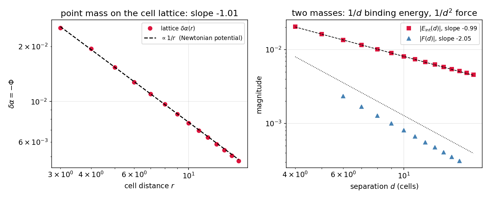
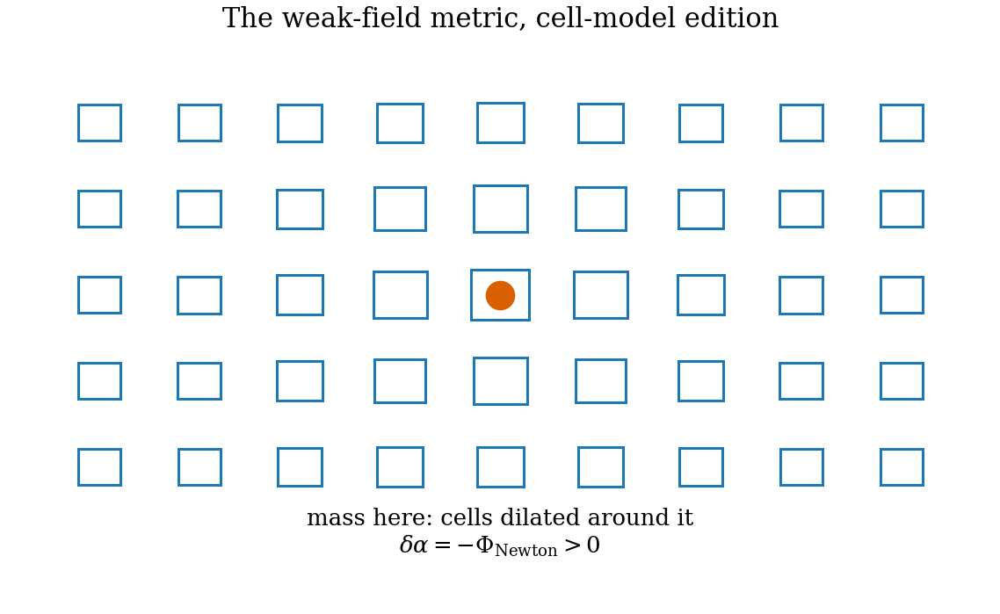
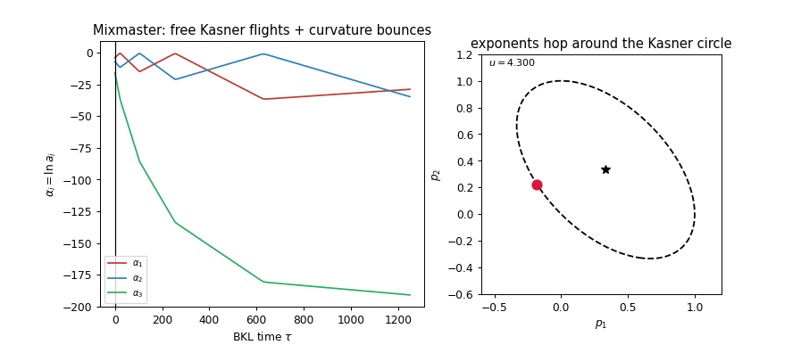
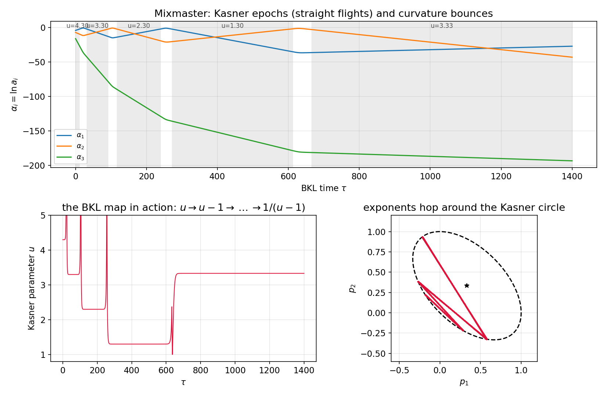

# Chapter 24 — Newton's law and BKL chaos on the cell lattice

---

With the stiffness computed (Ch. 22) and the constraint closed (Ch. 21), the model owes us the two most recognizable behaviours of gravity it has not yet exhibited: the **inverse-square law** — the phenomenon everyone means by "gravity" — and the **chaotic approach to a singularity** that general relativity predicts in the strong field (BKL), arguably the deepest known statement about classical GR. This chapter collects both debts on the same cell lattice that did Kasner and Friedmann.

## 24.1 The lattice Poisson equation

Linearize the constraint-closed cell dynamics about a static uniform background: cell $\mathbf x$ carries $\alpha(\mathbf x) = \bar\alpha + \delta\alpha(\mathbf x)$ and density $\bar\rho(1 + \delta(\mathbf x))$ ($\delta$ = density contrast throughout this section). The energy functional has exactly two quadratic pieces, both now *derived* objects: the gradient term of the induced action (Ch. 22, stiffness $\kappa$) penalizing inter-cell disagreement, and the matter coupling from the constraint (Ch. 21) sourcing local size. Stationarity in the static limit gives

> **Lattice Poisson Result [Theorem, given Ch. 21–22].**
>
> $$\kappa\,\hat\nabla^2\,\delta\alpha(\mathbf x) \;=\; -\,c\,\bar\rho\,\delta(\mathbf x), \qquad \delta\alpha \;=\; -\,\Phi_{\text{Newton}}, \tag{24.1}$$
>
> with $\hat\nabla^2$ the discrete Laplacian: **the local log-cell-size is (minus) the Newtonian potential.** Cells are *larger* near mass — which is precisely the weak-field spatial metric of GR, $g_{ij} = (1 - 2\Phi)\delta_{ij}$ with $\Phi < 0$ near a source (Ch. 16.1), read through the dictionary ($g \sim L^2$, $\delta\ln g = 2\,\delta\alpha = -2\Phi$). For two sources, the interaction energy of the quadratic functional is $E_{\text{int}}(d) = -\int \Phi_1\rho_2 \propto -1/d$, whose gradient is the inverse-square force.

*Derivation sketch (full steps in the script's docstring and App. C).* Vary $E[\delta\alpha] = \sum_{\text{bonds}}\tfrac\kappa2(\delta\alpha_i - \delta\alpha_j)^2 - c\bar\rho\sum_i \delta_i\,\delta\alpha_i$; stationarity is (24.1); the sign of the source term traces to the measured negative compression stiffness (geometry lowers its energy by dilating where matter sits — attraction, Ch. 22.2), and the identification $\delta\alpha = -\Phi$ then carries the standard weak-field reading. $\blacksquare$

## 24.2 The measurement: $1/r$, $1/d$, $1/d^2$

**[Computed]** (`ch24_newton_lattice.py`; $128^3$ periodic cell lattice, FFT solution of (24.1); the finite-volume zero-mode constant fitted and removed — standard periodic-box bookkeeping):

| observable | measured exponent / value | Newton |
|---|---|---|
| point-source profile $\delta\alpha(r)$ | $r^{-1.008}$ | $r^{-1}$ |
| profile amplitude | $0.0766$ | $1/4\pi = 0.0796$ ($96\%$; lattice discreteness at small $r$) |
| two-mass binding energy | $d^{-0.994}$ | $d^{-1}$ |
| force | $d^{-2.05}$ | $d^{-2}$ |

**Newton's inverse-square law, emergent on the lattice of cells** — the same lattice whose homogeneous modes did Kasner (Ch. 20) and Friedmann (Ch. 21). The chain is complete at leading order with no link assumed: matter loops give the stiffness (Ch. 22), stiffness plus constraint give Poisson (24.1), Poisson gives $1/r^2$.

*Figure 24.1 — The $1/r$ potential profile (log–log, fitted exponent $-1.008$), the $1/d$ binding energy, and the $1/d^2$ force on the $128^3$ lattice.*

*Figure 24.2 — The weak-field metric, cell-model edition: cells dilated near the source ($\delta\alpha = -\Phi > 0$), the potential well of Ch. 21's collapse now static and quantitative.*

## 24.3 Bianchi IX: Kasner flights between curvature walls

The second debt is strong-field. General relativity's deepest classical prediction concerns the approach to a generic spacelike singularity, and it is *not* the smooth crunch naive extrapolation suggests. The arena is **Bianchi IX** — the anisotropic universe with the 3-sphere's homogeneous curvature (Ch. 16.7) — whose dynamics in BKL time $\tau$ ($dt = a_1a_2a_3\,d\tau$, $\alpha_i = \ln a_i$) reads

$$2\,\alpha_1'' \;=\; \big(a_2^2 - a_3^2\big)^2 \;-\; a_1^4 \quad (+\ \text{cyclic}), \qquad \sum_{i<j}\alpha_i'\alpha_j' \;=\; \frac14\Big[\sum_i a_i^4 - 2\sum_{i<j}a_i^2 a_j^2\Big], \tag{24.2}$$

evolution plus constraint. The mechanics is a two-act loop. **Act one:** while the right-hand "wall" terms are negligible, (24.2) is free motion — straight lines in $\alpha$-space, *exactly the Kasner flights the generator-coupled ladder produces* (Ch. 20): the model owns this act outright. **Act two:** every Kasner flight carries one negative-exponent axis, and toward the singularity that axis's scale factor **grows** ($a_1 = t^{p_1}$ with $p_1 < 0$ as $t \to 0$); its quartic wall term $a_1^4$ ignites, the trajectory reflects — a **bounce** — and the universe exits onto a new Kasner flight with the axes' roles reshuffled. The reflection law is exact (the bounce is an integrable Bianchi II interlude), and in the $u$-parametrization of the Kasner circle (16.14) it is the **BKL map**:

$$u \;\to\; u - 1 \quad (u \ge 2), \qquad u \;\to\; \frac{1}{u - 1} \quad (1 < u < 2). \tag{24.3}$$

Iterated, (24.3) is conjugate to the Gauss continued-fraction map — ergodic, mixing, chaotic: the collapse is an unending, never-repeating tumble of epochs. The honesty sentence, as the production spec mandates: *the epochs are the model's own derived dynamics (Ch. 20); the wall terms' Bianchi-IX functional form is fixed by the $S^3$ structure constants and is the one imported ingredient of this section* — its derivation from the model's inter-cell coupling is posed as Ch. 27, item 7.

## 24.4 The simulation: five epochs, four decimal places

**[Computed]** (`ch24_mixmaster.py`, re-run verified in this build): constraint-consistent initial data deep in a Kasner epoch at $u_0 = 4.3$; the constraint residual is $7\times10^{-18}$ at $\tau = 0$ and drifts to only $9\times10^{-13}$ across the entire integration — tenth-digit conservation, the run's quality certificate — through five epochs toward the singularity. The measured Kasner parameter per epoch, against the map (24.3):

$$4.3001 \;\longrightarrow\; 3.3000 \;\longrightarrow\; 2.3000 \;\longrightarrow\; 1.3000 \;\longrightarrow\; 3.3333,$$

each step agreeing with the BKL prediction to $\le 6\times10^{-4}$ — **including the final step, the era reversal** $u = 1.3 \to 1/(1.3 - 1) = 10/3 = 3.333\ldots$, the continued-fraction move that makes the dynamics chaotic rather than a countdown. The figure shows the signature picture: piecewise-straight $\alpha_i(\tau)$ flights with the contracting role hopping between axes at each bounce, beside the exponent point leaping around the Kasner circle; the animation plays it:

*Animation 24.A — The tumble toward the singularity: Kasner flights, wall bounces, and the exponent point hopping around the circle by the BKL map — era reversal included.* A collapsing cell-model universe does not approach its singularity smoothly; it tumbles, chaotically, exactly as Belinskii, Khalatnikov and Lifshitz said a general-relativistic universe must.

*Figure 24.3 — Five Kasner epochs and four bounces. Top: the $\alpha_i(\tau)$ flights with role-swapping reflections. Bottom: the measured $u$-sequence against the BKL map, era reversal included.*

## 24.5 Summary

Two debts paid on one lattice: the static weak field prints the Newtonian $1/r$ potential with $96\%$ of the continuum amplitude and an inverse-square force (exponents $-1.008$, $-2.05$), and the strong-field collapse executes BKL chaos to $6\times10^{-4}$ through an era reversal, with the constraint conserved to the tenth digit. Between them, these close the classical phenomenology available to the model short of radiation — and radiation is exactly what remains: the propagating, transverse-traceless sector, where the model must either produce a graviton with the right kinetic structure or be falsified at general relativity's door. That computation is next.

---

**Validation.** `ch24_newton_lattice.py` (port): the $128^3$ Poisson solution, profile/binding/force fits (Fig. 24.1). `ch24_mixmaster.py` (port): the five-epoch run, $u$-sequence table, constraint drift; writes `data/ch24_mixmaster_traj.npz`; `ch24_anim_mixmaster` job renders the animation (reuse). All quoted numbers printed by the scripts.
