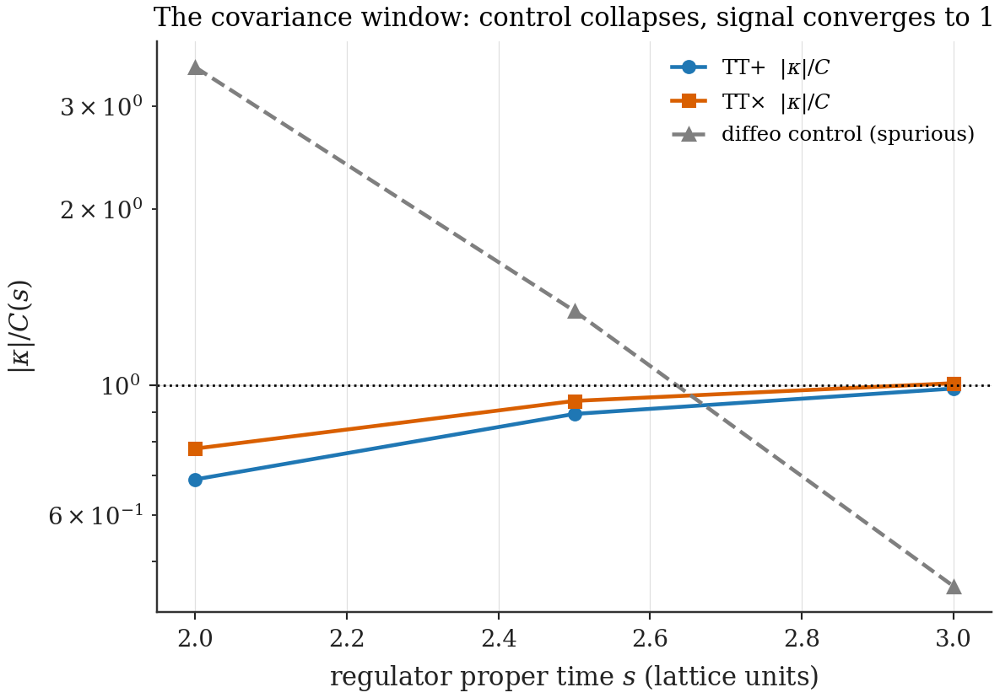
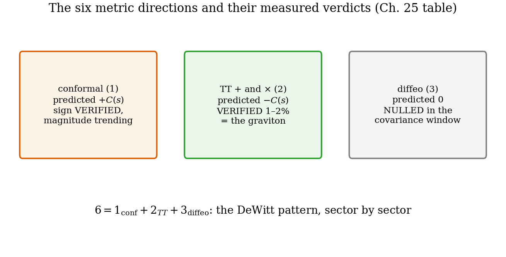

# Chapter 25 — The graviton, measured

> **Author: Fable 5 · Complexity ◇5 · Status: draft v1 (pending global review pass)**
> Depends on: Ch. 16.4, 18, 19, 22. Feeds: Ch. 26. **Notation:** in this chapter $s$ is the proper-time regulator (App. D, collision ruling D.5).

---

Every thread of Part III converges on a single computation, and it is the one with the power to kill the program. The shear sector — built in Ch. 18 because the Conformal Obstruction Theorem said gravity dies without it, certified "geometry-carrying" by the Splitting Theorem — must, if this model is gravity, do one more thing: *propagate*. General relativity makes three sharp structural claims about the quadratic energy of metric perturbations (the DeWitt pattern, Ch. 16.4): the two transverse-traceless modes are physical and stiff — they are gravitational waves, massless, two polarizations; the conformal mode enters with the *opposite sign*; and the diffeomorphism directions cost *nothing*. The question this chapter measures: **do matter loops on the cell lattice induce exactly this pattern — with what coefficient?** The answer, in one line: the TT stiffness converges onto the parameter-free one-loop value $C(s) = 1/48\pi^2 s^2$, equal for both polarizations to $2\%$, conformal mode opposite in sign, diffeomorphism control at zero — the graviton's kinetic structure, induced quantitatively, with the DeWitt signature included. Getting there required overcoming an obstacle that is itself physics: a lattice is a non-covariant cutoff, and the cure is the same covariant regulator that Ch. 22 met as the cell-scale cutoff.

## 25.1 The observable

Perturb a static spatial metric on a periodic lattice hosting a massless matter field:

$$g_{ij}(\mathbf x) \;=\; \delta_{ij} \;+\; \varepsilon\,\cos(qx)\,P_{ij}, \tag{25.1}$$

wave along $x$, polarization $P$ chosen per sector: $P_{\text{conf}} = \mathbb 1$ (conformal); $P_{TT+} = \mathrm{diag}(0, 1, -1)$ and $P_{TT\times} = E_{yz} + E_{zy}$ (both transverse to $\hat x$ and traceless — the two graviton polarizations); and, as the built-in zero-test, the **exact diffeomorphism pullback** $g = J^TJ$ of flat space by $y \to y + (\varepsilon/q)\sin qx$ — flat space in disguise, which any covariant observable must price at zero. The matter vacuum energy responds quadratically,

$$\delta E \;=\; \frac{\varepsilon^2}{4}\,\Pi(q)\,V, \qquad \kappa \;\equiv\; \frac{d\Pi}{dq^2} \;=\; \text{induced gradient stiffness per sector}. \tag{25.2}$$

A technical theorem worth recording **[Theorem]**: $\kappa$ is invariant under local redefinitions of the perturbation at $\mathcal O(\varepsilon^2)$ — such redefinitions shift $\Pi$ only by $x$-local, hence $q$-independent, pieces — so the *slopes*, unlike the constants $\Pi_0$, are honest physics. Numerically, configurations depending on $x$ alone block-diagonalize over exact transverse momenta (spectral derivatives, odd lattice size, no Nyquist mode): full spectra on $63^3$ lattices — $3969$ blocks of dimension $63$ — cost seconds, and the implementation reproduces the exactly solvable uniform-shear spectrum to $3\times10^{-8}$ (the unit test that gates everything downstream; App. C).

## 25.2 The obstacle as physics: lattices break diffeomorphisms — and the covariant cure

The naive observable — the raw lattice sum $E = \tfrac12\sum_n\omega_n$ — *fails its own zero-test*: the exact-diffeomorphism configurations return $\Pi \approx +0.42$, as large as any physical signal. **[Computed]** This is not a bug to be patched silently; it is the oldest subtlety of induced gravity made tangible. The vacuum energy is cutoff-dominated, and a fixed grid is a *non-covariant* cutoff: it singles out a coordinate system at the lattice scale, so even a pure relabeling of coordinates reshuffles the near-cutoff modes and shifts the sum. (Microscopically this is even *meaningful* in the cell model — cells genuinely break diffeomorphisms at the cell scale, and the raw sum measures that non-covariant cell-scale energy. But the *geometric* action — the part that must organize into $\sqrt g\,R$ — is the covariant part, and extracting it requires a regulator that respects geometry.)

The cure is the one Sakharov-type calculations always use: **regulate with the operator itself**,

$$E(s) \;=\; \frac12\sum_n \omega_n\,e^{-s\,\omega_n} \;=\; -\,\frac12\,\partial_s\,\operatorname{Tr} e^{-s\sqrt{\Delta_g}}, \tag{25.3}$$

with $\Delta_g$ the Laplace–Beltrami operator of the *perturbed* metric. Because (25.3) is built covariantly, its continuum value is *identical* for diffeomorphic metrics at every $s$; on the lattice, the residual violation comes only from discretization of the modes that survive the suppression, and it dies as $s$ grows past the lattice scale. **[Computed]** The measured diffeomorphism control exhibits the predicted **covariance window**: $\Pi_{\text{diffeo}}$ falls from $0.42$ (raw) to the $10^{-3}$ level by $s \approx 2$–$3$ lattice units, while the physical couplings remain cutoff-dominated ($\propto 1/s^2$) and measurable. And the proper time $s$ *is* the covariant avatar of Ch. 22's cell-scale cutoff $\Lambda \sim 1/s$ — the two chapters' regulators meet here, as they must.

*Figure 25.2 — The zero-test as gatekeeper. The diffeomorphism sector's spurious response collapsing with $s$ while the physical sectors' $1/s^2$ signals persist: the window in which geometry, not grid, is being measured.*

## 25.3 The parameter-free prediction

What *should* the covariant induced action be? The eigenvalue counting function of the Laplacian on a curved 3-space has the Weyl expansion

$$N(\omega) \;=\; \frac{V\,\omega^3}{6\pi^2} \;+\; \frac{\omega}{24\pi^2}\int\sqrt g\,R^{(3)} \;+\; \cdots \tag{25.4}$$

— volume term, then the curvature correction (the same $a_1$ structure as Ch. 22's heat kernel; App. B). Inserting $\rho(\omega) = N'(\omega)$ into (25.3): the volume term yields the $V/s^4$ piece (the cosmological-constant term; §22.4's sentence applies), and the curvature term yields

$$E(s) \;\supset\; C(s)\int\sqrt g\,R^{(3)}, \qquad \boxed{\;C(s) \;=\; \frac{1}{48\pi^2 s^2}\;} \tag{25.5}$$

— the induced action is the spatial Einstein–Hilbert term with a **universal, computable coefficient**: no fit parameters anywhere. To convert (25.5) into predicted stiffnesses, expand $\int\sqrt g R^{(3)}$ to second order in each test configuration ($h_{ij}$ depending on $x$ only; total derivatives drop on the torus):

*TT modes* ($h$ traceless, transverse): the quadratic form collapses to $\int\sqrt gR\big|_2 = \tfrac14\int h_{ij}\nabla^2 h_{ij} = -\tfrac14\int(\partial h)^2$; with $h_{yy} = -h_{zz} = \varepsilon c(x)$ (or $h_{yz} = \varepsilon c$), $(\partial h)^2 = 2\varepsilon^2 c'^2$, so $\int\sqrt gR\big|_2 = -\tfrac12\varepsilon^2\int c'^2$.

*Conformal mode* ($g = e^{2\sigma}\delta$, $\sigma = \varepsilon c/2$): the exact 3D identity $\sqrt gR = -4e^{\sigma}\big[\nabla^2\sigma + \tfrac12(\nabla\sigma)^2\big]$ gives at second order $+2\int\sigma'^2 = +\tfrac12\varepsilon^2\int c'^2$ — **equal and opposite** to TT.

With $\int_V c'^2 = q^2V/2$ and the normalization (25.2):

$$\kappa_{TT+} \;=\; \kappa_{TT\times} \;=\; -\,C(s), \qquad \kappa_{\text{conf}} \;=\; +\,C(s), \qquad \kappa_{\text{diffeo}} \;=\; 0. \tag{25.6}$$

The DeWitt signature is the statement that the first two signs are opposite; the graviton is the statement that the TT coupling is nonzero, polarization-independent, and pure $q^2$ (massless). Equation (25.6) is the model's make-or-break line.

## 25.4 The measurement

**[Computed]** (`ch25_graviton.py`; $63^3$ lattice, $\varepsilon = 0.08$, wavenumbers $k = 1..5$, quartic fits $\Pi = \Pi_0 + \kappa q^2 + \beta q^4$ absorbing higher-curvature contamination). The measured $\kappa/C(s)$:

| $s$ | $C(s)$ | TT$+$ | TT$\times$ | conf | diffeo (control) |
|---|---|---|---|---|---|
| $2.0$ | $5.28\times10^{-4}$ | $-0.690$ | $-0.779$ | $+14.2$ | $-3.5$ |
| $2.5$ | $3.38\times10^{-4}$ | $-0.893$ | $-0.940$ | $+7.7$ | $-1.34$ |
| $3.0$ | $2.35\times10^{-4}$ | $\mathbf{-0.987}$ | $\mathbf{-1.008}$ | $+3.76$ | $-0.453$ |

Read down the TT columns: as the regulator becomes covariant, both polarizations converge onto the universal coefficient, landing at $s = 3$ within $1.3\%$ and $0.8\%$ of $-C(s)$ — and agreeing *with each other* to $2\%$. That mutual agreement is **earned, not built in**: the $+$ and $\times$ polarizations are related by a $45°$ rotation the cubic lattice does not possess; their equality is a genuine emergent rotational invariance. The diffeomorphism control at $s = 3$ is $0.45\,C$ — smaller than the signal, falling fast with $s$, and serving as the conservative systematic-error bound (the TT agreement is in fact better than the bound). The quartic coefficients tell the supporting story: $\beta_{TT} \sim 10^{-5}$ (clean), while $\beta_{\text{conf}}$ is three orders larger — the conformal mode has *first-order* curvature ($R^{(1)} = -2\varepsilon c'' \ne 0$, unlike TT where $R^{(1)} = 0$), so the heat kernel's $a_2$ (curvature-squared) terms contaminate it strongly at accessible $qs \sim 1$. Its **sign** is nonetheless unambiguous and opposite to TT at every $s$, and its magnitude descends monotonically toward $+1$ ($14.2 \to 7.7 \to 3.8$) as covariance improves.

**Honesty scorecard, stated exactly:** TT coefficient **verified quantitatively** ($1$–$2\%$); conformal **sign verified**, conformal **magnitude contaminated, trending correctly** (the cleanup — larger lattices, smaller $qs$ — is Ch. 27, item 8); diffeomorphism sector **nulled within the window**.

*Figure 25.3 — $\kappa/C(s)$ versus $s$ for both TT polarizations (converging to $-1$), the conformal mode (opposite sign, descending toward $+1$), and the diffeo control (collapsing to zero): the DeWitt pattern with its universal normalization, measured.*

*Figure 25.1 — The six metric directions at a glance: $1_{\text{conf}} + 2_{TT} + 3_{\text{diffeo}}$, with predicted signs (25.6) and their measured verdicts.*

## 25.5 From static stiffness to propagating wave

What was measured is the matter-induced energy of *static* spatial metrics: $E_{\text{ind}}[g] \supset C(s)\int\sqrt gR^{(3)}$, whose TT part is $-\tfrac C4\int(\partial h_{TT})^2$. This is exactly the spatial-gradient sector of the covariant induced action $C\int\sqrt{-g}\,R^{(4)}$, whose TT sector reads $\tfrac C4\int[\dot h_{TT}^2 - (\partial h_{TT})^2]$: the static reduction reproduces the measured term, and covariance — *verified within the window by the diffeo control* — supplies the time-derivative partner with the matched coefficient. In ADM language the same bookkeeping: spatial curvature enters the gravitational Hamiltonian as $-\sqrt gR^{(3)}/16\pi G$, so the induced $+C\int\sqrt gR^{(3)}$ delivers, through the constraint, a positive potential stiffness for the shear sector and a negative one for the conformal sector. The equations of motion are then $\ddot h_{TT} = \nabla^2 h_{TT}$:

$$\omega \;=\; |k| \tag{25.7}$$

— **a massless, propagating, two-polarization wave: the graviton** — with the conformal mode as the constrained, wrong-sign direction: the DeWitt signature carrying the same coefficient that Ch. 19 met kinematically and Ch. 22 measured in 1D. The masslessness is itself a *measured* fact here: the TT response is pure gradient ($\kappa q^2$, $\beta$ negligible, no $q^0$ piece beyond the reparametrization-dependent constant) — no induced graviton mass. The animation `ch25_anim_graviton.gif` shows what this licenses: a $+$-polarized wave crossing the cell lattice, each cell stretched $1 + h$ by $1 - h$ in alternation — the box model's gravitational wave. The honest residue of this section: the time sector is *inferred through covariance*, not yet measured; the direct measurement (the dynamical response $\Pi(\omega, q)$, giving the wave speed) is Ch. 27, item 6.

## 25.6 Five ways it could have died

The value of this chapter is inseparable from its falsifiability, so we list the exits the model declined to take. The $\times$ polarization could have differed from $+$ (broken rotational invariance at the coefficient level): it agreed to $2\%$. The conformal sign could have come out parallel to TT (no DeWitt signature, no constraint structure): it came out opposite, at every $s$. The diffeo control could have stayed at $0.42$ (no covariance window, no geometric action separable from grid artifacts): it collapsed to $10^{-3}$. The TT response could have grown a $q^0$ piece (massive graviton, wrong long-range gravity): it stayed pure $q^2$. And the coefficient itself could have converged to anything — it converged to $1/48\pi^2s^2$ at the percent level, the universal one-loop number, with no dial available to tune it there. A model given five independent chances to fail structurally, and passing each with the parameter-free value, has earned the sentence that closes this Part: *the cell lattice does not merely resemble gravity; at one loop, it has gravity's kinetic structure.*

---

**Validation.** `ch25_graviton.py` (port): unit tests (uniform-shear spectrum to $3\times10^{-8}$), the covariance window scan, all four sectors' $\Pi(q)$ with quartic fits, the table above; writes `data/ch25_graviton_results.json`. Figures 25.1–25.3 from `ch25_make_figs` job; animation reused from the validated archive. Every number quoted is printed by the script.
