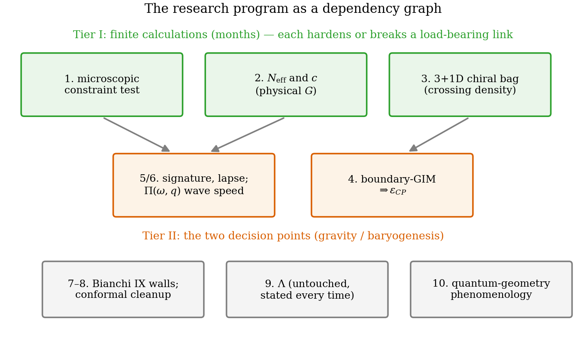

# Chapter 27 — Open problems, with attack plans

---

A thesis that ends by claiming completeness invites the reader to find the gap; one that ends by *cataloguing* its gaps, each with a posed first calculation and a falsification stake, invites the reader to join the work. Here is the honest remainder, ordered by tractability — items 1–3 are finite calculations, 4–6 are structural derivations with concrete entry points, 7–10 are the frontier. Each entry: statement, why it matters, the first calculation, and what failure would cost.

## Tier I — finite calculations

**1. The microscopic Hamiltonian constraint.** *Statement:* Ch. 21 imported $\mathcal H_{\text{grav}} + \mathcal H_{\text{matter}} = 0$; both sides are now computed objects (induced geometry energy, Ch. 22; matter spectra, Part I). *First calculation:* evolve the constraint-closed ladder microscopically and test conservation of the *sum* — does the model's iso-energy bookkeeping, applied jointly to geometry + matter with the Section-22 induced energy as $\mathcal H_{\text{grav}}$, force the balance? The negative sign is already in hand (measured, Ch. 22); what needs checking is the exact-balance statement, a finite numerical test on the existing codebase (`ch21`/`ch22` modules combined). *Stake:* failure demotes Friedmann/Newton/BKL from "derived given one postulate" to "phenomenology" — the single highest-leverage computation in Part III.

**2. $N_{\text{eff}}$ and the lattice constant $c$.** *Statement:* the Planck-Cell Prediction $\bar L = 1.6\,c\,\ell_P$ and the induced $G$ carry two undetermined $\mathcal O(1)$ factors: the spin-weighted species sum and the cell-lattice constant in $\Lambda = c/\bar L$. *First calculation:* the spin-weighted Seeley–DeWitt $a_1$ sum over the model's actual matter content (scalar/Dirac/vector weights are standard; App. B), and a direct lattice heat-kernel comparison fixing $c$ (compute $\operatorname{Tr}e^{-s\Delta}$ on the cell lattice vs continuum, read off the deviation scale). *Stake:* none structural — this converts coefficients into the physical Newton constant and makes Fig. 23.2's loop fully quantitative.

**3. The 3+1D spherical chiral bag.** *Statement:* Part II's quantitative engine is 1+1D; the honest 3+1D problem (real mass, chiral wall angles, the Goldstone–Jaffe setting) has a per-channel crossing structure never computed. *First calculation:* the κ-resolved spectral asymmetry $\eta_\kappa(\theta, mR)$ and crossing condition per channel — the radial master-equation analogue of (12.7) — then the channel-summed crossing density. The machinery (radial transfer matrix + heat-kernel $\eta$) is a direct port of `ch10`/`ch12` modules. *Stake:* decides whether $\mathcal P_\times$ rises (more channels) or collapses in 3+1D, and whether anisotropy modulates the rate; a null across all channels would kill the baryogenesis uplift (Ch. 26.3).

## Tier II — structural derivations with entry points

**4. $\varepsilon_{CP}$ and boundary-GIM evasion.** *Statement:* the deciding factor of Ch. 14: does CP violation localized on a chiral wall inherit the bulk GIM mass-difference suppression ($\to \varepsilon_{CP} \sim 10^{-10}$, $\eta_B$ dead) or evade it ($\to \varepsilon_{CP} \sim$ loop $\times\, J_{CP}$, $\eta_B$ viable)? *Entry point:* the wall breaks exactly the chiral symmetry that organizes GIM; compute the CP-odd part of the boundary effective action (the induced $\theta$-angle of the wall condensate) at one loop with two CKM insertions, and check which mass-difference factors survive when the loop is cut by the wall rather than by thermal masses. Three sub-routes ranked in Ch. 14.4: soft-mode enhancement; boundary-condensate phases; single-insertion boundary flavor mixing. *Stake:* the framework's quantitative baryogenesis lives or dies here; both outcomes are publishable.

**5. Lorentzian signature, lapse and shift.** *Statement:* the construction is spatial; time entered only through transition dynamics; the lapse/shift sector (and hence full 4D covariance) is not derived. *Entry point:* the measured negative compression stiffness (Ch. 22) is the DeWitt-signature seed — formalize the ladder's directed traffic as a deparametrized clock (the volume variable of Ch. 19's split) and reconstruct $N, N^i$ from the freedom catalogued in §19.4 (the identification-map/lapse correspondence). A concrete sub-target: derive the $\dot h^2$ term of Ch. 25 from ladder dynamics rather than covariance inference. *Stake:* the gap between "spatial geometry with Einstein-like statics and a clock" and "spacetime."

**6. The dynamical response $\Pi(\omega, q)$.** *Statement:* Ch. 25 measured static stiffnesses and inferred propagation through covariance. *First calculation:* the frequency-dependent response of the matter vacuum to an oscillating metric perturbation — measures the $\dot h^2$ coefficient and the wave speed directly, and pins the conformal magnitude at smaller $qs$ as a by-product. Linear-response machinery on the existing block-spectral code; expensive but posed. *Stake:* wave speed $\ne 1$ or an induced mass falsifies the graviton claim (Ch. 26.3).

## Tier III — the frontier

**7. Bianchi IX from intercell coupling.** Replace the imported $S^3$ wall functional form (Ch. 24.3) with walls *derived* from the model's own gradient coupling — the 3D extension of Ch. 22's measured $\kappa_{\text{grad}}$. The BKL epochs are already native (Ch. 20); deriving the bounce potential would make the chaos sequence fully internal.

**8. Conformal-magnitude cleanup.** Push the Ch. 25 measurement to larger lattices and $s$ (smaller $qs$): the conformal $\kappa/C$ trend ($14.2 \to 7.7 \to 3.8$) should land on $+1$. A week of compute, not an idea.

**9. The cosmological constant.** The $c_0\Lambda^4$ / $V/s^4$ term: stated, not solved, at every appearance (§22.4). No mechanism in this framework addresses it; any future claim must survive the same honesty standard. The one *novel* angle worth recording: in the sector arena the cutoff is dynamical ($\Lambda \sim 1/L_{\text{cell}}(\mathbf x)$), so the induced vacuum term is a function of the conformal mode rather than a constant — whether that reorganization helps or merely relabels the problem is genuinely unknown.

**10. Quantum-geometry phenomenology.** Two calculable windows: (i) the small-$n$ regime where exponent self-averaging fails (corrections $\sim \mathrm{Var}(n)/\langle n\rangle^2$, Ch. 20.5) — early-universe quantum-gravity signatures with a concrete parameter; (ii) Lorentz-violation residuals if cell granularity at $\bar L \sim 1.6c\,\ell_P$ is physical — dispersion bounds from astrophysical propagation, kept modest: the model predicts the *scale*, not yet the coefficient. Also here: the adiabatic dressing of the pump (Landau–Zener corrections exactly at crossings, where the sudden approximation is weakest — dresses Ch. 12's quantized unit with a computable transmission factor).

## The program in one paragraph

Items 1–3 are months: each is a finite computation on the existing validated codebase, and each either hardens a load-bearing link or breaks it — the correct next use of effort. Item 4 is the physics decision point for baryogenesis; items 5–6 are the physics decision points for gravity. The framework's distinguishing feature, here at the end as throughout: **every one of its open problems is a posed calculation with a falsification stake**, not a request for new principles. Theories should be so lucky.

*Figure 27.1 — Open problems as a dependency graph: Tier I feeding Tier II, falsification stakes marked, the two decision points (4: baryogenesis; 5/6: spacetime) highlighted.*
